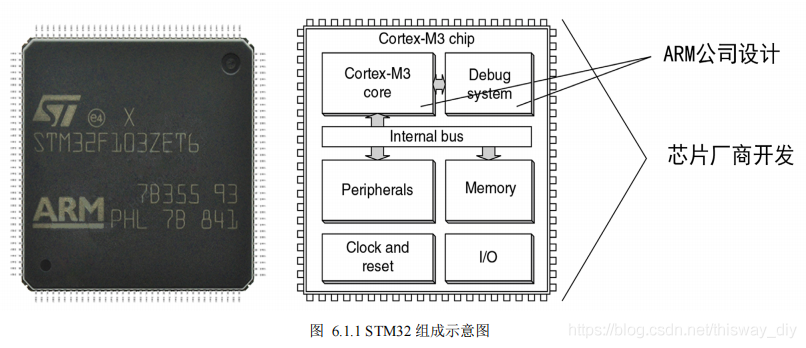
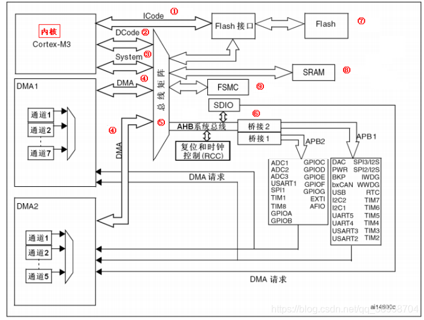
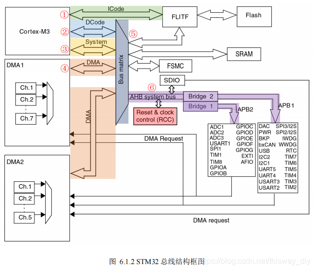
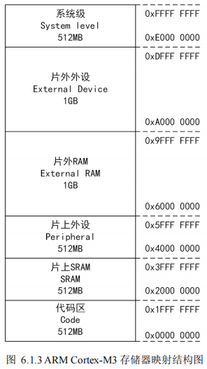
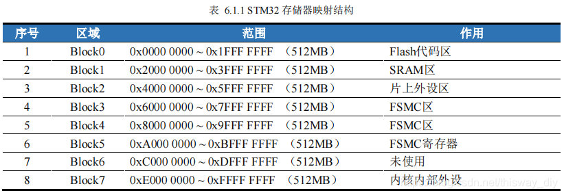

# STM32体系结构

## 单片机

​	单片机是一种集成电路芯片，其可以将CPU、ROM、RAM、时钟、计时器等多个部件集成到一块芯片上；

​	通常将单片机分为：CPU、外设；而CPU存在多种架构，比如精简指令集的RISC与复杂指令集的CISC。对STM32来说，其使用了ARM公司设计的Cortex-M系列（对于STM32F103RC来说，就使用了Cortex-M4系列，当然不同的STM32芯片也会使用其他Cortex-M系列），而ARM公司是设计RISC的，所以STM32芯片的cpu都使用了精简指令集架构。

​	而STM32中的外设部分，则由意法半导体STM公司自己设计。STM买下ARM公司设计出的芯片（ARM公司只负责设计并出售IP），再自己根据需要设计外设最后制成STM32。当然还有很多其他公司会购买ARM的芯片并且各自设计外设，这样也就得到了各种外设类型的单片机。当然单片机中也有使用CISC的。

## STM32体系结构

### STM32的各个部件

​	

- **Cortex-M3**：单片机的CPU，内核，完成所有的指令、运算的中央处理器；

- **FLASH**：一般用来存储代码和一些定义为const的数据，断电不丢失；

-  **SRAM：**函数栈、存储程序运行中的中间变量；

-  **DMA**：Direct Memory Access：直接内存存取，是一种可以大大减轻CPU工作量的数据转移方式。

     CPU有转移数据、计算、控制程序转移等很多功能，但其实转移数据（尤其是转移大量数据）是可以不需要   CPU参与。比如希望外设A的数据拷贝到外设B，只要给两种外设提供一条数据通路，再加上一些控制转移	的部件就可以完成数据的拷贝；

    　DMA就是基于以上设想设计的，它的作用就是解决大量数据转移过度消耗CPU资源的问题。有了DMA使	        	CPU更专注于更加实用的操作--计算、控制等；

- **SDIO**：Secure Digital Input and Output，即安全数字输入输出接口；

    它是在SD卡接口的基础上发展而来，它可以兼容之前的SD卡，并可以连接SDIO接口设备，比如：蓝牙、	    	WIFI、照相机等；

-  **FSMC**：Flexible Static Memory Controller，译为灵活的静态存储控制器，用来管理拓展的存储器；

- **总线**：各部件之间传输数据信息、地址信息和控制信息的公共通道；

- **其他外设**：ADC、GPIO、DAC、UART等外设，一般通过APB1或APB2总线与CPU通信；

    

### STM32总线结构

​	总线（Bus）是各种**信号线的集合**，是嵌入式系统种各部件之间传输数据信息、地址信息和控制信息的**公共通道**。

​	与总线相关的主要参数有**总线宽度**、**总线频率**和**总线带宽**。**总线宽度**是指总线能同时传输的数据位数， 如8位、32位、64位；**总线频率**是指总线的工作速度，频率越高，速度越快；**总线带宽**用来描述总线传输数据的快慢，总线带宽=总线宽度x总线频率/8，单位为MB/s。

​	STM32的总线结构如图所示，可以分为6部分：

​	

- ​    **ICode总线**：（Instruction bus）用于访问存储空间里指令的总线；
- ​    **DCode总线**：（Data bus）：用于访问存储空间里数据的总线；
- ​    **System总线**：用于访问指令、数据以及调试模块接口；
- ​    **DMA总线**：用于内存与外设之间的数据传输；
- ​    **Bus matrix**（总线矩阵）：用于总线之间的访问优先级管理控制；
- ​    **APB总线**：用于外设接口的数据传输；ARM公司推出AMBA片上总线结构，该总线主要包含先进高速总线（Advanced High-speed Bus，AHB）和先进外设总线（Advanced Peripheral Bus，APB），分别连接高速  设备和低速设备。基于这个总线结构，ICode、Dcode、System Bus都是AHB总线。这里AHB系统总线经过两个AHB-APB桥转换成了两个APB总线。APB1上挂接有DAC、UART等外设，其最高频率可达36MHz；APB2上挂接有ADC、GPIO等外设，其最高频率可达72MHz。

​	在MCU每次复位后，所有的外设时钟都会默认处于关闭状态。因此，在使用外设前需要操作复位和时钟寄存器(Reset and Clock Control，RCC)开启所需外设的时钟。

### STM32存储结构

​	CPU通过总线访问各个外设，现在通往外设的“路”已经铺好，还需要规定各个外设的“门牌号”，以便精准控制每个外设。ARM Cortex-M3系列的处理器，采用存储器与I/O设备（外设）统一编址的方式，将部分存储器地址范围用于外设，这种通过存储器地址访问外设的方式，称为存储器地址映射。

​	ARM将这4G空间从低地址到高地址依次划分为代码区（Code）、片上SRAM区 （SRAM）、片上外设（Peripheral）、片外RAM（External RAM）、片外外设（External Device）和系统级 （System level）

​	ARM公司只是大概的规定了存储器空间的映射，允许各芯片厂商在指定范围内自行定义和使用这些存储空间，未分配的空间为保留的地址空间。

​	STM32在ARM规定的基础上，将4G空间分为了Block0、Block1、Block2、……、Block7，共8块，每块大小为512MB：

- 0x0000 0000 ~ 0x1FFF FFFF(512MB)：作为代码区，用于存放下载的代码。系统上电后，将从该部分读取代码；
- 0x2000 0000 ~ 0x3FFF FFFF(512MB)：作为SRAM区，用于存放运行代码。系统上电后，将从Flash读取代码，放到SRAM里，CPU再从SRAM读取代码运行；
- 0x4000 0000 ~ 0x5FFF FFFF(512MB)：作为片上外设区，用于存放厂商外设寄存器。要操作外设，即修改这里对应的外设寄存器；
- 0x6000 0000 ~ 0x9FFF FFFF(1GB)：作为片外RAM，用于扩展RAM。当SRAM或者Flash不够用时，MCU通过FSMC外接其它IC芯片，则在这个地址范围读写IC芯片数据；
- 0xA000 0000 ~ 0xDFFF FFFF(1GB)：作为片外外设区，用于读写扩展IC芯片的寄存器。ST只用了这里的一半空间，另外一空间未使用；
- 0xE000 0000 ~ 0xFFFF FFFF(512MB)：作为内核外设区，用于存放Cortex-M3内核的内部外设。CortexM3内核的内部外设有NVIC、Systick等；

## 总结

- STM32由ARM公司设计的Cortex-M3内核与ST公司开发的外设资源组成。

- Cortex-M3内核有内部寄存器，主要用于运算和内核的控制；

- Cortex-M3内核通过总线和外设连接，重点了解大部分外设都挂载APB；

- STM32采用存储器与外设统一编址的方式，控制外设，则对应操作指定地址的外设寄存器即可；

    

