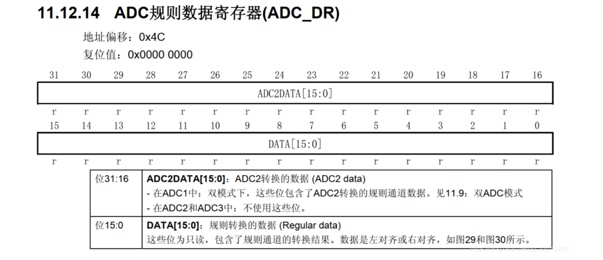
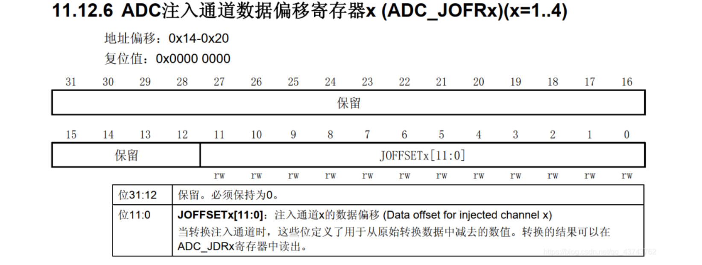
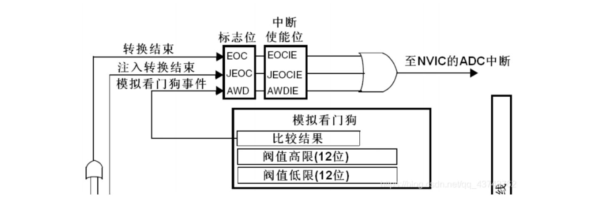
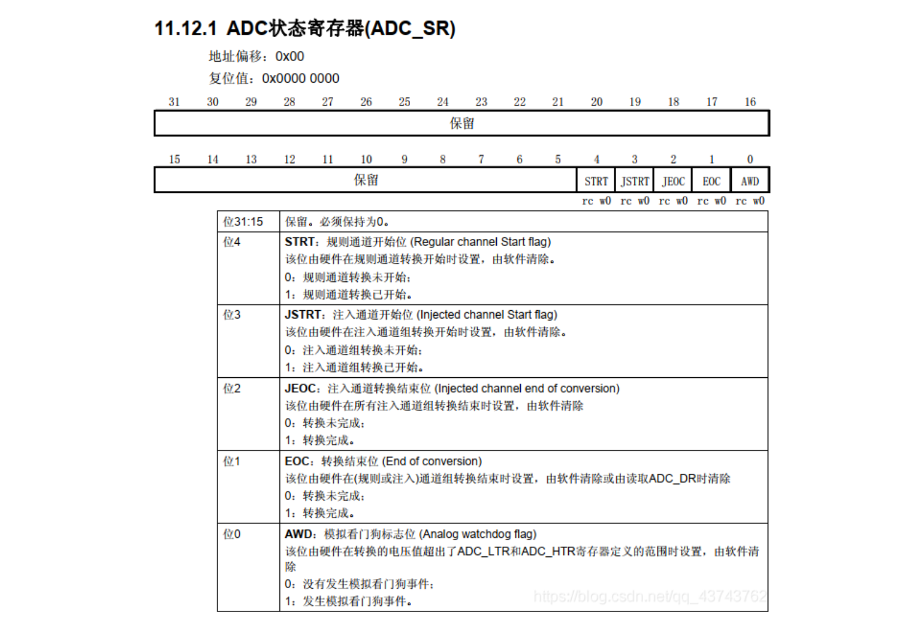

# STM32 ADC模块

## 一、ADC简介

​	==ADC==是**Analog-to-Digital Converter**的缩写，指**模/数转换器**。ADC是指将连续变化的**模拟信号**转换为**离散的数字信号**的器件。

​	一句话说明：<u>ADC就是数模转换，将模拟量转换为数字量</u>；

​	**STM32F103**系列有**3个ADC**，精度为**12位**，每个**ADC**最多有**16个外部通道**。其中ADC1和ADC2都有16个外部通道，ADC3一般有8个外部通道，各通道的A/D转换可以单次、连续、扫描或间断执行，ADC转换的结果可以左对齐或右对齐储存在16位数据寄存器中。ADC的输入时钟不得超过14MHz，其时钟频率由PCLK2分频产生。

​	


## 二、ADC功能框图

​	STM中ADC外设的功能框图，如下：


​	功能框图可以大体分为7部分：

### 2.1 电压输入范围

  ADC所能测量的电压范围就是**VREF- ≤ VIN ≤ VREF+**，把 VSSA 和 VREF-接地，把 VREF+和 VDDA 接 3V3，得到ADC 的输入电压范围为：**0~3.3V**。

---

### 2.2 工作模式

- ==ADC单通道==：
    - 要求进行==一次ADC转换==：配置为**单次模式使能，扫描模式失能**。这样ADC的这个通道，转换一次后，就停止转换。
    - 要求进行==连续ADC转换==：配置为**连续模式使能，扫描模式失能**。这样ADC的这个通道，转换一次后，接着进行下一次转换，不断连续。
- ==ADC多通道==：
    - 要求进行==一次ADC转换==：配置为**单次模式使能，扫描模式使能**。这样ADC的多个通道，按照配置的**顺序依次转换一次**后，就停止转换。
    - 要求进行==连续ADC转换==：配置为**连续模式使能，扫描模式使能**。这样ADC的多个通道，按照配置的**顺序依次转换一次**后，**接着进行下一次**转换，不断连续。
    - <u>扫描模式只在多通道的条件下有效，来使得各个通道**按照配置循序依次转换**</u>。而单次模式无论在单通道还是多通道下只对这些或者这个通道进行一次转换，连续模式无论是在单通道还是多通道下都对这些或者这个通道不断进行连续的转换。

---

### 2.3  输入通道

  ADC的信号输入就是通过[通道](https://so.csdn.net/so/search?q=通道&spm=1001.2101.3001.7020)来实现的，信号通过通道输入到单片机中，单片机经过转换后，将模拟信号输出为数字信号。STM32中的ADC有着18个通道，其中外部的16个通道已经在框图中标出，如下：


​	这**16个通道**对应着不同的**IO口**，此外ADC1/2/3 还有**内部通道**：ADC1 的**通道 16** 连接到了芯片内部的**温度传感器**， **Vrefint 连接到了通道 17**。ADC2 的模拟通道 **16 和 17 连接到了内部的 VSS**。

​	ADC的全部通道如下图所示：

​	:star:==注意==：使用的时候要，先配置好GPIO，然后根据自己使用的ADC与GPIO到这里对照，到底开启ADC的哪个通道。必须要求GPIO与ADC的通道是对应的；


​	**外部的16个通道**在转换时又分为==规则通道==和==注入通道==，其中**规则通道**最多有**16路**，**注入通道**最多有**4路**（注入通道貌似使用不多），下面简单介绍一下两种通道：

- **规则通道**顾名思义就是，最**平常**的通道、也是最**常用**的通道，**平时的ADC转换**都是用规则通道实现的。
- **注入通道**是相对于规则通道的，注入通道可以在规则通道转换时，强行插入转换，相当于一个“**中断通道**”吧。<u>当有注入通道需要转换时，规则通道的转换会停止，优先执行注入通道的转换，当注入通道的转换执行完毕后，再回到之前规则通道进行转换</u>。

​	 知道了ADC的转换通道后，**如果ADC**只使用**一个通道**来转换，那就很简单，但如果是使用**多个通道进行转换**就涉及到一个**先后顺序**了，毕竟规则转换通道**只有一个数据寄存器**。多个通道的使用顺序分为俩种情况：**规则通道**的转换顺序和**注入通道**的转换顺序：

- **规则通道中的转换顺序**由三个寄存器控制：**SQR1、SQR2、SQR3**，它们都是32位寄存器。**SQR寄存器**控制着<u>转换通道的数目和转换顺序</u>，只要在对应的寄存器位SQx中写入相应的通道，这个通道就是第x个转换。具体的对应关系如下：


​	通过**SQR1寄存器**就能了解其转换顺序在寄存器上的实现了：


---

### 2.4 触发源

​	ADC转换的**输入、通道、转换顺序**都已经说明了，但ADC转换是怎么触发的呢？就像通信协议一样，都要规定一个起始信号才能传输信息，ADC也需要一个触发信号来实行模/数转换。

​	其一就是通过**直接配置寄存器触发**（软件触发），通过配置控制寄存器CR2的ADON位，<u>写1时开始转换，写0时停止转换</u>。在程序运行过程中只要调用库函数，将**CR2寄存器的ADON位置1**就可以进行转换，比较好理解。

​	另外，还可以通过内部**定时器**或者**外部IO触发**转换（外部事件触发），也就是说可以利用**内部时钟让ADC进行周期性的转换**，也可以利用**外部IO使ADC在需要时转换**，具体的触发由控制寄存器CR2决定。


​	在[参考手册](https://mp.weixin.qq.com/s?__biz=MzI1MDg4OTMwMw==&mid=2247490769&idx=2&sn=28049cab8dffcb5b4ce2cdc4c1136b91&chksm=e9fa09e9de8d80ff963270c66c976ad9de746b833d253a3a5fef386e83cbe45588aee4919cd1&token=475123526&lang=zh_CN&scene=21#wechat_redirect)中可以找到，ADC_CR2寄存器的详情如下：


​	                                        

---

### 2.5 转化时间

​	还有一点，就是**转化时间**的问题，<u>ADC的每一次信号转换都要时间，这个时间就是==转化时间==</u>，转换时间由==采样时间==与==转换时间==组成，这些时间都与**ADC的时钟**有关；

​	先看**ADC的时钟**：由于**ADC**在STM32中是挂载在**APB2总线**上的，所以ADC得时钟是由PCLK2（72MHz）经过分频得到的，分频因子由 RCC 时钟配置寄存器RCC_CFGR 的位 15:14 ADCPRE[1:0]设置，可以是 2/4/6/8 分频，一般配置**分频因子为8**，即8分频得到**ADC的输入时钟频率为9MHz**。即 ADCCLK = 1/9MHz

​	==采样时间==是可以配置的，配置采样周期可以确定<u>使用多少个**ADC时钟周期**来对电压进行采样</u>，采样的周期数可通过 ADC采样**时间寄存器 ADC_SMPR1 和 ADC_SMPR2**中的 SMP[2:0]位设置，ADC_SMPR2 控制的是通道 0~9， ADC_SMPR1 控制的是通道 10~17。每个通道可以配置不同的采样周期，但最小的采样周期是1.5个周期，也就是说如果想最快时间采样就设置采样周期为1.5；当然还可以配置为别的更大的周期来采样；

​	==转换时间==取决于转换的精度（也就是ADC转换后的位数），精度越高，转换时间越长：

|  精度  |   转换时间    |
| :----: | :-----------: |
| 12bits | 12.5 * ADCCLK |
| 10bits | 11.5 * ADCCLK |
| 8bits  | 9.5 * ADCCLK  |
| 6bits  | 7.5 * ADCCLK  |

​	那么如果我们使用12bits的精度，转化时间为：
$$
转化时间=采样时间+12.5ADCCLK
$$
​    12.5个周期是固定的，一般我们设置 PCLK2=72M，经过 ADC 预分频器能分频到最大的时钟只能是 12M，采样周期设置为 1.5 个周期，算出最短的转换时间为 (1.5 + 12.5)/12M = 1.17us。

---

### 2.6 数据寄存器

​	转换完成后的数据就存放在==数据寄存器==中，但数据的存放也分为**规则通道转换数据**和**注入通道转换数据**的。

- **规则数据寄存器**负责存放规则通道转换的数据，通过32位寄存器ADC_DR来存放：

    

    ​	当使用ADC独立模式（也就是只使用一个ADC，可以使用多个通道）时，数据存放在低16位中，当使用ADC多模式时高16位存放ADC2的数据。需要注意的是ADC转换的精度是12位，而寄存器中有16个位来存放数据，所以要规定数据存放是左对齐还是右对齐。

    ​	当使用多个通道转换数据时，会产生多个转换数据，然鹅数据寄存器只有一个，多个数据存放在一个寄存器中会覆盖数据导致ADC转换错误，所以我们经常在一个通道转换完成之后就立刻将数据取出来，方便下一个数据存放。一般开启DMA模式将转换的数据，传输在一个数组中，程序对数组读操作就可以得到转换的结果。

-  **注入通道转换**的数据寄存器有4个，由于注入通道最多有4个，所以注入通道转换的数据都有固定的存放位置，不会跟规则寄存器那样产生数据覆盖的问题。ADC_JDRx 是 32 位的，低 16 位有效，高 16 位保留，数据同样分为左对齐和右对齐，具体是以哪一种方式存放，由ADC_CR2 的 11 位 ALIGN 设置。
             

---

### 2.7 中断



​	从框图中可以知道数据转换完成之后可以产生中断，有三种情况：

- **规则通道数据转换完成之后**，可以产生一个中断，可以在中断函数中读取规则数据寄存器的值。这也是单通道时读取数据的一种方法。
- **注入通道数据转换完成之后**，可以产生一个中断，并且也可以在中断中读取注入数据寄存器的值，达到读取数据的作用。
- **当输入的模拟量（电压）不再阈值范围内**就会产生看门狗事件，就是用来监视输入的模拟量是否正常。

​	以上中断的配置都由ADC_SR寄存器决定：



---

### 2.8 电压转换

​	要知道，转换后的数据是**一个12位的二进制数**，我们需要把这个二进制数代表的模拟量（电压）用数字表示出来。比如测量的电压范围是0~3.3V，转换后的二进制数是x，因为12位ADC在转换时将电压的范围大小（也就是3.3）分为4096（2^12）份，所以转换后的二进制数x代表的真实电压的计算方法就是：
$$
y=3.3* x / 4096
$$

---


## 三、ADC 配置函数

### 3.1 ADC_DeInit()

​	设置ADC为默认值，一般在开始配置之前调用；

````c
void ADC_DeInit(ADC_TypeDef* ADCx);
// 使用举例：
ADC_DeInit(ADC1);
````

---

### 3.2 ADC_Init()

​	配置ADC的函数，很重要，当然跟之前一样，先看其初始化结构体：

````c
typedef struct
{
	uint32_t ADC_Mode; // ADC 工作模式选择
 	FunctionalState ADC_ScanConvMode; // ADC 扫描（多通道）或者单次（单通道）模式选择 
 	FunctionalState ADC_ContinuousConvMode; // ADC 单次转换或者连续转换选择
	uint32_t ADC_ExternalTrigConv; // ADC 转换触发信号选择
	uint32_t ADC_DataAlign; // ADC 数据寄存器对齐格式
	uint8_t ADC_NbrOfChannel; // ADC 采集通道数
} ADC_InitTypeDef;
````

- :one:**ADC_Mode**：ADC的模式，有10个参数选择：

    - **ADC_Mode_Independent**：独立模式，双ADC不能同步，每个ADC接口独立工作，现在我只懂这个模式；           
    - ADC_Mode_RegInjecSimult               
    - ADC_Mode_RegSimult_AlterTrig            
    - ADC_Mode_InjecSimult_FastInterl      
    - ADC_Mode_InjecSimult_SlowInterl           
    - ADC_Mode_InjecSimult                   
    - ADC_Mode_RegSimult                         
    - ADC_Mode_FastInterl                       
    - ADC_Mode_SlowInterl                      
    - ADC_Mode_AlterTrig                

- :two:**ADC_ScanConvMode**：配置扫描或单次，具体见[2.4 工作模式]()；

    - **ENABLE**：设置扫描模式，只有多通道才有意义；
    - **DISABLE**：设置单次模式；

- :three:**ADC_ContinuousConvMode**：配置单次或连续转换；

    - **ENABLE**：设置连续转换，ADC 不断进行采样；
    - **DISABLE**：设置单次转换；

- :four:**ADC_ExternalTrigConv**：选择ADC的触发源，有很多触发源，各个选择的意义见[2.4 触发源]()：

    - ADC_ExternalTrigConv_T1_CC1
    - ADC_ExternalTrigConv_T1_CC2
    - ADC_ExternalTrigConv_T2_CC2 
    - ADC_ExternalTrigConv_T3_TRGO
    - ADC_ExternalTrigConv_T4_CC4         
    - ADC_ExternalTrigConv_Ext_IT11_TIM8_TRGO

    - ADC_ExternalTrigConv_T1_CC3 
    - ADC_ExternalTrigConv_None

    - ADC_ExternalTrigConv_T3_CC1
    -  ADC_ExternalTrigConv_T2_CC3 
    - ADC_ExternalTrigConv_T8_CC1 
    - ADC_ExternalTrigConv_T8_TRGO 
    - ADC_ExternalTrigConv_T5_CC1 
    - ADC_ExternalTrigConv_T5_CC3

- :five:**ADC_DataAlign**：设置数据对齐方式，因为保存ADC的寄存器是16bits，但是ADC分辨率为12bits

    - **ADC_DataAlign_Right**：右对齐；
    - **ADC_DataAlign_Left**：左对齐；

- :six:**ADC_NbrOfChannel**：打算开启的ADC通道数量；

​	配置好这些之后就可以使用初始化函数了；

````c
void ADC_Init(ADC_TypeDef* ADCx, ADC_InitTypeDef* ADC_InitStruct);
````

---


### 3.3  ADC_RegularChannelConfig()

​	刚刚的结构体没有选择具体要使用哪个通道，而这个函数就是来配置通道的，会分析一下它的参数：

````c
void ADC_RegularChannelConfig(ADC_TypeDef* ADCx, uint8_t ADC_Channel, uint8_t Rank, uint8_t ADC_SampleTime)
````

- :one:**ADCx**：要配置的是哪个ADC：ADC1、ADC2、ADC3；
- :two:**ADC_Channel**：要配置的是哪个通道，每个ADC有16个通道，所以这里有16个选项：
    - **ADC_Channel_x**：x从1到16，表示配置第x个通道，再次提醒，通道不可以乱选，对照[2.3 输入通道]();
- :three:**Rank**：主要用于多路ADC时，必须是从1到16的整数，表明配置的这个通道在 DMA 传输过程的读取顺序；
    - 比如这样，配置 通道1 Rank为1，通道2 为2，那么我们使用 DMA 时，会把通道1读取的数据放入内存数字的第一个元素，通道2是第二个；
- :four:**ADC_SampleTime**：采样时间，可以选择，详细的计算参考[2.5 转化时间]()；
    - **ADC_SampleTime_1Cycles5**：一次ADC读取用时 1.5 个 ADC周期；
    - **ADC_SampleTime_7Cycles5**：一次ADC读取用时 7.5 个 ADC周期；
    - **ADC_SampleTime_13Cycles5**：一次ADC读取用时 13.5 个 ADC周期；
    - **ADC_SampleTime_28Cycles5**：一次ADC读取用时 28.5 个 ADC周期；
    - **ADC_SampleTime_41Cycles5**：一次ADC读取用时 41.5 个 ADC周期；
    - **ADC_SampleTime_55Cycles5**：一次ADC读取用时 55.5 个 ADC周期；
    - **ADC_SampleTime_71Cycles5**：一次ADC读取用时 71.5 个 ADC周期；
    - **ADC_SampleTime_239Cycles5**：一次ADC读取用时 239.5 个 ADC周期；

---


### 3.4 ADC_ITConfig()

​	用来配置 ADC 的中断的函数，下面介绍一下其参数；

````c
void ADC_ITConfig(ADC_TypeDef* ADCx, uint16_t ADC_IT, FunctionalState NewState);
````

- :one:**ADCx**：ADC1, ADC2, ADC3；
- :two:**ADC_IT**：设置 ADC 在什么时刻触发中断；
    - **ADC_IT_EOC**：End of conversion interrupt mask，结束一次读取后发生中断；
    - **ADC_IT_AWD**: Analog watchdog interrupt mask，模拟看门狗中断，不太理解；
    - **ADC_IT_JEOC**: End of injected conversion interrupt mask，没看懂；
- :three:**NewState**：设置使能还是失能；

---


### 3.5 ADC_Cmd()

​	使/失能 ADC，不多解释；

````c
void ADC_Cmd(ADC_TypeDef* ADCx, FunctionalState NewState)
````

---


### 3.6 ADC_SoftwareStartConvCmd()

​	有时我们不希望 ADC 一直运转，只需要在特定时间采集，比如按下一个按键进入中断控制函数；这个函数就可以实现这一点，我们调用一次，ADC 就会读取一次数据。

​	但是这是有前提的：

- 首先，我们的ADC配置时肯定就不可以是连续采样，即把 ADC_ContinuousConvMode 设为 DISABLE，采集一次就停止；
- 并且要设置 ADC_ExternalTrigConv 为 ADC_ExternalTrigConv_None，表示不使用外部中断源；

````c
void ADC_SoftwareStartConvCmd(ADC_TypeDef* ADCx, FunctionalState NewState);
````

- 当传入 **ENABLE** ，会设置 ADC 控制寄存器的某个位，ADC就会开始采样，但之后硬件会立刻将其设回原值；那么如果我们设置的是单次模式，采样一次完成后就会停止；
- 当传入 **DISABLE**，会禁止外部事件触发（没看懂）；

​	总之，这个函数可以作为一个开关，调用一次 ADC 就会采集一次信号；

---


## 四、ADC使用情景1

​	以下的例子是ADC的简单使用，即不断读取某个ADC值，并且设置一个中断函数，每次读取就进入中断函数获取这个值

---

### 3.1 引脚配置函数

​	 首先配置相应的GPIO引脚，毕竟模拟信号是通过GPIO引脚传输到开发板的，注意的是，引脚的模式一定要是模拟输入！这里使用的是 **GPIOC_1**；

````c
void ADC_GPIO_Config(void)
{
    // 就简单的配置一个GPIO，只是模式必须为模拟输入，其他没什么特别的
	GPIO_InitTypeDef   GPIO_InitStruct;
	RCC_APB2PeriphClockCmd(RCC_APB2Periph_GPIOC,  ENABLE);
	GPIO_InitStruct.GPIO_Pin = GPIO_Pin_1;
    //必须是模拟输入
	GPIO_InitStruct.GPIO_Mode = GPIO_Mode_AIN;
	GPIO_Init(GPIOC , &GPIO_InitStruct);	
}
````

​	配置引脚就是老套路：声明结构体变量、开启时钟、写入结构体、初始化GPIO。

---

### 3.2 NVIC配置函数

​	 因为我们是在转换完成后利用中断，在中断函数中读取数据，所以要首先配置中断函数的优先级，因为程序中只有这一个中断，所以优先级的配置就比较随意。

​	那么如果不使用ADC中断的话，就不需要这一步；

````c
void ADC_NVIC_Config(void)
{
	NVIC_InitTypeDef NVIC_InitStruct ;
	/* 配置中断优先级分组(设置抢占优先级和子优先级的分配)，在函数在misc.c */
	NVIC_PriorityGroupConfig(NVIC_PriorityGroup_1) ;
	/* 配置初始化结构体 在misc.h中 */
	/* 配置中断源 在stm32f10x.h中 */
	NVIC_InitStruct.NVIC_IRQChannel = ADC1_2_IRQn ;
	/* 配置抢占优先级 */
	NVIC_InitStruct.NVIC_IRQChannelPreemptionPriority = 1 ;
	/* 配置子优先级 */
	NVIC_InitStruct.NVIC_IRQChannelSubPriority = 1 ;
	/* 使能中断通道 */
	NVIC_InitStruct.NVIC_IRQChannelCmd = ENABLE ;
	/* 调用初始化函数 */
	NVIC_Init(&NVIC_InitStruct) ;
}
````

---

### 3.3 ADC配置函数

​	ADC的配置函数是ADC的精髓，在这个函数中包含的内容有：ADC的初始化结构体配置、配置了时钟分频、配置了通道转换顺序、打开转换中断、进行校准、软件触发ADC采集等。

​	函数中都有详细的注释：

````c
void ADC_Config(void)
{
 	ADC_InitTypeDef  ADC_InitStruct;
  	RCC_APB2PeriphClockCmd(RCC_APB2Periph_ADC1,  ENABLE);
    /* 配置ADC时钟为6分频，即12M */
  	RCC_ADCCLKConfig(RCC_PCLK2_Div6);
	/* 配置初始化结构体，详情见头文件 */
    ADC_InitStruct.ADC_Mode = ADC_Mode_Independent; //只使用一个ADC，独立模式
    ADC_InitStruct.ADC_ScanConvMode = DISABLE; //禁止扫描模式
  	ADC_InitStruct.ADC_ContinuousConvMode = ENABLE; // 连续转换模式，会不断读取ADC信号
  	ADC_InitStruct.ADC_DataAlign = ADC_DataAlign_Right; // 右对齐存储
  	ADC_InitStruct.ADC_ExternalTrigConv = ADC_ExternalTrigConv_None; //不使用外部触发源
  	ADC_InitStruct.ADC_NbrOfChannel = 1; //一个通道
  	ADC_Init(ADC1, &ADC_InitStruct);
	/* 配置ADC通道转换顺序和时间 */
    // 使用ADC1，并且查到PC1对应的是11通道，去查前面的表
 	 ADC_RegularChannelConfig(ADC1, ADC_Channel_11, 1, ADC_SampleTime_55Cycles5);
	/* 配置为转换结束后产生中断 在中断中读取信息，即读一个就产生一个中断 */
  	ADC_ITConfig(ADC1, ADC_IT_EOC, ENABLE);
	/* 开启ADC，进行转换 */
  	ADC_Cmd(ADC1, ENABLE);
	/* 重置ADC校准 */
  	ADC_ResetCalibration(ADC1);
	/* 等待初始化完成 */
	while(ADC_GetResetCalibrationStatus(ADC1));
	/* 开始校准 */
    ADC_StartCalibration(ADC1);
	/* 等待校准完成 */
	while (ADC_GetCalibrationStatus(ADC1));
	/* 软件触发ADC转换 */
  	ADC_SoftwareStartConvCmd(ADC1, ENABLE);
}
````

---

### 3.4 中断函数

​	在中断函数中进行读取数据，将数据存放在变量result中

````c
extern uint16_t resurt;
void ADC1_2_IRQHandler(void)
{
	/* 判断产生中断请求 */
	if(ADC_GetITStatus(ADC1, ADC_IT_EOC) == SET)
	{
    	resurt = ADC_GetConversionValue(ADC1);
		/* 清除中断标志 */
  		ADC_ClearITPendingBit(ADC1, ADC_IT_EOC);
	}
}
````

---

### 3.5 完整代码

​	读取周期信号，估算最大峰峰值，重点参考配置过程就好；

````c
#include "stm32f10x.h"

#define NUMS 4
#define TIMES 500
int time = 0;
int num = 0;
uint16_t current_vol = 0;
uint16_t max_vol = 0;
uint16_t amps[NUMS];


void ADC_GPIO_Config(void)
{
	GPIO_InitTypeDef   GPIO_InitStruct;
	RCC_APB2PeriphClockCmd(RCC_APB2Periph_GPIOC,  ENABLE);
	GPIO_InitStruct.GPIO_Pin = GPIO_Pin_0;
	GPIO_InitStruct.GPIO_Mode = GPIO_Mode_AIN;
	GPIO_Init(GPIOC , &GPIO_InitStruct);	
}

void ADC_NVIC_Config(void)
{
	NVIC_InitTypeDef NVIC_InitStruct ;
	NVIC_PriorityGroupConfig(NVIC_PriorityGroup_1) ;
	NVIC_InitStruct.NVIC_IRQChannel = ADC1_2_IRQn ;
	NVIC_InitStruct.NVIC_IRQChannelPreemptionPriority = 1 ;
	NVIC_InitStruct.NVIC_IRQChannelSubPriority = 1 ;
	NVIC_InitStruct.NVIC_IRQChannelCmd = ENABLE ;
	NVIC_Init(&NVIC_InitStruct) ;
}

void ADC_Config(void)
{
 	ADC_InitTypeDef  ADC_InitStruct;
  	RCC_APB2PeriphClockCmd(RCC_APB2Periph_ADC1,  ENABLE);
  	RCC_ADCCLKConfig(RCC_PCLK2_Div6);
    ADC_InitStruct.ADC_Mode = ADC_Mode_Independent; 
    ADC_InitStruct.ADC_ScanConvMode = DISABLE;
  	ADC_InitStruct.ADC_ContinuousConvMode = ENABLE;
  	ADC_InitStruct.ADC_DataAlign = ADC_DataAlign_Right; 
  	ADC_InitStruct.ADC_ExternalTrigConv = ADC_ExternalTrigConv_None ; 
  	ADC_InitStruct.ADC_NbrOfChannel = 1;
  	ADC_Init(ADC1, &ADC_InitStruct);

 	ADC_RegularChannelConfig(ADC1, ADC_Channel_10, 1, ADC_SampleTime_55Cycles5);
  	ADC_ITConfig(ADC1, ADC_IT_EOC,ENABLE);
  	ADC_Cmd(ADC1, ENABLE);
  	ADC_ResetCalibration(ADC1);
	while(ADC_GetResetCalibrationStatus(ADC1)){}
    ADC_StartCalibration(ADC1);
	while (ADC_GetCalibrationStatus(ADC1)){}
  	ADC_SoftwareStartConvCmd(ADC1, ENABLE);
}

double ample;
void ADC1_2_IRQHandler(void)
{
	int j;
	uint32_t sum = 0;
	if (ADC_GetITStatus(ADC1, ADC_IT_EOC) == SET)
	{
		 ADC_ClearITPendingBit(ADC1, ADC_IT_EOC);
		current_vol = ADC_GetConversionValue(ADC1);
		if (max_vol < current_vol)
				max_vol = current_vol;
		
		if (++time == TIMES)
		{
			amps[num++] = max_vol;
			max_vol = 0;
			time = 0;
		}
		
		if (num == NUMS)
		{
			// average
			for (j = 0; j < NUMS; ++j)
			{
				sum += amps[j];
			}
			
			ample = (sum / NUMS) * 3.3 / 0xFFF;
			num = 0;
			return;
		}
	}
}

int main()
{
	ADC_GPIO_Config();
	ADC_NVIC_Config();
	ADC_Config();
	
	while(1){}
		
	return 0;
}
````


## 五、ADC使用情景2

​	这里我们用高级的用法，用TIM来控制ADC读取的间隔，并且让DMA自动把读取的数值保存到内存中，不需要花费CPU去执行读取ADC的操作；

---

### 4.1 引脚配置

​	跟之前的一样，就是配置一个GPIO而已，这里使用的是PB0；

````c
void GPIO_config(void)
{
    // 就简单的配置一个GPIO，只是模式必须为模拟输入，其他没什么特别的
	GPIO_InitTypeDef   GPIO_InitStruct;
	RCC_APB2PeriphClockCmd(RCC_APB2Periph_GPIOB,  ENABLE);
	GPIO_InitStruct.GPIO_Pin = GPIO_Pin_0;
    //必须是模拟输入
	GPIO_InitStruct.GPIO_Mode = GPIO_Mode_AIN;
	GPIO_Init(GPIOB , &GPIO_InitStruct);	
}
````

---

### 4.2 ADC配置

​	这里就有与三中不同的地方了，详见注释，需要注意的地方有：

- 需要关闭ADC的连续采样模式；
- 设置ADC的外部触发源为计时器，具体的各种外部触发源见[2.4 触发源]()

````c
void ADC_config(void)
{
    RCC_ADCCLKConfig(RCC_PCLK2_Div6);
	ADC_InitTypeDef ADC_InitStructure;
    
    // 开启时钟，ADC1在APB2上
    RCC_APB2PeriphClockCmd(RCC_APB2Periph_ADC1, ENABLE );
    
    // 恢复ADC1的默认值
	ADC_DeInit(ADC1); 

    // 独立模式，ADC1只有一个通道读取数据
	ADC_InitStructure.ADC_Mode = ADC_Mode_Independent;	
    // 关闭扫描模式
	ADC_InitStructure.ADC_ScanConvMode = DISABLE;	
    // 关闭连续采样，这与三不同，因为我们这里使用计数器控制ADC的采样
	ADC_InitStructure.ADC_ContinuousConvMode = DISABLE;	
    // 设置ADC的触发源为TIM2
	ADC_InitStructure.ADC_ExternalTrigConv = ADC_ExternalTrigConv_T2_CC2;	
    // 右对齐
	ADC_InitStructure.ADC_DataAlign = ADC_DataAlign_Right;
    // 只有一个通道
	ADC_InitStructure.ADC_NbrOfChannel = 1;		
    // 初始化
	ADC_Init(ADC1, &ADC_InitStructure);		
    // 通道配置，注意对应2.3 中的表格，ADC1的8号通道是GPIOB_0
	ADC_RegularChannelConfig(ADC1,ADC_Channel_8,1,ADC_SampleTime_1Cycles5);
}
````

---

### 4.3 DMA配置

​	DMA还没学，这里就先列出几个重要的地方

````c
void DMA_config(void* addr, uint16_t len)
{
    RCC_AHBPeriphClockCmd(RCC_AHBPeriph_DMA1,ENABLE);		
    
    // 这里选择DMA从哪里读取数据，读取ADC1->DR寄存器，就是2.6中说的数据寄存器
	DMA_InitStructure.DMA_PeripheralBaseAddr = (u32)&(ADC1->DR);		
    // 这里选择DMA把数据放在哪里，这个地址我们可以自己选，一般是一个数组的第一个元素的地址
    // DMA开始会把数据搬到这样，之后每次都搬到上一次的下/上一个元素上，把数组填满
	DMA_InitStructure.DMA_MemoryBaseAddr = (u32)addr;	
    // DMA转移方向：从外设到内存
	DMA_InitStructure.DMA_DIR = DMA_DIR_PeripheralSRC;	
    // DMA搬数据的次数，一般设定为数组的大小，这样就可以刚好填满一个数组；
	DMA_InitStructure.DMA_BufferSize = len;								
	DMA_InitStructure.DMA_PeripheralInc = DMA_PeripheralInc_Disable;  	
	DMA_InitStructure.DMA_MemoryInc = DMA_MemoryInc_Enable;  	
    // 数据宽度：半字，16bits
	DMA_InitStructure.DMA_PeripheralDataSize = DMA_PeripheralDataSize_HalfWord; 
	DMA_InitStructure.DMA_MemoryDataSize = DMA_MemoryDataSize_HalfWord;
	DMA_InitStructure.DMA_Mode = DMA_Mode_Circular;						
	DMA_InitStructure.DMA_Priority = DMA_Priority_Medium;				
	DMA_InitStructure.DMA_M2M = DMA_M2M_Disable;						
	DMA_Init(DMA1_Channel1,&DMA_InitStructure);		
}
````

---

### 4.4 NVIC配置

​	当DMA搬完了规定数量的数据，我们希望去处理他们，这就需要使用中断

````c
void NVIC_config()
{
    // 中断源
	NVIC_InitStructure.NVIC_IRQChannel = DMA1_Channel1_IRQn;  	
	NVIC_InitStructure.NVIC_IRQChannelPreemptionPriority = 1;  
	NVIC_InitStructure.NVIC_IRQChannelSubPriority = 3;  	
	NVIC_InitStructure.NVIC_IRQChannelCmd = ENABLE; 			
	NVIC_Init(&NVIC_InitStructure);  
    
    // 设置 DMA，读完数据后就进入中断
    DMA_ITConfig(DMA1_Channel1,DMA1_IT_TC1,ENABLE);			
    
    // 这里看不是很懂
    ADC_DMACmd(ADC1,ENABLE);				
	ADC_Cmd(ADC1, ENABLE);						
	ADC_ResetCalibration(ADC1);					
	while(ADC_GetResetCalibrationStatus(ADC1));
	ADC_StartCalibration(ADC1);	 			
	while(ADC_GetCalibrationStatus(ADC1));	 	
	DMA_Cmd(DMA1_Channel1,ENABLE);				
	ADC_ExternalTrigConvCmd(ADC1,ENABLE);	
}
````

---

### 4.5 TIM配置

​	要使用TIM来控制ADC采样间隔，当然需要用到TIM了；

````c
// 两参数，一个是周期，一个是分频
void TIM2_config(u16 Period,u16 Prescaler)
{
	TIM_TimeBaseInitTypeDef  TIM_TimeBaseStructure;
	TIM_OCInitTypeDef TIM_OCInitStructure;
	RCC_APB1PeriphClockCmd(RCC_APB1Periph_TIM2,ENABLE);			
	
    // 设置分频，对系统时钟72MHz分
	TIM_TimeBaseStructure.TIM_Prescaler = Prescaler-1;	
    // 计数周期
	TIM_TimeBaseStructure.TIM_Period = Period-1;	
    // TIM计时间隔的计算小例子：
    // 比如Prescaler = 72, Period = 1000
    // 那么现在TIM时钟为 1MHz，间隔1000算计时一次，那么每次间隔就是 1ms
    
    // 上升计数
	TIM_TimeBaseStructure.TIM_CounterMode = TIM_CounterMode_Up;		
	TIM_TimeBaseStructure.TIM_ClockDivision = TIM_CKD_DIV1;			
	TIM_TimeBaseInit(TIM2,&TIM_TimeBaseStructure);				

    // 后面看不很懂
	TIM_OCInitStructure.TIM_OCMode = TIM_OCMode_PWM1;				
	TIM_OCInitStructure.TIM_OutputState = TIM_OutputState_Enable;	
	TIM_OCInitStructure.TIM_Pulse = Period/2;					
	TIM_OCInitStructure.TIM_OCPolarity = TIM_OCPolarity_Low;		
	TIM_OC2Init(TIM2, & TIM_OCInitStructure);				
	
	TIM_Cmd(TIM2,ENABLE);										
	TIM_InternalClockConfig(TIM2);							
	TIM_OC2PreloadConfig(TIM2, TIM_OCPreload_Enable);		
	TIM_UpdateDisableConfig(TIM2, DISABLE);
}
````

---

### 4.6 中断函数

​	现在配置好了，来编写中断函数，也即当ADC读取完规定数量的数据时候，进入这个函数

````c
void DMA1_Channel1_IRQHandler(void)
{
	if(DMA_GetITStatus(DMA1_IT_TC1)!=RESET)			
	{
		// 数据处理
		
		DMA_ClearITPendingBit(DMA1_IT_TC1);
    }
}
````

---

### 4.7 完整代码

````c
#include "stm32f10x.h"

// 读取32个数据
#define N 32
uint16_t AD_data[N];


void ADC_config(void)
{ 	
	ADC_InitTypeDef ADC_InitStructure; 
	NVIC_InitTypeDef NVIC_InitStructure;
	GPIO_InitTypeDef GPIO_InitStructure;
	DMA_InitTypeDef DMA_InitStructure;
	
	RCC_APB2PeriphClockCmd(RCC_APB2Periph_GPIOB |RCC_APB2Periph_ADC1, ENABLE );	
	RCC_AHBPeriphClockCmd(RCC_AHBPeriph_DMA1,ENABLE);		
	RCC_ADCCLKConfig(RCC_PCLK2_Div6);
	            
	GPIO_InitStructure.GPIO_Pin = GPIO_Pin_0;
	GPIO_InitStructure.GPIO_Mode = GPIO_Mode_AIN;		
	GPIO_Init(GPIOB, &GPIO_InitStructure);			
	
	
	ADC_DeInit(ADC1); 

	ADC_InitStructure.ADC_Mode = ADC_Mode_Independent;	
	ADC_InitStructure.ADC_ScanConvMode = DISABLE;		
	ADC_InitStructure.ADC_ContinuousConvMode = DISABLE;	
	ADC_InitStructure.ADC_ExternalTrigConv = ADC_ExternalTrigConv_T2_CC2;	
	ADC_InitStructure.ADC_DataAlign = ADC_DataAlign_Right;			
	ADC_InitStructure.ADC_NbrOfChannel = 1;								
	ADC_Init(ADC1, &ADC_InitStructure);									
	ADC_RegularChannelConfig(ADC1,ADC_Channel_8,1,ADC_SampleTime_1Cycles5);
	
	
	DMA_InitStructure.DMA_PeripheralBaseAddr = (u32)&(ADC1->DR);		
	DMA_InitStructure.DMA_MemoryBaseAddr = (u32)&AD_Data[0];			
	DMA_InitStructure.DMA_DIR = DMA_DIR_PeripheralSRC;					
	DMA_InitStructure.DMA_BufferSize = N;								
	DMA_InitStructure.DMA_PeripheralInc = DMA_PeripheralInc_Disable;  	
	DMA_InitStructure.DMA_MemoryInc = DMA_MemoryInc_Enable;  			
	DMA_InitStructure.DMA_PeripheralDataSize = DMA_PeripheralDataSize_HalfWord; 
	DMA_InitStructure.DMA_MemoryDataSize = DMA_MemoryDataSize_HalfWord;
	DMA_InitStructure.DMA_Mode = DMA_Mode_Circular;						
	DMA_InitStructure.DMA_Priority = DMA_Priority_Medium;				
	DMA_InitStructure.DMA_M2M = DMA_M2M_Disable;						
	DMA_Init(DMA1_Channel1,&DMA_InitStructure);							


	NVIC_InitStructure.NVIC_IRQChannel = DMA1_Channel1_IRQn;  	
	NVIC_InitStructure.NVIC_IRQChannelPreemptionPriority = 1;  
	NVIC_InitStructure.NVIC_IRQChannelSubPriority = 3;  	
	NVIC_InitStructure.NVIC_IRQChannelCmd = ENABLE; 			
	NVIC_Init(&NVIC_InitStructure);  							
	DMA_ITConfig(DMA1_Channel1,DMA1_IT_TC1,ENABLE);				
	
	ADC_DMACmd(ADC1,ENABLE);				
	ADC_Cmd(ADC1, ENABLE);						
	ADC_ResetCalibration(ADC1);					
	while(ADC_GetResetCalibrationStatus(ADC1));
	ADC_StartCalibration(ADC1);	 			
	while(ADC_GetCalibrationStatus(ADC1));	 	
	DMA_Cmd(DMA1_Channel1,ENABLE);				
	ADC_ExternalTrigConvCmd(ADC1,ENABLE);	
}	

void TIM2_config(u16 Period,u16 Prescaler)
{
	TIM_TimeBaseInitTypeDef  TIM_TimeBaseStructure;
	TIM_OCInitTypeDef TIM_OCInitStructure;
	RCC_APB1PeriphClockCmd(RCC_APB1Periph_TIM2,ENABLE);			
	
	TIM_TimeBaseStructure.TIM_Prescaler = Prescaler-1;				
	TIM_TimeBaseStructure.TIM_Period = Period-1;					
	TIM_TimeBaseStructure.TIM_CounterMode = TIM_CounterMode_Up;		
	TIM_TimeBaseStructure.TIM_ClockDivision = TIM_CKD_DIV1;			
	TIM_TimeBaseInit(TIM2,&TIM_TimeBaseStructure);				

	TIM_OCInitStructure.TIM_OCMode = TIM_OCMode_PWM1;				
	TIM_OCInitStructure.TIM_OutputState = TIM_OutputState_Enable;	
	TIM_OCInitStructure.TIM_Pulse = Period/2;					
	TIM_OCInitStructure.TIM_OCPolarity = TIM_OCPolarity_Low;		
	TIM_OC2Init(TIM2, & TIM_OCInitStructure);				
	
	TIM_Cmd(TIM2,ENABLE);										
	TIM_InternalClockConfig(TIM2);							
	TIM_OC2PreloadConfig(TIM2, TIM_OCPreload_Enable);		
	TIM_UpdateDisableConfig(TIM2, DISABLE);
}

void DMA1_Channel1_IRQHandler(void)
{
	if(DMA_GetITStatus(DMA1_IT_TC1)!=RESET)			
	{
		// 数据处理
		
		DMA_ClearITPendingBit(DMA1_IT_TC1);
    }
}

int main()
{
    ADC_config();
    // 1ms采样一次
    TIM2_config(1000, 72);
    while(1){}
    return 0;
}

````

---


## 六、ADC使用情景3

​	只有三个ADC，但有多个管脚需要采集信号怎么办，这时就不能再使用独立模式了！假设我们有这样的需求，五个模拟信号，希望按下某个按钮后 ADC 依次读取这些信号并且用 DMA 保存到内存中；

​	这里使用 PA0, PA1,,,,,,PA4 作为模拟输入，并且使用 ADC1，根据[2.3 输入通道]()的表格，得知这五个管脚分别就对应 ADC1 的0，1，2，3，4，5号通道；

---

### 6.1 GPIO 配置

​	跟之前的是一样的：

````c
void GPIO_config(void)
{
	GPIO_InitTypeDef GPIO_InitStruct;
	RCC_APB2PeriphClockCmd(RCC_APB2Periph_GPIOA,  ENABLE);
	GPIO_InitStruct.GPIO_Pin = GPIO_Pin_0 | GPIO_Pin_1 | GPIO_Pin_2 | GPIO_Pin_3 | GPIO_Pin_4;
    GPIO_InitStruct.GPIO_Speed = GPIO_Speed_50MHz;
    //必须是模拟输入
	GPIO_InitStruct.GPIO_Mode = GPIO_Mode_AIN;
	GPIO_Init(GPIOA , &GPIO_InitStruct);
}
````

---


### 6.2 配置 DMA

​	用使用 DMA 转移数据；

````c
// 数组保存 ADC 的值
uint16_t ADC_data[5];
void DMA_config()
{
    DMA_InitTypeDef DMA_InitInstructure;
	RCC_AHBPeriphClockCmd(RCC_AHBPeriph_DMA1,ENABLE);
    
    DMA_DeInit(DMA1_Channel1);  							//复位
    DMA_InitStructure.DMA_PeripheralBaseAddr=ADC1_DR_Address; //外设地址，这里就是adc1的地址
    DMA_InitStructure.DMA_MemoryBaseAddr=(u32)&ADC_data[0]; //存储器地址
    DMA_InitStructure.DMA_DIR=DMA_DIR_PeripheralSRC; //传输方向，外设-->内存

    DMA_InitStructure.DMA_BufferSize = 5;	//存储数据大小
    DMA_InitStructure.DMA_PeripheralInc=DMA_PeripheralInc_Disable;	//外设地址不增量
    DMA_InitStructure.DMA_MemoryInc=DMA_MemoryInc_Enable;	//内存地址增量

    DMA_InitStructure.DMA_PeripheralDataSize=DMA_PeripheralDataSize_HalfWord;   //外设数据宽度，半字16	位
    DMA_InitStructure.DMA_MemoryDataSize=DMA_MemoryDataSize_HalfWord; //外设与内存数据宽度应为一样
    DMA_InitStructure.DMA_Mode=DMA_Mode_Circular;  //DMA传输模式为循环传输，有数据就传

    DMA_InitStructure.DMA_Priority=DMA_Priority_High;	//通道优先级为高
    DMA_InitStructure.DMA_M2M=DMA_M2M_Disable;	//关闭从存储器到存储器模式
    DMA_Init(DMA1_Channel1,&DMA_InitStructure);	
    // 这里的通道1也不是乱选的，可以看DMA那部分，DMA1的通道1就对应ADC1
    DMA_Cmd(DMA1_Channel1,ENABLE);              //使能DMA请求
}
````

---


### 6.3 配置 ADC

````c
void ADC_config()
{	
	ADC_InitTypeDef ADC_InitStructure; 
	ADC_DeInit(ADC1);  //复位ADC1,将外设 ADC1 的全部寄存器重设为缺省值
	ADC_InitStructure.ADC_Mode = ADC_Mode_Independent;	//ADC工作模式:ADC1和ADC2工作在独立模式
	ADC_InitStructure.ADC_ScanConvMode = ENABLE;	//模数转换工作在多通道模式
	ADC_InitStructure.ADC_ContinuousConvMode = DISABLE;	//模数转换工作在非连续转换模式
	ADC_InitStructure.ADC_ExternalTrigConv = ADC_ExternalTrigConv_None;	//转换由软件而不是外部触发启动
	ADC_InitStructure.ADC_DataAlign = ADC_DataAlign_Right;	//ADC数据右对齐
	ADC_InitStructure.ADC_NbrOfChannel = 5;	//顺序进行规则转换的ADC通道的数目
	ADC_Init(ADC1, &ADC_InitStructure);	//根据ADC_InitStruct中指定的参数初始化外设ADCx的寄存器   
    
    RCC_ADCCLKConfig(RCC_PCLK2_Div6);   //设置ADC分频因子6 72M/6=12,ADC最大时间不能超过14M

    // ADC1, ADC1通道0, 序号为1,采样时间为239.5周期
    ADC_RegularChannelConfig(ADC1, ADC_Channel_0, 1, ADC_SampleTime_239Cycles5 );	 
    // ADC1, ADC1通道1, 序号为2,采样时间为239.5周期
	ADC_RegularChannelConfig(ADC1, ADC_Channel_1, 2, ADC_SampleTime_239Cycles5 );	 
    // ADC1, ADC1通道2, 序号为3,采样时间为239.5周期
	ADC_RegularChannelConfig(ADC1, ADC_Channel_2, 3, ADC_SampleTime_239Cycles5 );	
    // ADC1, ADC1通道3, 序号为4,采样时间为239.5周期
	ADC_RegularChannelConfig(ADC1, ADC_Channel_3, 4, ADC_SampleTime_239Cycles5 );	
    // ADC1, ADC1通道4, 序号为5,采样时间为239.5周期
	ADC_RegularChannelConfig(ADC1, ADC_Channel_4, 5, ADC_SampleTime_239Cycles5 );	

    // 使能
    ADC_DMACmd(ADC1,ENABLE);  // 这步骤别忘了	
    ADC_Cmd(ADC1,ENABLE);
    
    
	ADC_ResetCalibration(ADC1);	//使能复位校准 
	while(ADC_GetResetCalibrationStatus(ADC1));	//等待复位校准结束
	ADC_StartCalibration(ADC1);	 //开启AD校准
	while(ADC_GetCalibrationStatus(ADC1));	 //等待校准结束	
}
````

---


### 6.4 中断函数

​	这里的中断函数可以是很多，比如按下某个按钮的中断函数：

````c
void EXTI0_IRQHandler()
{
	// 调用ADC_SoftwareStartConvCmd()可以采样一次信号
    ADC_SoftwareStartConvCmd(ADC1, ENABLE);
	while(ADC_GetFlagStatus(ADC1, ADC_FLAG_EOC)==0){};   //等待转换完成
    // 之后就可以对保存 ADC 数据的数据进行操作
    // ...
}
````

