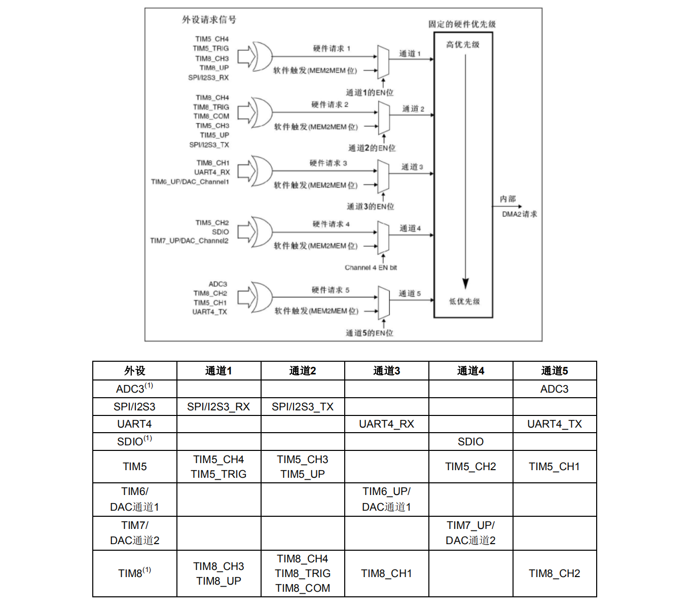
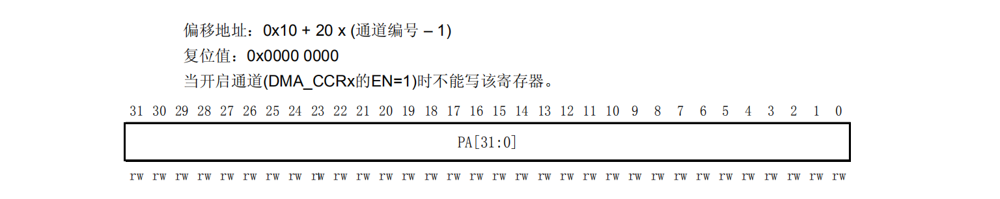
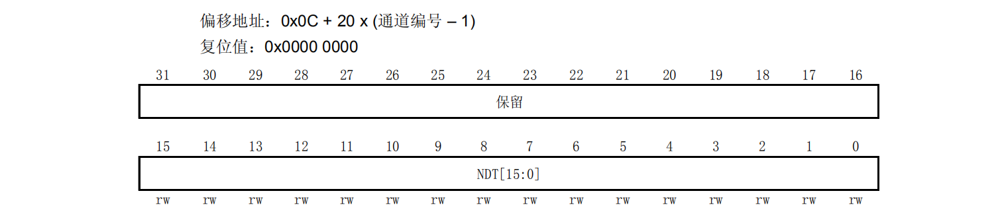
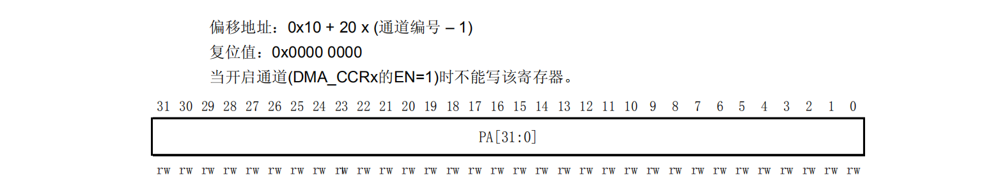

# STM32 DMA模块

## 一、DMA概述

### 1.1 DMA 的意义与概念

​	外设读取到数据之后，通常都只是保存在其相应的寄存器上，如果我们要在程序中使用他们，不得不花费CPU去读取，这使得程序浪费在没有什么意义的事情上。而DMA可以解决这个问题；

​	==DMA(Direct memory access)**直接内存访问**==，被用于**内存和内存**之间或**内存和外设**之间的高速数据传输。数据传输可以在**没有CPU的干预**下快速移动，<u>这样可以保持CPU资源处理其他事情</u>。

---


### 1.2 STM32 上的 DMA 资源

​	STM32 最多有 **2 个 DMA 控制器**（ DMA2 仅存在大容量产品中），<u>12个独立的可配置的通道(请求)， DMA1 有 7 个通道。DMA2 有 5 个通道</u>。每个通道专门用来管理来自于**一个或多个外设**对存储器访问的请求。还有一个**仲裁器**来协调各个 DMA 请求的优先权（也就是所每个 DMA 可以执行不同的搬移动作，但这样就必须有一共设备来协调同一个 DMA 执行不同搬移操作的顺序，即为仲裁器）。

- 小容量产品是指闪存存储器容量在16K至32K字节之间的微控制器。
- 中容量产品是指闪存存储器容量在64K至128K字节之间的微控制器。
- 大容量产品是指闪存存储器容量在256K至512K字节之间的微控制器。
- 互联型产品是指STM32F105xx和STM32F107xx微控制器。

---


### 1.3 DMA 的特征

- 每个通道都直接连接专用的硬件 DMA 请求，每个通道都同样支持**软件触发**。这些功能通过软件来配置。
- 在同一个 DMA 模块上，**多个请求间的优先权**可以通过软件编程设置(共有四级：**很高、高、中等和低**)，<u>优先权设置相等时由硬件决定</u>(请求 0 优先于请求 1 ，依此类推，可以参考STM32数据手册）。
- **独立**的源和目标数据区的**传输宽度**(字节、半字、全字，也即 8bits , 16bits, 32bits)，模拟打包和拆包的过程。源和目标地址必须按数据传输宽度对齐。
- 支持循环的缓冲器管理（会把原来的数据覆盖）。
- 每个通道都有 ==3 个事件标志==(**DMA 半传输， DMA 传输完成和 DMA 传输出错**)，这 3 个事件标志逻辑或成为一个单独的中断请求。
- **存储器和存储器间**的传输（**仅 DMA2 可以**）。
- 外设和存储器、存储器和外设之间的传输（DMA1 与 DMA2 都可以）。
- 闪存、SRAM 、外设的 SRAM 、APB1 、APB2 和 AHB 外设均可作为访问的**源和目标**。
- 可编程的数据传输数目：**最大为65535（216-1）；**

---


### 1.4 DMA 事务

​	==DMA传输事务==包含一系列的**给定数目**的**数据传输序列**。传输的数目可以通过**软件编程**，**8位，16位或32位**。

​	每一次DMA传输包含3个操作：

- :one:==获取数据==：通过 **DMA_SxPAR 或 DMA_SxM0AR** 寄存器**寻址**，从外设数据寄存器或存储单元加载数据；
-  :two:==搬运数据==：通过 **DMA_SxPAR 或 DMA_SxM0AR** 寄存器**寻址**，将加载的数据存储到外设数据寄存器或存储器单元；
- :three:==计数==：**DMA_SxNDTR** 计数器在数据存储结束后递减，该寄存器中包含还需要执行的事务数量；

​	在产生事件后，外设会向 DMA 控制器发送请求信号。 DMA 控制器根据通道优先级处理该请求。只要 DMA 控制器访问外设， DMA 控制器就会向外设发送确认信号。外设获得 DMA 控制器的确认信号后，便会立即释放其请求。一旦外设使请求失效， DMA 控制器就会释放确认信号。如果有更多请求，外设可以启动下一个事务；

-----


### 1.5 DMA 请求映像

#### 1.5.1 DMA1 控制器

​	从外设**(TIMx[x=1、2 、3、4] 、ADC1 、SPI1、SPI/I2S2、I2Cx[x=1、2]和USARTx[x=1、2、3])**产生的**7个请求**，通过逻辑或输入到**DMA1控制器**，这意味着同时只能有一个请求有效。可以从这七个地方读取数据；

​	外设的DMA请求，可以通过设置相应**外设寄存器中的控制位**，被独立地**开启或关闭**。


---

#### 1.5.2 DMA2 控制器

​	从外设(TIMx[5、6、7、8]、ADC3、SPI/I2S3、UART4、DAC通道1、2和SDIO)产生的5个请求，经逻辑或输入到DMA2控制器，这意味着同时只能有一个请求有效。参见下图的DMA2请求映像。

​	外设的DMA请求，可以通过设置相应外设寄存器中的DMA控制位，被独立地开启或关闭。



---


### 1.6 DMA寄存器

​	DMA寄存器的介绍主要参照参考手册，这里给几个很重要的：

---

#### 1.6.1 DMA通道x外设地址寄存器(DMA_CPARx)(x = 1…7)



| 数据位 | 功能                                                         |
| ------ | ------------------------------------------------------------ |
| 位31:0 | PA[31:0]：外设地址 (Peripheral address)<br/>外设数据寄存器的基地址，作为**数据传输的源或目标**。<br/>当PSIZE=’01’(16位)，不使用PA[0]位。操作自动地与半字地址对齐。<br/>当PSIZE=’10’(32位)，不使用PA[1:0]位。操作自动地与字地址对齐。 |

---

#### 1.6.2 DMA通道x传输数量寄存器(DMA_CNDTRx)(x = 1…7)



| 数据位  | 功能                                                         |
| ------- | ------------------------------------------------------------ |
| 位31:16 | 保留，始终读为0。                                            |
| 位15:0  | NDT[15:0]：**数据传输数量** (Number of data to transfer)<br>数据传输数量为**0至65535**。这个寄存器只能在通道**不工作(DMA_CCRx的EN=0)时写入**。<br>通道开启后该寄存器变为只读，指示剩余的待传输字节数目。寄存器内容在**每次DMA传输后递减**。<br>数据**传输结束**后，寄存器的内容或者**变为0**；或者当该通道配置为**自动重加载模式**时，寄存器的内容将被自动重新加载为之前**配置时的数值**。<br>当寄存器的内容**为0时**，无论通道是否开启，都**不会发生任何数据传输**。 |

---

#### 1.6.3 DMA通道x外设地址寄存器(DMA_CPARx)(x = 1…7)



| 数据位 | 功能                                                         |
| ------ | ------------------------------------------------------------ |
| 位31:0 | MA[31:0]：存储器地址<br/>存储器地址作为数据传输的**源或目标**。<br/>当MSIZE=’01’(16位)，不使用MA[0]位。操作自动地与半字地址对齐。<br/>当MSIZE=’10’(32位)，不使用MA[1:0]位。操作自动地与字地址对齐。 |

---


### 1.7 DMA 函数

​	介绍常用的 DMA 函数；

---

#### 1.7.1 DMA_DeInit（）

​	该函数作用为将DMA恢复为初始默认值。这一步是在配置DMA初始化函数前必不可少的。
​	其函数原型为：

````c
void DMA_DeInit(DMA_Channel_TypeDef* DMA_Channelx);
// 其中DMAx_Channelx：x是要选的通道
// 调用示例为：
DMA_DeInit(DMA1_Channel1);  // 调用DMA1的通道1
// 注意在调用时要表明调用DMA1还是DMA2
````

---

#### 1.7.2 DMA_Init()

​	非常重要的配置函数，先看看初始化结构体：

````c
typedef struct 
{ 
	u32 DMA_PeripheralBaseAddr; 
	u32 DMA_MemoryBaseAddr; 
	u32 DMA_DIR; 
	u32 DMA_BufferSize; 
	u32 DMA_PeripheralInc; 
	u32 DMA_MemoryInc; 
	u32 DMA_PeripheralDataSize; 
	u32 DMA_MemoryDataSize; 
	u32 DMA_Mode; 
	u32 DMA_Priority; 
	u32 DMA_M2M; 
} DMA_InitTypeDef;
````

​	下面讲解结构体中成员的具体含义及其取值：

- :one:**DMA_PeripheralBaseAddr** ：该参数为 DMA 外设基地址，一般外设的地址都能在操作手册中找到，后面在举例中会提到如何确定这个值。

- :two:**DMA_MemoryBaseAddr**：该参数用以定义 DMA 内存基地址，也就是外设传输的信息经过DMA后所要存储的地方。可以自定义一个变量，取其地址作为存储地址。

- :three:**DMA_DIR**，该参数规定了数据传输的方向，即是DMA发送信号给外设，还是外设传信号给DMA。

    有两个取值：

    - **DMA_DIR_PeripheralDST**，DMA发送信号给外设；
    - **DMA_DIR_PeripheralSRC**，外设传信号给DMA；

- :four:**DMA_BufferSize**，用以定义指定 DMA 通道的 DMA 缓存的大小，即传输大小。

- :five:**DMA_PeripheralInc**，该参数规定外设地址是随传输递增还是不变。

    该参数有两个取值：

    - **DMA_PeripheralInc_Enable**，外设地址随传输递增；
    - **DMA_PeripheralInc_Disable**，外设地址不随传输改变；

- :six:**DMA_MemoryInc**，该参数和第五个参数相似，不过该参数规定的是内存地址递增与否。

    该参数有两个取值：

    - **DMA_PeripheralInc_Enable**，内存地址随传输递增；
    - **DMA_PeripheralInc_Disable**，内存地址不随传输改变；

- :seven:**DMA_PeripheralDataSize**，该参数规定了外设数据宽度。

    该参数有三个取值：

    - **DMA_PeripheralDataSize_Byte**，数据宽度为 8 位；
    - **DMA_PeripheralDataSize_HalfWord**，数据宽度为 16 位；
    - **DMA_PeripheralDataSize_Word**，数据宽度为 32 位；

- :eight:**DMA_MemoryDataSize**，该参数规定了内存的数据长度；

    该参数有三个取值：

    - **DMA_MemoryDataSize_Byte**，数据宽度为 8 位；
    - **DMA_MemoryDataSize_HalfWord**，数据宽度为 16 位；
    - **DMA_MemoryDataSize_Word**，数据宽度为 32 位；

- :nine:**DMA_Mode**，该参数规定DMA的工作模式，是循环工作还是正常工作，其中循环模式用于处理循环缓冲区和连续的数据传输（如ADC的扫描模式）。

    该参数有两个取值：

    - **DMA_Mode__Normal**，DMA工作在循环模式：进行完一次DMA数据传输后，要启动第二次DMA传输，需先关闭该DMA通道，重新设置DMA传输数据个数，再开启DMA通道；
    - **DMA_Mode_Circular**，DMA工作在正常模式：不需要向正常模式一样，进行完一次DMA数据传输后，要启动第二次DMA传输会自动配置；

- :one::zero:**DMA_Priority**，该参数可修改DMA 通道 x 的优先级；

    该参数有四个取值：

    - <1>**DMA_Priority_VeryHigh** DMA，通道 x 拥有非常高优先级；
    - <2>**DMA_Priority_High** DMA，通道 x 拥有高优先级；
    - <3>**DMA_Priority_Medium**，DMA 通道 x 拥有中优先级；
    - <4>**DMA_Priority_Low** DMA，通道 x 拥有低优先级；

- :one::one:**DMA_M2M**，该参数使能 DMA 通道的内存到内存传输，其中DMA通道的操作可以在没有外设请求的情况下进行，这种操作就是内存到内存传输模式。

    该参数有两个取值：

    - <1>**DMA_M2M_Enable** DMA，通道 x 设置为内存到内存传输；
    - <2>**DMA_M2M_Disable** DMA，通道 x 没有设置为内存到内存传输；

````c
void DMA_Init(DMA_Channel_TypeDef* DMAy_Channelx, DMA_InitTypeDef* pStructure);
// 调用示例：
DMA_Init(DMA1_Channel1,&DMA_InitStructure);		
````

---

#### 1.7.3 DMA_Cmd()

````c
void DMA_Cmd(DMA_Channel_TypeDef* DMAy_Channelx, FunctionalState  NewState);
// 其中要注意的是参数y和x，其含义比较明显，在此不再赘述
// 调用示例为：
DMA_Cmd(DMA1_Channel1 , ENABLE); // 调用DMA1的通道1
````

---

#### 1.7.4 DMA_DMA_ITConfig

```c
void DMA_ITConfig(DMA_Channel_TypeDef* DMA_Channelx, u32 DMA_IT, 
                  FunctionalState NewState);
// DMA_IT有三个取值，其值及含义分别为：
// DMA_IT_TC：传输完成
// DMA_IT_HT：传输一半
// DMA_IT_TE：传输错误
// 调用示例：
DMA_ITConfig(DMA1_Channel1,DMA1_IT_TC1,ENABLE);
```

---


## 二、DMA 的配置

​	下面是配置 **DMA 通道 x 的过程(x代表通道号)：**通道不是乱选的，根据自己用的是哪个 DMA，从哪个2外设读取数据，去[1.5]()中找对应的通道；

- 在**DMA_CPARx寄存器**中设置==外设寄存器==的地址。发生外设数据传输请求时，这个地址将是数据传输的**源或目标**。
- 在**DMA_CMARx寄存器**中设置==数据存储器==的地址。发生外设数据传输请求时，传输的数据将**从这个地址读出或写入这个地址**。
- 在DMA_CNDTRx寄存器中设置要传输的==数据量==。在每个数据传输后，这个数值==递减==。
- 在DMA_CCRx寄存器的PL[1:0]位中设置通道的优先级。
- 在DMA_CCRx寄存器中设置<u>==数据传输的方向==、==循环模式==、==外设和存储器的增量模式==、==外设和存储器的数据宽度==、==传输一半产生中断或传输完成产生中断==。</u>
- 设置DMA_CCRx寄存器的==ENABLE位==，启动该通道。一旦启动了DMA通道，它即可响应连到该通道上的外设的DMA请求。<u>当传输一半的数据后，**半传输标志**(HTIF)被置1</u>，当设置了允许半传输中断位(HTIE)时，将产生一个中断请求。在数据传输结束后，<u>传输**完成标志**(TCIF)被置1</u>，当设置了允许传输完成中断位(TCIE)时，将产生一个中断请求。

​	下面以 **DMA1，USART2_RX** 配置为例子；

---


### 2.1 NVIC 配置

​	因为要使用中断，所以肯定需要配置 NVIC：

````c
NVIC_InitTypeDef NVIC_InitStructure;
//DMA1通道6 NVIC 配置
// 选择中断源一定要注意，先去找使用的 DMA 与外设应该用那个通道，这里DMA1，USART2_RX对应的是DMA1的6通道
// 选错了就不行了，那么这个中断源就是DMA1的6号中断源
NVIC_InitStructure.NVIC_IRQChannel = DMA1_Channel6_IRQn;			//NVIC通道设置
NVIC_InitStructure.NVIC_IRQChannelPreemptionPriority = 3 ;			//抢占优先级
NVIC_InitStructure.NVIC_IRQChannelSubPriority = 0;					//子优先级
NVIC_InitStructure.NVIC_IRQChannelCmd = ENABLE;						//IRQ通道使能
NVIC_Init(&NVIC_InitStructure);										//根据指定的参数初始化VIC寄存器
````

---


### 2.2 DMA 配置

​	配置 DMA 的过程，特别注意：

- 外设地址、内存地址、数据传输方向，缓存大小，内存地址增长方向，数据宽度

````c
DMA_InitTypeDef DMA1_Init;
NVIC_InitTypeDef NVIC_InitStructure;

RCC_AHBPeriphClockCmd(RCC_AHBPeriph_DMA1,ENABLE);					//使能DMA1时钟

//DMA_USART2_RX  USART2->RAM的数据传输
DMA_DeInit(DMA1_Channel6);										//将DMA的通道6寄存器重设为缺省值 
// 启动传输前装入实际RAM地址， 这里就是 USART2 的 DR 寄存器
DMA1_Init.DMA_PeripheralBaseAddr = (u32)(&USART2->DR);
//设置接收缓冲区首地址
DMA1_Init.DMA_MemoryBaseAddr = (u32)u1rxbuf;       
//数据传输方向，从外设读取到内存
DMA1_Init.DMA_DIR = DMA_DIR_PeripheralSRC;						
//DMA通道的DMA缓存的大小
DMA1_Init.DMA_BufferSize = USART2_MAX_RX_LEN;					
DMA1_Init.DMA_PeripheralInc = DMA_PeripheralInc_Disable;			//外设地址寄存器不变
//内存地址寄存器递增
DMA1_Init.DMA_MemoryInc = DMA_MemoryInc_Enable;		
//数据宽度为8位
DMA1_Init.DMA_PeripheralDataSize = DMA_PeripheralDataSize_Byte;	
//数据宽度为8位
DMA1_Init.DMA_MemoryDataSize = DMA_MemoryDataSize_Byte;			
DMA1_Init.DMA_Mode = DMA_Mode_Normal;								//工作在正常模式
DMA1_Init.DMA_Priority = DMA_Priority_High; 						//DMA通道 x拥有高优先级 
DMA1_Init.DMA_M2M = DMA_M2M_Disable;							//DMA通道x没有设置为内存到内存传输
DMA_Init(DMA1_Channel6,&DMA1_Init); 								//对DMA通道6进行初始化

// 配置中断是：全部传输完毕后产生中断，进入中断函数
DMA_ITConfig(DMA1_Channel6,DMA_IT_TC,ENABLE);						//开USART2 Rx DMA中断
DMA_Cmd(DMA1_Channel6,ENABLE);           							//使DMA通道6开始工作
USART_DMACmd(USART2, USART_DMAReq_Rx, ENABLE);        				//开启串口DMA接收
````

---


### 2.3 中断处理函数

​	这里我们启动了：当数据读取完毕后就进入中断，所以需要编写中断处理函数，这些函数的名称已经规定好，这里我们使用的是DMA1的6号通道，所以中断函数就是 `DMA1_Channel6_IRQHanlder(void)`：

````c
void DMA1_Channel6_IRQHandler(void)
{
    if(DMA_GetITStatus(DMA1_IT_TC1)!=RESET)	
    {
        DMA_ClearITPendingBit(DMA1_IT_TC1);
        // ... 
	}
}
````

---


## 三、DMA使用

### 4.1 查询方式

​	查询方式可以不使能DMA中断，通过DMA_GetFlagStatus函数判断标志位来辨别是否传输完成或过半以及出错，然后关闭DMA通道，用DMA_SetCurrDataCounter函数重设缓存大小，完成相应操作后要记得清除标志位再使能DAM通道。如果使能了循环模式，会自动重装载计数。

---

### 4.2 中断方式

DMA中断一般用于定长数据传输，以传输完成中断为例。
（1）当产生DMA传输完成中断后，清除中断标志位、传输完成标志位；
（2）关闭DMA通道；
（3）处理数据；
（4）重新设置DMA通道的DMA缓存的大小（可以省去）；
（5）开启DMA通道

---

### 4.3 不定长数据传输

以串口为例，不定长数据传输的时候，可以通过串口空闲中断来判断传输是否完成（传输缓存大小要大于传输的数据大小），数据长度可以通过DMA_GetCurrDataCounter函数来计算，然后关闭DMA通道，重设DMA缓存的大小，再启用DMA通道。

---

### 4.4 双缓冲方式

设置两个缓冲区，设置一个缓冲区标志（用来指示当前处在哪个缓冲区），每完成一次传输就通过重新配置DMA_MemoryBaseAddr的缓冲区地址，下次传输数据就会保存到新的缓冲区中，可以通过自定义缓存区标志来判断和切换，这样可以避免缓冲区数据来不及处理就被覆盖的情况，也能为处理数据留出更多地时间（指到下次传输完成）。

---

​	在使用DMA的时候，如果启用了DMA传输中断，还要写相应的中断函数，在中断函数中切记要清除中断标志位。**DMA只有在传输完成或传输过半或者传输出错才会产生中断**（前提打开了中断）；

