# STM32 串口通信

参考：[(85条消息) STM32串口通信详解_rivencode的博客-CSDN博客_stm32串口通信](https://blog.csdn.net/k666499436/article/details/124354165?utm_source=app&app_version=4.15.0&code=app_1562916241&uLinkId=usr1mkqgl919blen)

## 1. 数据通信方式

### 1.1 串行与并行通信

- ==串行通讯==：是指设备之间通过一根数据信号线，地线以及控制信号线，按数据位形式一位一位地传输数据的通讯方式，同一时刻只能传输一位(bit)数据。
- ==并行通讯==：是指使用 8、16、32 及 64 根或更多的数据线(有多少信号为就需要多少信号位)进行传输的通讯方式，可以同一时刻传输多个数据位的数据。

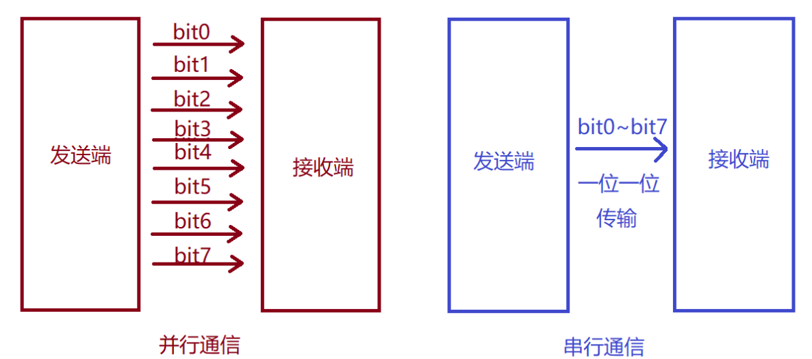

### 1.2 全双工、半双工及单工通讯

- ==单工通信==：信息只能单方向传输的工作方式，一个固定为发送设备，另一个固定为接收设备，发送端只能发送信息不能接收信息，接收端只能接收信息不能发送信息，只需一根信号线；
- ==半双工通信==：可以实现双向的通信，但不能在两个方向上同时进行，必须轮流交替进行，其实也可以理解成一种可以切换方向的单工通信，同一时刻必须只能一个方向传输，只需一根数据线；
- ==全双工通信==：在同一时刻，两个设备之间可以同时收发数据，全双工方式无需进行方向的切换，这种方式要求通讯双方均有发送器和接收器，同时，需要2根数据线。

### 1.3 同步通讯与异步通讯

- ==同步通讯==：收发设备双方会使用一根信号线表示时钟信号，在==时钟信号==的驱动下双方进行协调，同步数据，通讯中通常双方会统一规定在时钟信号的上升沿或下降沿对数据线进行采样，对应时钟极性与时钟相位；
- ==异步通讯==：不需要时钟信号进行数据同步，它们直接在数据信号中穿插一些同步用的信号位，或者把主体数据进行打包，以数据帧（串口：起始位 数据 校验位(可以没有) 停止位）的格式传输数据，某些通讯中还需要双方约定数据的传输速率（波特率），以便更好地同步。


## 2. 串口通信协议

> 通讯协议：分为物理层和协议层。物理层规定通讯系统中具有机械、电子功能部分的特性，确保原始数据在物理媒体的传输（硬件层）；协议层主要规定通讯逻辑，统一收发双方的数据打包、解包标准（软件层）。

### 2.1 物理层

一般使用的单片机，其物理层使用的是 TTL；

> TTL(Transistor-Transistor Logic)，规定逻辑 1 为 2.4V-5V，逻辑 0 为 0-0.5V；

而单片机跟计算机通信使用的是 USB 串口，二者协议的定义不同，为了让二者可以正常通信，并且存在一个转换电路把 TTL电平转为 USB 电平，把 USB 电平转为 TTL 电平；

 电平转换芯片一般有CH340、PL2303、CP2102、FT232，CH340 使用的比较多；

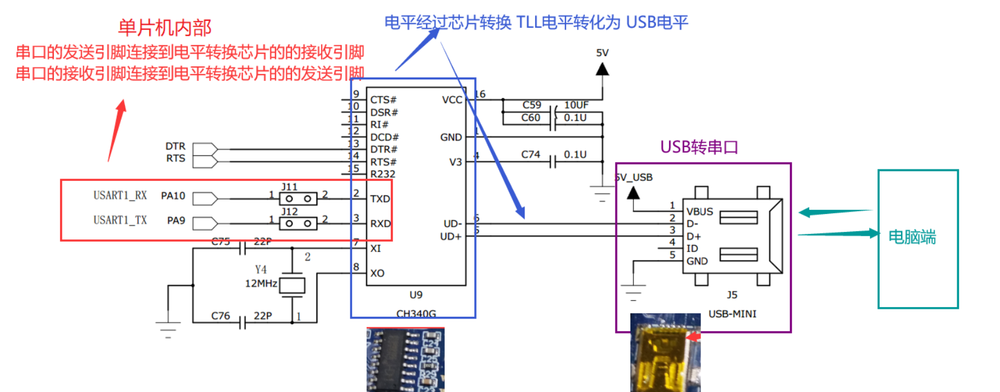

转换的基本流程如上图；

### 2.2 协议层

串口通讯的协议层中，规定了数据包的内容，它由启始位、主体数据、校验位以及停止位组成，通讯双方的数据包格式要约定一致（一样的起始位 数据 校验位 停止位）才能正常收发数据；

#### 通讯的起始和停止信号

串口通讯的一个数据包从起始信号开始，直到停止信号结束；

数据包的起始信号由一个逻辑 0 的数据位表示，而数据包的停止信号可由 0.5、1、1.5 或 2 个逻辑 1 的数据位表示：

- 1个停止位：停止位位数的默认值。
- 2个停止位：可用于常规USART模式、单线模式以及调制解调器模式。
- 0.5个停止位：在智能卡模式下接收数据时使用。
- 1.5个停止位：在智能卡模式下发送和接收数据时使用。

#### 有效数据

在数据包的起始位之后紧接着的就是要传输的主体数据内容，也称为有效数据，有效数据的长度常被约定为 5、6、7 或 8 位长；

#### 数据校验

常用的有奇偶校验（不展开）


## 3. USART 功能框图与寄存器分析

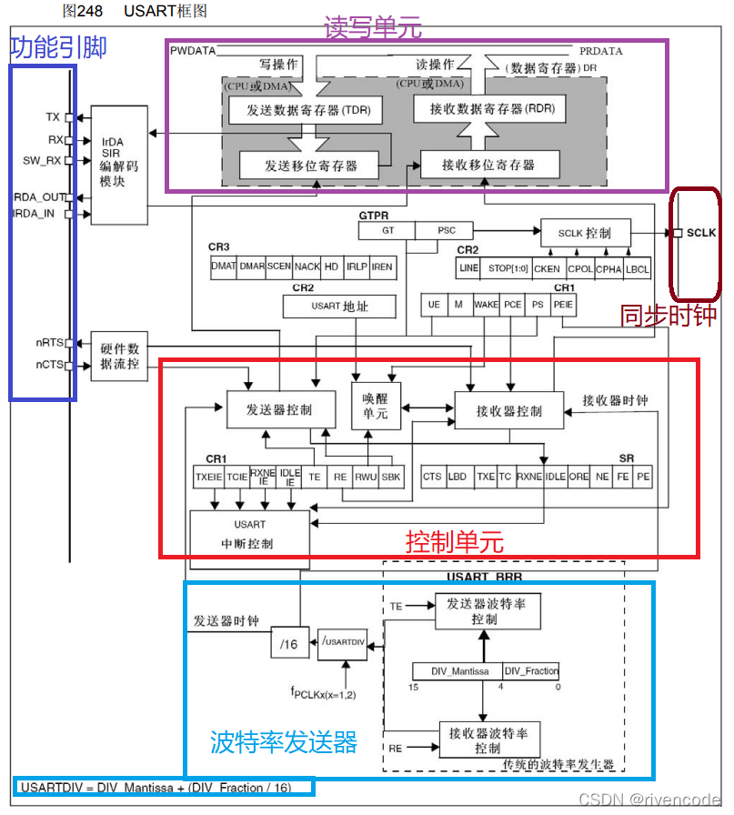

还可以从源码中找到关于 `USART` 的结构体定义：

````c
typedef struct
{
  __IO uint16_t SR;			// 表示 USART 当前状态的寄存器： SR
  uint16_t  RESERVED0;
  __IO uint16_t DR;			// 保存数据的寄存器：DR
  uint16_t  RESERVED1;
  __IO uint16_t BRR;		// 配置波特率的寄存器：BRR
  uint16_t  RESERVED2;
  __IO uint16_t CR1;		// 控制寄存器1：CR1
  uint16_t  RESERVED3;
  __IO uint16_t CR2;		// 控制寄存器1：CR1
  uint16_t  RESERVED4;
  __IO uint16_t CR3;		// 控制寄存器1：CR1
  uint16_t  RESERVED5;
  __IO uint16_t GTPR;		
  uint16_t  RESERVED6;
} USART_TypeDef;
````

下面的功能狂徒与这些寄存器息息相关；

### 3.1 功能引脚

- TX：发生数据输出引脚；
- RX：接收数据输入引脚；
- SCLK：发送器时钟输出引脚。适用于同步模式；
- 其他不重要不介绍；

### 3.2 读写单元

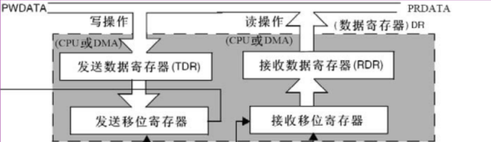

其中有两个寄存器很重要：`TDR` 与 `RDR`，分别代表：发送数据寄存器、接收数据寄存器，都是 `[8:0]` 位的；

CPU 或 DMA 可以并行得向 `TDR` 写入要发送出的数据。`TDR` 寄存器就会把这些数据并行转移到发送移位寄存器中，之后再由移位寄存器一个一个将数据发送出去；

同理，接收移位寄存器会把接收到的数据一位一位读入，读取完毕后并行写入到 `RDR` 中，CPU 或 DMA 就可以直接来到 `RDR` 中并行得获取数据。

标志库中封装的读取、发送数据函数就是读取 `DR` 寄存器、写入 `DR` 寄存器：

````c
void USART_SendData(USART_TypeDef* USARTx, uint16_t Data)
{
  /* Check the parameters */
  assert_param(IS_USART_ALL_PERIPH(USARTx));
  assert_param(IS_USART_DATA(Data)); 
    
  /* Transmit Data */
  USARTx->DR = (Data & (uint16_t)0x01FF);
}

uint16_t USART_ReceiveData(USART_TypeDef* USARTx)
{
  /* Check the parameters */
  assert_param(IS_USART_ALL_PERIPH(USARTx));
  
  /* Receive Data */
  return (uint16_t)(USARTx->DR & (uint16_t)0x01FF);
}
````

> 这里不太理解，源码中不管是读还是写都是操作 `DR` 寄存器，没有找到 `TRD` 与 `RDR`；

上述过程可以如下图表示：

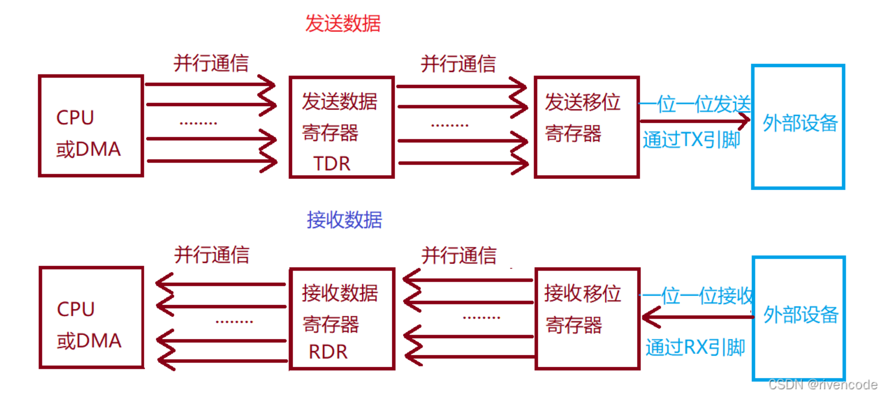

### 3.3 波特率发生器

发送和接收由一共用的波特率发生器驱动，当发送器和接收器的使能位分别置位时，分别为其产生时钟：

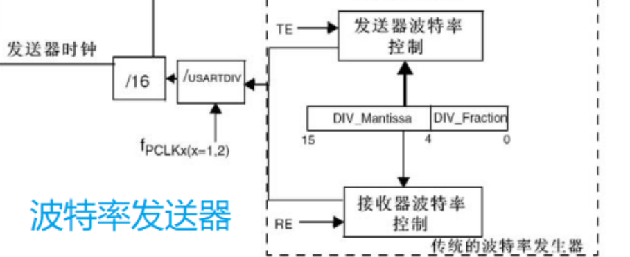

由上图可见，时钟的来源有两种：$f_{PCLK1}$ 与 $f_{PCLK2}$ ，其中 ：$f_{PCLK2}$ 是给串口 1 使用的，频率为 72MHz，$f_{PCLK1}$  给串口 2 - 5 使用，频率为 36MHz；

这个时钟会经过两次分配，一次是可以配置的 `USARTDIV`，另一次是固定的 16，那么最后的波特率就为：
$$
f = \frac{f_{PCLK}}{16 * USARTDIV}
$$
而 `USARTDIV` 是通过 `USART_TypeDef` 结构体中的 `BRR` 寄存器完成：

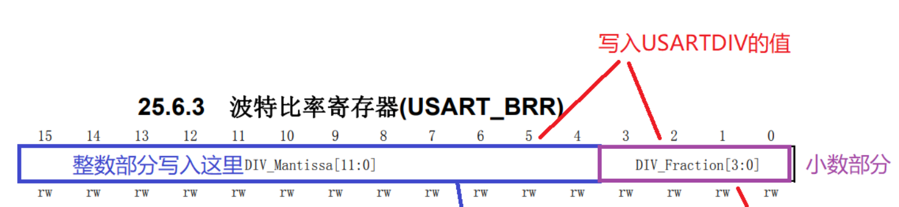

这个寄存器共 16 位，高 12 位存放 `USARTDIV` 的整数部分，低 4 位存放小数部分，例如配置 115200 的波特率（假设时钟频率为 72MHz），应该有：
$$
115200  =\frac{72000000}{16 * USARTDIV}
$$
计算得到 `USARTDIV = 39.0665`，那么就把 `39` 保存到整数部分（BRR 的高 12 位）；

而对小数部分，由于一共就四位，只能表示 16 个值，最大是 1，那么就是把 1 分成 16 份，每份是 0.0625。那么这四位的 1 代表 0.0625，现在需要表示 0.625，那么就需要 1，所以小数部分为 0001；

所以写入到 BRR 的值为 0x271；

###  3.4 控制单元

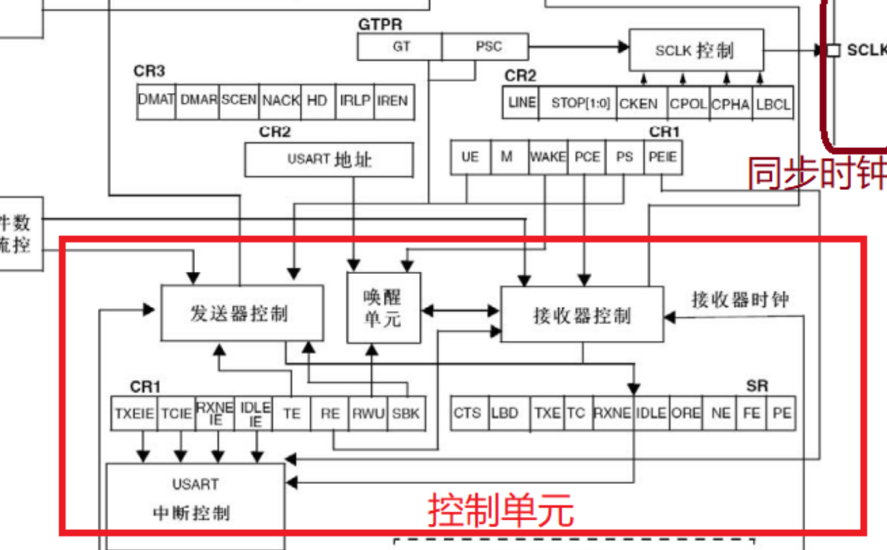

控制单元中的模块基本都是收到寄存器的控制，下面分开看：

#### 发送器

发送器根据 M 位的状态发送 8 位或 9 位的数据字。当发送使能位 (TE) 被设置时，发送移位寄存器中的数据在 TX 脚上输出，相应的时钟脉冲在 CK 脚上输出。

一个字符帧发送需要三个部分：起始位 + 数据帧（可能有校验位）+ 停止位；

每个字符（一个数据帧）之前都有一个低电平的起始位，之后跟着的停止位，其数目可配置，数据是从最低位开始传输，停止位是一定时间周期的高电平。

发生器的使用流程大致为：

- 通过在 CR1 寄存器上置位 UE 位来激活 USART

  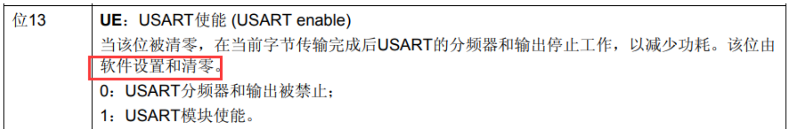

- 编程 CR1 的 M 位来定义字长

  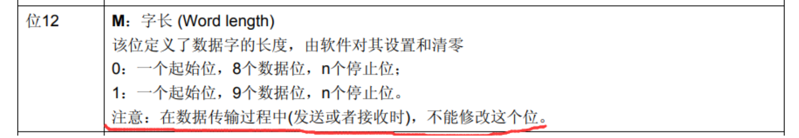

- 在 CR2 中编程停止位的位数

  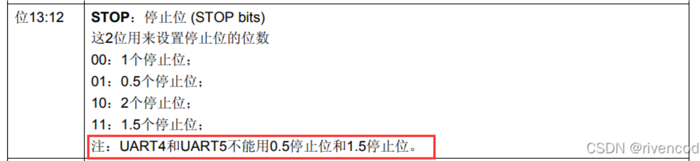

- 利用 BRR 寄存器选择要求的波特率

- 设置 CR1 中的 TE 位，发送一个空闲帧帧(一个数据帧长度的高电平)作为第一次数据发送

  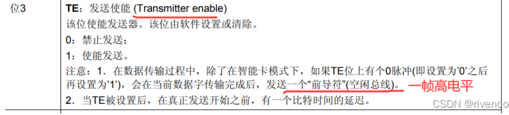

- 把要发送的数据写进 DR 寄存器(此动作清除TXE位)，TEX 位于 SR 寄存器上：

  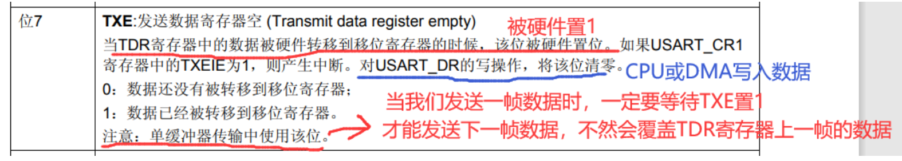

- 在USART_DR寄存器中写入最后一个数据字后，要等待 TC = 1，它表示最后一个数据帧的传输结束(移位寄存器中的数据全部发送完毕。当需要关闭USART或需要进入停机模式之前，需要确认传输结束，避免破坏最后一次传输，TC 寄存器位于 SR 寄存器上

  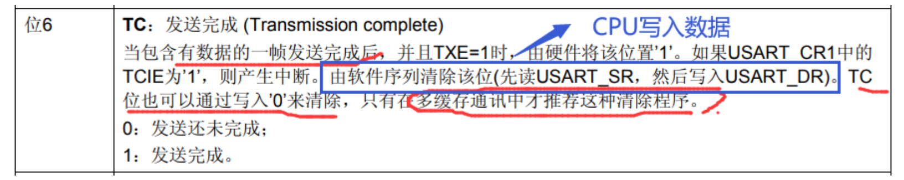

其中 TXE 与 TC 位比较重要（二者都表示当前 USART 的发生状态，所以位于 SR 寄存器上）

之前说过，CPU 或 MDA 会把数据写入到 TDR 中，之后再把数据转入输出移位寄存器，最后一位一位发送；TXE 与 TC 的作用就是来标识这个过程的进度；

当 CPU 或 MDA 向 TDR 写入待发送的数据，TXE 被设置为 1，表示数据在 TDR 中，但还没转移到移位寄存器。而当数据转移到移位寄存器后，TXE 被硬件设置为 0；

而数据在移位寄存器中需要一位一位的发送出去，这个过程中不能去覆盖移位寄存器的内容。当  CPU 或 MDA 向 TDR 写入待发送的数据，TC 也会被设置为 0，但只有移位寄存器已经把数据发送完毕后，此为才能被硬件设置为 1，表示此处发送完全结束；

#### 接收器

将 CR1 寄存器的 RE 位置 1，使能 USART 接收，使得接收器在 RX 线开始搜索起始位。

在确定到起始位后就根据 RX 线电平状态把数据存放在接收移位寄存器内。

接收完成后就把接收移位寄存器数据移到 RDR 内，并把 SR 寄存器的 RXNE 位置 1（表示当前接收端状态为接收到了新数据保存在 RDR 中，但还没被 CPU 或 DMA 读走），同时如果 CR2 寄存器的 RXNEIE 置 1 （此位置 1 表示开启读取数据中断，每当数据来到就产生一个中断）的话可以产生中断。

> 所以，可以利用这个中断，设置好中断函数，发生中断后就把数据读走，RXNE 位会被硬件设置为 0，RDR 寄存器上的内容就可以被清除，新的数据可以被读取

如果 RXNE 被设置为 1（接收到数据，但还没读取走），又再次收到新的数据，发生溢出错误；

#### USART 中断

常用的中断：

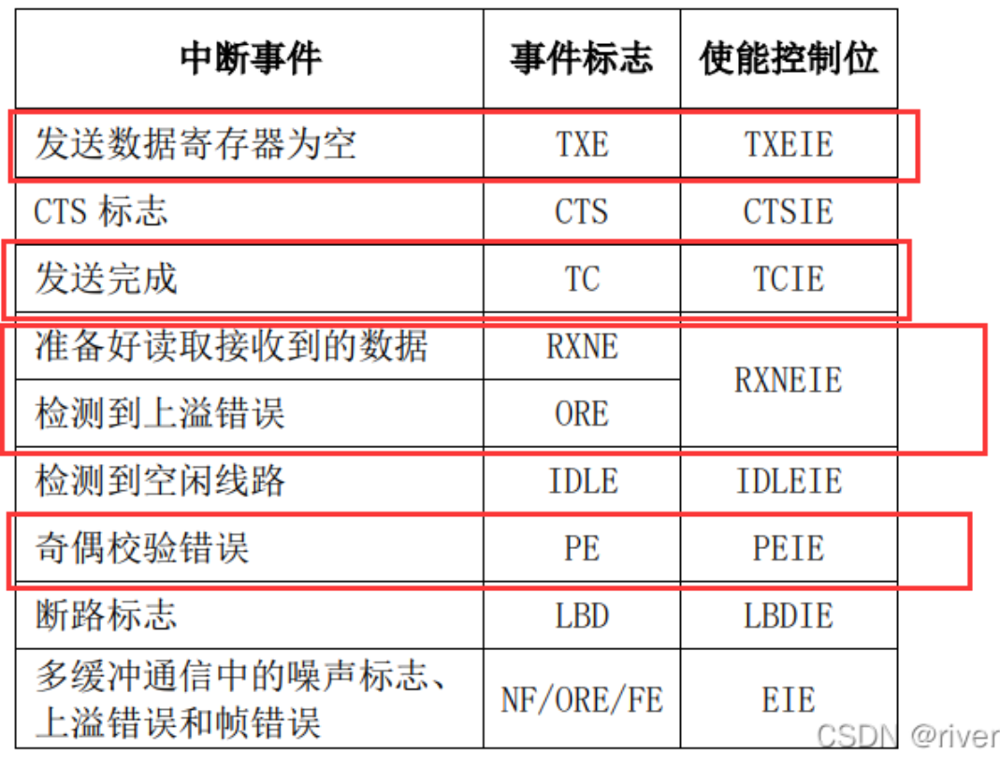

> 使得控制位，就是表示是否开启对应中断，都位于 CR 寄存器上

功能框图中还涉及很多寄存器的位没有说，比如设置停止位长度的、设置奇偶校验的，只说了重要的一些。


## 4. USART 初始化结构体

3 中说都是很理论的东西，实际用的时候也很少会去直接使用寄存器。

初始化结构体是很重要的，单片机都是这个套路。每个功能有一个 `XX_TypeDef` 结构体，里面有寄存器，寄存器真正控制着内部电路工作。配置的时候就用 `XXX_InitTypeDef`，把想要设置的放在这个结构体，然后调用 `XXX_Init`，把结构体中的数据赋值到寄存器中；

````c
typedef struct
{
  uint32_t USART_BaudRate;            // 波特率
  uint16_t USART_WordLength;          // 数据长度
  uint16_t USART_StopBits;            // 结束位个数
  uint16_t USART_Parity;              // 校验位
  uint16_t USART_Mode;                // USART 模式
  uint16_t USART_HardwareFlowControl; // 硬件控制流
    
} USART_InitTypeDef;
````

- `USART_BaudRate`：波特率设置。一般设置为 2400、9600、19200、115200。

  标准库函数会自己计算计算得到 USARTDIV 值，从而写入USART_BRR 寄存器；

- `USART_WordLength`：数据帧字长，可选 8 位或 9 位。

  它设置了USART_CR1 寄存器的 M 位的值。如果没有使能奇偶校验位，一般使用 8 数据位；如果使能了奇偶校验则一般设置为 9 数据位，最后一位是奇偶校验位。

- `USART_StopBits`：停止位设置，可选 0.5 个、1 个、1.5 个和 2 个停止位，它设定USART_CR2 STOP位，一般选择 1 个停止位

- `USART_Parity` ：奇偶校验控制选择 ，USART_CR1 寄存器的 PCE 位和 PS 位的值。

- `USART_Mode`：USART 模式选择；

  有 USART_Mode_Rx 和 USART_Mode_Tx，允许使用逻辑或运算选择两个，选了 USART_Mode_Rx 就将 UCR1 寄存器的 RE 位设置位 1，开启接收功能，选了 USART_Mode_Rx 就将 UCR1 寄存器的 TE 位设置位 1，开启发送功能

- `USART_HardwareFlowControl`：硬件流控制选择，只有在硬件流控制模式才有效，可选有⑴使能 RTS、⑵使能 CTS、⑶同时使能 RTS 和 CTS、⑷不使能硬件流。

