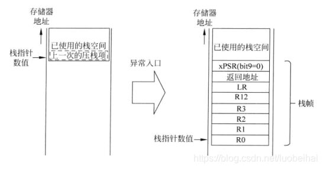

# STM32异常与中断

[TOC]

## 1、异常与中断的概念

​	**异常**主要指来自CPU内部的意外事件，比如执行未定义指令、算数溢出、除0运算等（**同步中断**）；

​	**中断**一般来自外部硬件（片上外设、外部I/O输入等）发生的事件，当这些硬件产生中断信号，CPU会暂停当前运行的程序，转而去处理相关硬件的中断服务程序（**异步中断**）；

​	但无论是中断还是异常，程序都会**偏离正常的流程**，转而去执行异常/中断的**处理函数**；

​	如果没有明确指出是异常还是中断，就统统称为中断；


### 1.1 为什么需要中断

​	对于检测一个按钮是否被按下，CPU可以选择两种方式去判断；

​	首先，可以在CPU正在执行的程序中**插入按钮检测程序**，这样CPU在执行主要的指令时，需要经常停下来去检测按钮的状态；而且当按钮刚好在CPU执行其他程序时按下，其将不会被检测到；

​	齐次，可以将按钮按下的事件**设置为一个中断**，当按钮被按下，就设置某个位，而CPU在每次执行完一条指令后，都会去查看这个位，当发现按钮按下的位被设置，发生中断，转到中断服务程序；通常，这个检测位是否被设置的工作由硬件完成，不需要花费CPU的执行时间，而且这样使得按钮被按下的事件几乎**不可能被忽略**；

​	而且，当我们需要检测许多事件时，如果采用查询的方法，那么大部分的执行时间都花费在了检测上，这就是中断存在的价值；


### 1.2 ARM体系如何使用中断

​	在**ARM体系**中，使用中断的过程一般为：

​	1、**中断初始化**：

​		1.1、设置**中断源**（EXTI），让某个外设可以产生中断；

​		1.2、设置**中断控制器**（NVIC），使得/屏蔽某个外设的中断通道，设置中断优先级；

​		1.3、使得CPU中断总开关；

​	2、CPU开始运行主程序；

​	3、中断产生，比如是用户按下了按钮，信号经过**中断控制器**设置CPU的某个位；

​	4、CPU执行完某个指令，**查看中断位**，是否有中断产生；

​	5、发生中断或异常的产生，跳转到中断处理程序：

​		5.1、**保存现场**；

​		5.2、分辨异常/中断，**调用对应的处理函数**；

​		5.3、执行完处理函数，**恢复现场**；


## 2、STM32异常与中断处理流程

### 2.1 概述

​	对上述过程中，我们需要解决：

- CPU如何调用异常/中断处理函数；（中断向量表）
- 调用完毕后如何返回主程序；（利用保存现场的程序计数器）
- 主程序在发生中断前的数据如何保存；（恢复现场）

​	

### 2.2 中断向量表

​	STM32维护了一张保存**中断处理程序的表**，也就是一个**函数指针数组**，每个表项就是一个中断处理函数的入口

​	当中断发生，硬件会根据中断号自动跳转到向量表中对应的中断函数执行入口，执行服务；

​	对STM32F103来说，程序运行的加载起始地址为0x8000000，所以中断向量表也会被加载到这个地址；


### 2.3 保存现场

#### 2.3.1 概念引入

​	当我们正在执行 `a = a + b`的指令：（伪汇编代码）

````assembly
mov a r0
mov b r1
add r1 r0
mov r0 [&a]
````

​	我们一共需要四句指令，当执行了两句后，中断发生了；执行完中断程序后，寄存器r0, r1的值几乎不可能不被改变，那么此时若我们执行` add r1 r0`就会得到错误的结果；

​	所以我们需要在进入中断处理函数前保存寄存器的值，当然位于内存上的变量就不需要保存，我们只要知道主程序执行到哪个地址，执行完中断处理程序后再让程序计数器回到原位置即可；

​	综上，当CPU进入中断处理程序前，就需要把不希望中断程序修改的寄存器保存起来，称为**保存现场**；当执行完中断程序后，回到主程序**恢复现场**后，继续执行；


#### 2.3.2 保存哪些寄存器

​	CPU内部常用寄存器有 r0 到 r15，再加上程序状态寄存器；

​	下图为STM32F103内部寄存器示例

​	

​	可以看出，寄存器很多，但是我们不需要把所有都保存；

​	ARM公司推出了一个 **ATPCS 标准（ARM-Thumb procedure call standard，ARM-Thumb过程调用标准）**。其中规定了这些寄存器的使用规则：

| 寄存器 |  别名   |           使用规则            |
| :----: | :-----: | :---------------------------: |
|  r15   |   pc    |          程序计数器           |
|  r14   |   lr    |          连接寄存器           |
|  r13   |   sp    |          数据栈指针           |
|  r12   |   ip    | 子程序内部调用的scratch寄存器 |
|  r11   |   v8    |    ARM状态局部变量寄存器8     |
|  r10   | v7   s1 |    ARM状态局部变量寄存器7     |
|   r9   | v6   sb |    ARM状态局部变量寄存器6     |
|   r8   |   v5    |    ARM状态局部变量寄存器5     |
|   r7   |   v4    |    ARM状态局部变量寄存器4     |
|   r6   |   v3    |    ARM状态局部变量寄存器3     |
|   r5   |   v2    |    ARM状态局部变量寄存器2     |
|   r4   |   v1    |    ARM状态局部变量寄存器1     |
|   r3   |   a4    |   参数/结果/scratch 寄存器4   |
|   r2   |   a3    |   参数/结果/scratch 寄存器3   |
|   r1   |   a2    |   参数/结果/scratch 寄存器2   |
|   r0   |   a1    |   参数/结果/scratch 寄存器1   |

​	其中（r0-r3、r12、lr，ps）为**调用者保存**，其他的为**被调用者保存**；

​	所以当主函数A调用中断函数B，那么B为被调用者，所以（r4-r11）是自动被B保存，在中断函数返回时会**自动恢复**，那么我们就不需要保存这些寄存器，只要（r0-r3、r12、lr，ps）；


#### 2.3.3 STM32如何保存现场

​	STM32的现场保存是CPU的硬件自动完成，我们暂时不需要关心这些复杂的硬件实现




### 2.4 恢复现场

​	利用STM32提供的 EXC_RETURN 机制，我们不深入研究；

这些讲的都是一些中断的原理部分，接下来会讲要如何写代码，后面的才是最重要的，主要需要三步：

- 配置 **NVIC**；
- 配置 **EXTI**；
- 编写**中断处理函数**；


## 3、NVIC 

### 3.1 NVIC 简介

​	**NVIC：Nested Vectored Interrupt Controller**，**嵌套向量中断控制器**；STM32中拥有一个强大的NVIC，位于 **Cortex-M3 内核中**，不可屏蔽中断(NMI)和外部中断都由它来处理，主要作用是配置 STM32 中断的**分组**与**优先级属性**；


### 3.2 中断源及属性

​	中断源即**中断的来源**，可以是GPIO的电平变化，时钟信号的跳变等；

​	在STM32中，可能同时存在多个中断请求，为了处理这种情况，STM32给每个中断源都附加**两个属性**，当我们需要设置中断源时，就必须设置其这两个属性：

- **抢占属性**：表示打断其他中断的能力；当中断B的处理程序执行时，中断A发送，并且有更高的强制优先级，CPU转而去执行中断A的处理程序，出现中断嵌套；
- **响应属性**：表示中断的响应能力；当两个相同抢占属性的中断同时到达，CPU比较两个中断的响应属性，执行响应优先级高的；

​	当抢占与响应两个属性都相同的中断同时到达，CPU根据其在**中断向量表**的排位的高低来选择执行顺序；

​	注意：响应属性是不可以打断中断的，比如中断B处理程序执行时，与其相同抢占属性但响应优先级更高的中断A达到也是不会发生中断嵌套的；

​	注意：属性的值**越大**，表示优先级**越低**：抢占属性越大--> 抢占优先级越低；响应属性同理；


### 3.3 中断分组

​	对每一个中断源，STM32分配给其 **4 个bit** 的空间去配置**抢占属性**与**响应属性**的数值，而并没有明确说明两个属性各需要多少个bit来表示，那么就有五种分配方式：

- **第0组**：所有4bit配置响应属性；
- **第1组**：最高1bit配置抢占属性，低3bit配置响应属性；
- **第2组**：最高2bit配置抢占属性，低2bit配置响应属性；
- **第3组**：最高3bit配置抢占属性，低1bit配置响应属性；
- **第4组**：所有4bit配置抢占属性；

|  NVIC_PriorityGroup  | 抢占属性 | 响应属性 |                   描述                   |
| :------------------: | :------: | :------: | :--------------------------------------: |
| NVIC_PriorityGroup_0 |    0     |   0-15   |           所有4bit配置响应属性           |
| NVIC_PriorityGroup_1 |   0-1    |   0-7    | 最高1bit配置抢占属性，低3bit配置响应属性 |
| NVIC_PriorityGroup_2 |   0-3    |   0-3    | 最高2bit配置抢占属性，低2bit配置响应属性 |
| NVIC_PriorityGroup_3 |   0-7    |   0-1    | 最高3bit配置抢占属性，低1bit配置响应属性 |
| NVIC_PriorityGroup_4 |   0-15   |    0     |           所有4bit配置抢占属性           |

​	在 misc.h 中可见源代码：

````c
#define NVIC_PriorityGroup_0         ((uint32_t)0x700) /*!< 0 bits for pre-emption priority
                                                            4 bits for subpriority */
#define NVIC_PriorityGroup_1         ((uint32_t)0x600) /*!< 1 bits for pre-emption priority
                                                            3 bits for subpriority */
#define NVIC_PriorityGroup_2         ((uint32_t)0x500) /*!< 2 bits for pre-emption priority
                                                            2 bits for subpriority */
#define NVIC_PriorityGroup_3         ((uint32_t)0x400) /*!< 3 bits for pre-emption priority
                                                            1 bits for subpriority */
#define NVIC_PriorityGroup_4         ((uint32_t)0x300) /*!< 4 bits for pre-emption priority
                                                            0 bits for subpriority */
````


### 3.5 NVIC的配置

#### 3.5.1 NVIC_InitTypeDef 

​	如GPIO_InitTypeDef用来保存GPIO配置信息并且用于配置GPIO信息，配置NVIC时也需要一个保存其信息的结构体，名为 **NVIC_InitTypeDef**：（misc.h）

````c
typedef struct
{
  uint8_t NVIC_IRQChannel; // 中断源                

  uint8_t NVIC_IRQChannelPreemptionPriority;  // 抢占优先级

  uint8_t NVIC_IRQChannelSubPriority;         // 响应优先级

  FunctionalState NVIC_IRQChannelCmd;         // 中断使能或失能
    
} NVIC_InitTypeDef;
````

​	配置的第一步就是声明一个 NVIC_InitTypeDef结构体对象

````c
NVIC_InitTypeDef NVIC_InitStructure;
````


#### 3.5.2 选择中断分组

````c
NVIC_PriorityGroupConfig(NVIC_PriorityGroup_0);
````

​	调用 NVIC_PriorityGroupConfig 函数，参数填入需要配置的分组宏，所有的五个分组名称见[3.3中断分组](# 3.3 中断分组)；


#### 3.5.2 选择中断源

````c
NVIC_InitStructure.NVIC_IRQChannel =  EXTI9_5_IRQn;
````

​	选择中断源，告知 NVIC 你要开启的中断来自哪里；

​	比如这里我们就选择了来自 EXTI9_5_IROn 的中断源；（其他的中断源选择详见 [5.1 函数名称](# 5.1 函数名称)）


#### 3.5.3 配置抢占优先级

````c
NVIC_InitStructure.NVIC_IRQChannelPreemptionPriority = 0x00;
````

​	根据选择的中断分组与具体的需要，填写数值；注意不要超出范围；


#### 3.5.4 配置响应优先级

````c
NVIC_InitStructure.NVIC_IRQChannelSubPriority = 0x0f;
````

​	根据选择的中断分组与具体的需要，填写数值；注意不要超出范围；


#### 3.5.5 中断使能

````c
NVIC_InitStructure.NVIC_IRQChannelCmd = ENABLE;
````


#### 3.5.6 调用 NVIC_Init函数

````
NVIC_Init(&NVIC_InitStructure);
````

​	调用NVIC_Init函数配置 NVIC，传入之前保存 NVIC 配置信息的 NVIC_InitTypeDef 结构体**对象指针**；


#### 3.5.7 总览

````c
	/* 声明 NVIC 结构体对象 */
	NVIC_InitTypeDef NVIC_InitStruct;
    
   	/* 配置中断优先级分组(设置抢占优先级和响应优先级的分配)对应上面的图片 */
    NVIC_PriorityGroupConfig(NVIC_PriorityGroup_0);
    
    /* 配置中断源  */
    NVIC_InitStruct.NVIC_IRQChannel = EXTI9_5_IRQn;
    /* 配置抢占优先级 */
    NVIC_InitStruct.NVIC_IRQChannelPreemptionPriority = 0x00;
    /* 配置子优先级 */
    NVIC_InitStruct.NVIC_IRQChannelSubPriority = 0x0f;
    /* 使能中断通道 */
    NVIC_InitStruct.NVIC_IRQChannelCmd = ENABLE;

    /* 调用初始化函数 */
    NVIC_Init(&NVIC_InitStruct);
````


## 4、EXTI

### 4.1 EXTI 简介

​	**EXTI，External interrupt/event controller**，一个STM32的外设；

​	EXTI是一个有着多达20个接口的**控制器**；它可以为每一个接入接口的信号源配置**中断**（或**事件**）线、设置信号的**检测方式**、设置触发**事件的性质**；

​	传入EXTI的只是一个信号，而它的作用就是把这个信号的某种变化解释为一个中断；再通知 NVIC；

​	NVIC 做的事是在中断发生以后；而EXIT，可以这样说，他规定了什么叫做中断发生，一旦发生就通知NVIC；


### 4.2 EXTI 的功能

​	EXTI 有20条通道线，任一条的**功能框图**如下：	

​	其中分为两个主要功能：线路 1 - 2 -4 - 5 为**产生中断**；路线 1 - 3 - 6 - 7 - 8为**产生事件**；


#### 4.2.1 产生中断

​	顺着红线走：

- **编号 1** 是**输入线**：**EXTI 控制器有 20 个**中断/事件**输入线**，这些输入线可以通过寄存器设置为任意一个 GPIO，也可以是一些外设的事件。其作用仅仅是接受电平变化，并把变化传给下一次处理；
- **编号 2** 是一个**边沿检测电路**：根据**上升沿触发选择寄存**(EXTI_RTSR)和**下降沿触发选择寄存器**(EXTI_FTSR)来控制信号触发。其检测输入线的输入电平，如果检测到有边沿跳变就输出有效信号高电平给编号3电路，否则输出低电平。而 EXTI_RTSR 和 EXTI_FTSR 两个寄存器可以控制需要检测哪些类型的电平跳变过程，可以是只有**上升沿触发**、只有**下降沿触发**或者**上升沿和下降沿都触发**。
- **编号 3** 是一个**或门**电路：一个输入来自编号 2 电路，另外一个输入来自软件中断事件寄存器(EXTI_SWIER)。EXTI_SWIER允许我们通过程序控制就可以启动中断/事件线。所以这两个输入只有一个为高电平就可以输出 1 给编号4和编号6电路。
- **编号 4** 是一个**与门**电路：一个输入是编号 3 电路，另外一个输入来自**中断屏蔽寄存器(EXTI_IMR)**。如果 EXTI_IMR 设置为 0 时，那不管编号 3 电路的输出信号是 1 还是 0，最终编号 4 电路输出的信号都为 0。编号 4 电路输出的信号会被保存到挂起寄存器(EXTI_PR)内，如果确定编号 4 电路输出为 1 就会把 EXTI_PR 对应位置 1。
- **编号 5** 是将 EXTI_PR 寄存器内容输出到 **NVIC** 内，从而实现系统**中断事件控制**。

​	最后的结果就是：检测到输入线电平按我们设定的规则变化时，就向 NVIC 报告有一个中断发生，中间两个门电路只是拓展其功能；


#### 4.4.2 产生事件

​	顺着绿线走：前 1 到 3 与红线相同不再赘述：

- **编号6** 是一个**与门**：一个输入来自编号 3 电路，另外一个输入来自**事件屏蔽寄存器(EXTI_EMR)**。如果 EXTI_EMR设置为 0时，那不管编号 3电路的输出信号是 1还是 0，最终编号 6 电路输出的信号都为 0。	
- **编号 7** 是一个**脉冲发生器电路**：当它的输入端，即编号 6 电路的输出端，是一个有效信号 1 时就会产生一个脉冲；如果输入端是无效信号就不会输出脉冲。
- **编号 8** 是一个**脉冲信号**：产生事件的线路最终的产物，这个脉冲信号可以给其他外设电路使用，比如定时器 TIM、模拟数字转换器 ADC等等，这样的脉冲信号一般用来触发 TIM 或者 ADC开始转换。

​	最后的结果就时：检测到输入线电平按我们设定的规则变化时，将发出一个脉冲信号给外设使用，中间门电路只是拓展其功能；


#### 4.4.3 功能总结

​	产生中断线路目的是把输入信号输入到 NVIC，进一步会运行中断服务函数，实现功能，这样是软件级的；

​	产生事件线路目的就是传输一个脉冲信号给其他外设使用，并且是电路级别的信号传输，属于硬件级的；

​	另外，使用 EXIT 需要**打开时钟 AFIO**，其位于 **APB2 总线**；

````c
#define RCC_APB2Periph_AFIO              ((uint32_t)0x00000001)
````


### 4.3 EXTI 的分组

​	EXTI 有20条输入线，也就是说可以检测20个中断；

​	STM32规定：EXTI输入线的 **EXTI0 - EXTI15 这16条用来连接 GPIO**，使得GPIO 的电平成为中断信号源；

​	而 EXTI的第 x 好线只能连接到各组GPIO组的 GPIO_Pin_x 上；

​	比如 EXIT0 只能连接 GPIOA的Pin_0、 GPIOB的Pin_0、 GPIOC的Pin_0、 GPIOD的Pin_0；（对 STM32F103RC只有四组 GPIO，有更多组的话，可以连接的GPIO也更多）；

​	而 EXTI 16 - EXTI 19 先不做介绍；

​	

### 4.4 EXTI 的配置

#### 4.4.1 EXTI_InitTypeDef

​	老生长谈的结构体，基本的配置都是声明结构体，然后保存好配置信息后传入对应Init函数

````c
typedef struct
{
  uint32_t EXTI_Line;    // 指定中断/事件线是哪条       
   
  EXTIMode_TypeDef EXTI_Mode;       // 指定 EXTI 工作在中断还是事件模式

  EXTITrigger_TypeDef EXTI_Trigger;  // 指定 EXTI 的信号检测方式

  FunctionalState EXTI_LineCmd;      // 使能/失能 EXTI
  
}EXTI_InitTypeDef;
````

​	需要配置前定义一个EXTI_InitTypeDef 结构体

```c
EXTI_InitTypeDef EXTI_InitStructure;
```


#### 4.4.2 开启外设时钟

````c
RCC_APB2PeriphClockCmd(RCC_APB2Periph_AFIO, ENABLE);
````

​	牢记 EXTI 是外设，使用之前必须开启时钟，而其对应的时钟位于总线**APB2上的AFIO；**


#### 4.4.3 选择GPIO引脚

```c
GPIO_EXTILineConfig(GPIO_PortSourceGPIOC, GPIO_PinSource5);
```

​	因为我们要使用 GPIO 作为外部中断，那么就需要将对应的引脚**连接到 EXTI 某个输入线上**；

​	这里我们选择了 GPIOC 的 GPIO_Pin_5 引脚

​	在 stm32f10x_gpio.h中可以找到其他的一些宏定义：

````c
// 选择GPIO组
#define GPIO_PortSourceGPIOA       ((uint8_t)0x00)
#define GPIO_PortSourceGPIOB       ((uint8_t)0x01)
#define GPIO_PortSourceGPIOC       ((uint8_t)0x02)
#define GPIO_PortSourceGPIOD       ((uint8_t)0x03)
#define GPIO_PortSourceGPIOE       ((uint8_t)0x04)
#define GPIO_PortSourceGPIOF       ((uint8_t)0x05)
#define GPIO_PortSourceGPIOG       ((uint8_t)0x06)

// 选择GPIO_Pin
#define GPIO_PinSource0            ((uint8_t)0x00)
#define GPIO_PinSource1            ((uint8_t)0x01)
#define GPIO_PinSource2            ((uint8_t)0x02)
#define GPIO_PinSource3            ((uint8_t)0x03)
#define GPIO_PinSource4            ((uint8_t)0x04)
#define GPIO_PinSource5            ((uint8_t)0x05)
#define GPIO_PinSource6            ((uint8_t)0x06)
#define GPIO_PinSource7            ((uint8_t)0x07)
#define GPIO_PinSource8            ((uint8_t)0x08)
#define GPIO_PinSource9            ((uint8_t)0x09)
#define GPIO_PinSource10           ((uint8_t)0x0A)
#define GPIO_PinSource11           ((uint8_t)0x0B)
#define GPIO_PinSource12           ((uint8_t)0x0C)
#define GPIO_PinSource13           ((uint8_t)0x0D)
#define GPIO_PinSource14           ((uint8_t)0x0E)
#define GPIO_PinSource15           ((uint8_t)0x0F)
````

​	需要哪个就相应填入即可；


#### 4.4.4 选择的输入线

````c
EXTI_InitStructure.EXTI_Line = EXTI_Line5;
````

​	这里选择了 EXTI_Line5，实际上，选择的输入线需要跟之前选项的 GPIO 引脚匹配，原因见[4.3 EXTI的分组](# 4.3 EXTI 的分组)；

​	如果没有正确选择，编译器**不会报错**，但是最后程序**无法正确运行**；

​	在 stm32f10x_exti.h 中还可以找到总共的 20 条输入线；

````c
#define EXTI_Line0       ((uint32_t)0x00001)  /*!< External interrupt line 0 */
#define EXTI_Line1       ((uint32_t)0x00002)  /*!< External interrupt line 1 */
#define EXTI_Line2       ((uint32_t)0x00004)  /*!< External interrupt line 2 */
#define EXTI_Line3       ((uint32_t)0x00008)  /*!< External interrupt line 3 */
#define EXTI_Line4       ((uint32_t)0x00010)  /*!< External interrupt line 4 */
#define EXTI_Line5       ((uint32_t)0x00020)  /*!< External interrupt line 5 */
#define EXTI_Line6       ((uint32_t)0x00040)  /*!< External interrupt line 6 */
#define EXTI_Line7       ((uint32_t)0x00080)  /*!< External interrupt line 7 */
#define EXTI_Line8       ((uint32_t)0x00100)  /*!< External interrupt line 8 */
#define EXTI_Line9       ((uint32_t)0x00200)  /*!< External interrupt line 9 */
#define EXTI_Line10      ((uint32_t)0x00400)  /*!< External interrupt line 10 */
#define EXTI_Line11      ((uint32_t)0x00800)  /*!< External interrupt line 11 */
#define EXTI_Line12      ((uint32_t)0x01000)  /*!< External interrupt line 12 */
#define EXTI_Line13      ((uint32_t)0x02000)  /*!< External interrupt line 13 */
#define EXTI_Line14      ((uint32_t)0x04000)  /*!< External interrupt line 14 */
#define EXTI_Line15      ((uint32_t)0x08000)  /*!< External interrupt line 15 */
#define EXTI_Line16      ((uint32_t)0x10000)  /*!< External interrupt line 16 Connected to the PVD Output */
#define EXTI_Line17      ((uint32_t)0x20000)  /*!< External interrupt line 17 Connected to the RTC Alarm event */
#define EXTI_Line18      ((uint32_t)0x40000)  /*!< External interrupt line 18 Connected to the USB Device/USB OTG FS
                                                   Wakeup from suspend event */                                    
#define EXTI_Line19      ((uint32_t)0x80000)  /*!< External interrupt line 19 Connected to the Ethernet Wakeup event */
````

​	当然类似像 GPIO 选择引脚一样，EXTI 也可以一次选择多个输入线，用 | 把它们连接即可，比如

```
EXTI_InitStructure.EXTI_Line = EXTI_Line5 | EXTI_Line6 | | EXTI_Line7;
```

​	但是**需要注意**的是，既然选了更多的输入线，那么也要**启动对应的 GPIO** ；

​	比如就上面这个例子开启了 5、6、7三条输入线，那么也要开启 GPIO_Pin_5,GPIO_Pin_6,GPIO_Pin_7；

````
GPIO_EXTILineConfig(GPIO_PortSourceGPIOC, GPIO_PinSource5);
GPIO_EXTILineConfig(GPIO_PortSourceGPIOA, GPIO_PinSource6);
GPIO_EXTILineConfig(GPIO_PortSourceGPIOB, GPIO_PinSource7);
````

​	开启哪个 GPIO 组的引脚不重要，但是总是要选择一组开启对应的引脚才可以；

​	这里就选择了 GPIOC 的 Pin_5、GPIOA 的 Pin_5、GPIOB 的 Pin_7；


#### 4.4.5 选择工作模式

```c
EXTI_InitStructure.EXTI_Mode = EXTI_Mode_Interrupt;
```

​	只有两种模式选择：**中断或者事件**；

​	在 stm32f10x_exti.h 中可以找到相关的枚举；

```c
typedef enum
{
  EXTI_Mode_Interrupt = 0x00,
  EXTI_Mode_Event = 0x04
}EXTIMode_TypeDef;
```


#### 4.4.6 选择中断触发方式

````c
EXTI_InitStructure.EXTI_Trigger = EXTI_Trigger_Falling;
````

​	这里选择的是下降沿触发；

​	在 stm32f10x_exti.h 中还可以找到其他的方式

````c
typedef enum
{
  EXTI_Trigger_Rising = 0x08,		 // 上升沿触发
  EXTI_Trigger_Falling = 0x0C,	     // 下降沿触发
  EXTI_Trigger_Rising_Falling = 0x10 // 上升下降均触发
}EXTITrigger_TypeDef;
````


#### 4.4.7 使能EXTI线

```c
EXTI_InitStructure.EXTI_LineCmd = ENABLE;
```


#### 4.4.8 调用 EXTI_Init 函数

```c
EXTI_Init(&EXTI_InitStructure);
```

​	传入带有配置信息的结构体对象指针进行初始化，这里不再赘述；


#### 4.4.9 总览

​	我们需要配置：将 GPIOC 的 Pin_5 作为外部的下降沿触发；

```c
// 定义对象
EXTI_InitTypeDef EXTI_InitStructure;

// 开启时钟
RCC_APB2PeriphClockCmd(RCC_APB2Periph_AFIO, ENABLE);
// 连接 GPIO 引脚: 选择 GPIOC 的 5 号
GPIO_EXTILineConfig(GPIO_PortSourceGPIOC, GPIO_PinSource5);

// 选择 EXTI 输入线：对应Pin_5 选择了 EXTI_Line5
EXTI_InitStructure.EXTI_Line = EXTI_Line5;
// 选择工作模式：中断
EXTI_InitStructure.EXTI_Mode = EXTI_Mode_Interrupt;
// 选择中断触发方式：下降沿触发
EXTI_InitStructure.EXTI_Trigger = EXTI_Trigger_Falling;
// 使能
EXTI_InitStructure.EXTI_LineCmd = ENABLE;

// 初始化
EXTI_Init(&EXTI_InitStructure);
```

​	这里其实还要先配置GPIO，但不是很重要就没有写了；


## 5、编写中断处理函数

### 5.1 函数名称与分组

​	STM32已经在**启动文件中**编写好中断向量表，并且规定了各个 EXTI 引脚的中断处理函数名称（其实也不算规定好，如果想修改的话也是可以的，但一般不会这样），我们编写中断处理函数的时候就需要**使用规定好的函数名**称，只要我们写对函数名称，STM32会自动帮我们调用；

​	各个函数名称的定义在**启动文件**中可以看到，其中 EXTI 0 - 4 是各自单独使用一个函数，而 EXTI  5 - 9 共用一个，EXTI 10-15 公用一个；函数名称如下：

```assembly
                DCD     EXTI0_IRQHandler           ; EXTI Line 0
                DCD     EXTI1_IRQHandler           ; EXTI Line 1
                DCD     EXTI2_IRQHandler           ; EXTI Line 2
                DCD     EXTI3_IRQHandler           ; EXTI Line 3
                DCD     EXTI4_IRQHandler           ; EXTI Line 4
                    
                DCD     EXTI9_5_IRQHandler         ; EXTI Line 9..5
                    
                DCD     EXTI15_10_IRQHandler       ; EXTI Line 15..10
```

​	在[3.5.2](# 3.5.2 选择中断源) 中我们选择中断源，那么从上述中断函数的**命名规定**我们就可以看出，不仅中断数理函数是有分组的，**中断源也是分组的**；

​	当我们要使用到 EXTI 0 - EXTI 4时，这些输入端是有自己独立的中断处理函数，那么也就有独立的中断源：

​	**EXTI0_IRQn、EXTI1_IRQn、EXTI2_IRQn、EXTI3_IRQn、EXTI4_IRQn；**

​	要使用 EXTI 5-9 时，就设置 NVIC 的中断源为 **EXTI9_5_IRQn;**

​	要使用 EXTI 10-15 时，就设置 NVIC 的中断源为 **EXTI15_10_IRQn;**

​	这些都可以在 stm32f10x.h 中找到

````c
  EXTI0_IRQn                  = 6,      /*!< EXTI Line0 Interrupt                       		*/
  EXTI1_IRQn                  = 7,      /*!< EXTI Line1 Interrupt                                 */
  EXTI2_IRQn                  = 8,      /*!< EXTI Line2 Interrupt                                 */
  EXTI3_IRQn                  = 9,      /*!< EXTI Line3 Interrupt                                 */
  EXTI4_IRQn                  = 10,     /*!< EXTI Line4 Interrupt    
  		*/
  EXTI9_5_IRQn                = 23,     /*!< External Line[9:5] Interrupts                        */
  EXTI15_10_IRQn              = 40,     /*!< External Line[15:10] Interrupts                      */
````

​	当然如果有多个中断源，把它们或起来就可以：

```c
NVIC_InitStructure.NVIC_IRQChannel =  EXTI9_5_IRQn | EXTI0_IRQn | EXTI2_IRQn;
```

​	这里选了三个中断源，如果要想使用，后续还要对其 EXTI 进行配置，这里不再赘述；


### 5.2 示例

​	下面是一个 EXTI 5 - 9 输入端口中断处理函数的示例

```c
void EXTI9_5_IRQHandler(void)
{
  if(EXTI_GetITStatus(EXTI_Line5) != RESET)
  {
    /* Toggle LED1 */
		led_toggle();
    /* Clear the  EXTI line 5 pending bit */
    EXTI_ClearITPendingBit(EXTI_Line5);
  }
}
```

​	因为这是 5 个中断都可能使用的函数，那么我们需要判断一下到底是哪个端口引发了中断而进入函数：	

​	其中的 `EXTI_GetITStatus(EXTI_Line5) != RESET` 就是**判断**是不是 EXTI_Line_5 引发了中断；

​	那么对于其他的输入线判断方法也是一样的；

​	而`EXTI_ClearITPendingBit(EXTI_Line5);`用来**清除中断标志位**，以免不断进入中断；


## 6、EXTI 源码简析

​	看到这里我们已经可以完成最基本的外部中断的使用了，但是既然追求刺激就要深入底层；

​	我们知道所有外设的控制都是通过操作寄存器来实现的，我们已经见过GPIO是如何做到，现在来看看EXTI；

​	首先在 stm32f10x.h 中找到的关于 EXTI_TypeDef 结构体的源代码，与 GPIO_TypeDef 非常类似，里面定义了一些 uint32_t 的成员变量，也就是六个寄存器；

````c
typedef struct
{
  __IO uint32_t IMR;
  __IO uint32_t EMR;
  __IO uint32_t RTSR;
  __IO uint32_t FTSR;
  __IO uint32_t SWIER;
  __IO uint32_t PR;
} EXTI_TypeDef;
````

​	接下来是外设基地址，在GPIO中就见过它，因为 GPIO 与 EXTI 都属于外设，可以看到外设基地址为 x040000000;

````c
#define PERIPH_BASE           ((uint32_t)0x40000000) /*!< Peripheral base address in the alias region */
````

​	继续，接下来可以发现 APB2 总线上的外设起始地址是外设总地址加上 0x10000；

​	而 EXTI 就在 APB2 偏移 0x400 处，而且我们看到了 GPIOA 就排在 EXTI 后面；

```c
#define APB2PERIPH_BASE       (PERIPH_BASE + 0x10000)

#define EXTI_BASE             (APB2PERIPH_BASE + 0x0400)
#define GPIOA_BASE            (APB2PERIPH_BASE + 0x0800)
```

​	直接使用地址的话当然不是很方便，STM32又给我们封装了一层

```c
#define EXTI                ((EXTI_TypeDef *) EXTI_BASE)
```

​	将这个地址转为一个EXTI_TypeDef 类型的指针，这样我们就可以直接使用->来对 EXTI操作；

​	现在我们来看看 EXTI_Init 这个函数到底做了什么：我把分析都写在代码里面：

````c
void EXTI_Init(EXTI_InitTypeDef* EXTI_InitStruct)
{
  // 首先定义一个局部变量
  uint32_t tmp = 0;

  // 下面四句分别检查了传入的 EXTI_InitStruct 内部的四个成员变量是否被合法幅值
  assert_param(IS_EXTI_MODE(EXTI_InitStruct->EXTI_Mode));
  assert_param(IS_EXTI_TRIGGER(EXTI_InitStruct->EXTI_Trigger));
  assert_param(IS_EXTI_LINE(EXTI_InitStruct->EXTI_Line));  
  assert_param(IS_FUNCTIONAL_STATE(EXTI_InitStruct->EXTI_LineCmd));
	
  // 给 tmp 幅值，可以看到就是EXTI的起始地址，但我们把它看作是一个 uin32_t 操作，是为了方便偏移
  tmp = (uint32_t)EXTI_BASE;
  
  // 这句话判断了我们是想使能一个 EXTI 还是取消使能？
  if (EXTI_InitStruct->EXTI_LineCmd != DISABLE)
  {
    /* 判断是使能之后，首先修改 IMR 与 EMR 两个寄存器的值；
       IMR,Interrput Mode Rigister: 高12位无效，低20位各自对应着20条EXTI输入线，当给对应的位置1，	   							    表明这个输入线工作在中断发生模式；
       EMR,Event Mode Rigister: 高12位无效，低20位各自对应着20条EXTI输入线，当给对应的位置1，	   							     表明这个输入线工作在事件发生模式；
       那么这两句代码的意义就很明显了，你不是要使能 EXTI_InitStruct->EXTI_Line 里面保存的输入线吗，		   那不管原理这些线是啥模式，现在统统设0；
       
       将输入线按位取反，这样我们需要设置的位置就成了 0，不需要的位为 1；
       将寄存器对这个值按位取与，那么所有不需要设置的位保存原状态，而需要设置的位清零；
    */
    EXTI->IMR &= ~EXTI_InitStruct->EXTI_Line;
    EXTI->EMR &= ~EXTI_InitStruct->EXTI_Line;
    
    /* 这句话是为下一句话做铺垫，在4.4.5中展示了源码
         EXTI_Mode_Interrupt = 0x00,
  		 EXTI_Mode_Event = 0x04	
  	   如果我们希望设置的是中断，那么 EXTI_InitStruct->EXTI_Mode = 0，否则就是 4
  	   那么为什么是 0 和 4 呢？
  	   因为 IMR 与 EMR 对应于 EXTI 基地址的偏移就是 0 和 4；
  	   加上对应的数值后，现在的tmp从 EXTI 基地址来到了我们希望设置的寄存器地址；
       */
    tmp += EXTI_InitStruct->EXTI_Mode;
	
    /* 把 tmp 先解释为一个uint32_t的指针，再取这个地址，这样我们就拿到了 IMR 或者 EMR，
       而拿到了哪个就看你想要设置的模式；
       把这个寄存器或上要选择的线，那么没有选择的就保存原状态，选择的线对应位被置1*/
    *(__IO uint32_t *) tmp |= EXTI_InitStruct->EXTI_Line;
	
    /* 看明白了设置工作模式的方法以后，再看设置触发方式就简单很多了 */
    /* Clear Rising Falling edge configuration */
    EXTI->RTSR &= ~EXTI_InitStruct->EXTI_Line;
    EXTI->FTSR &= ~EXTI_InitStruct->EXTI_Line;
    
    /* Select the trigger for the selected external interrupts */
    if (EXTI_InitStruct->EXTI_Trigger == EXTI_Trigger_Rising_Falling)
    {
      /* Rising Falling edge */
      EXTI->RTSR |= EXTI_InitStruct->EXTI_Line;
      EXTI->FTSR |= EXTI_InitStruct->EXTI_Line;
    }
    else
    {
      tmp = (uint32_t)EXTI_BASE;
      tmp += EXTI_InitStruct->EXTI_Trigger;

      *(__IO uint32_t *) tmp |= EXTI_InitStruct->EXTI_Line;
    }
  }
  else
  {
    tmp += EXTI_InitStruct->EXTI_Mode;

    /* Disable the selected external lines */
    *(__IO uint32_t *) tmp &= ~EXTI_InitStruct->EXTI_Line;
  }
}
````

​	EXTI_Init 应该是比较简单的一个，GPIO 的会复杂一些，多看源码可以提高编程水平！

​	这里就写的很简单，有一些寄存器没有介绍；

​	

## 7、NVIC 源码简析

​	NVIC 比较复杂，我们这里只关注配置时会用到的；主要是以下这两个函数（misc.h）：

````c
void NVIC_PriorityGroupConfig(uint32_t NVIC_PriorityGroup);
void NVIC_Init(NVIC_InitTypeDef* NVIC_InitStruct);
````

​	

​	首先找到 NVIC_PriorityGroupConfig 的函数实现（misc.c）

````c
void NVIC_PriorityGroupConfig(uint32_t NVIC_PriorityGroup)
{
  /* Check the parameters */
  assert_param(IS_NVIC_PRIORITY_GROUP(NVIC_PriorityGroup));
  
  /* Set the PRIGROUP[10:8] bits according to NVIC_PriorityGroup value */
  SCB->AIRCR = AIRCR_VECTKEY_MASK | NVIC_PriorityGroup;
}
````

​	

第一句是检查参数我们不管，最重要的只有一句 `SCB->AIRCR = AIRCR_VECTKEY_MASK | NVIC_PriorityGroup;`，这里出现了陌生的宏与变量，因为NVIC是Cortex-Ms内核里的部件，所以到core_m3.h中去找：

```c
typedef struct
{
  __IO uint32_t ISER[8];                      /*Interrupt Set Enable Register */
       uint32_t RESERVED0[24];                                   
  __IO uint32_t ICER[8];                      /*nterrupt Clear Enable Register         */
       uint32_t RSERVED1[24];                                    
  __IO uint32_t ISPR[8];                      /*Interrupt Set Pending Register        */
       uint32_t RESERVED2[24];                                   
  __IO uint32_t ICPR[8];                      /*Interrupt Clear Pending Register       */
       uint32_t RESERVED3[24];                                   
  __IO uint32_t IABR[8];                      /*Interrupt Active bit Register          */
       uint32_t RESERVED4[56];                                   
  __IO uint8_t  IP[240];                      /*Interrupt Priority Register (8Bit wide)*/
       uint32_t RESERVED5[644];                                  
  __O  uint32_t STIR;                         /*Software Trigger Interrupt Register    */
}  NVIC_Type;                                               
/*@}*/ /* end of group CMSIS_CM3_NVIC */


/** @addtogroup CMSIS_CM3_SCB CMSIS CM3 SCB
  memory mapped structure for System Control Block (SCB)
  @{
 */
typedef struct
{
  __I  uint32_t CPUID;                        /*CPU ID Base Register                                  */
  __IO uint32_t ICSR;                         /*Interrupt Control State Register                      */
  __IO uint32_t VTOR;                         /*Vector Table Offset Register                          */
  __IO uint32_t AIRCR;                        /*Application Interrupt / Reset Control Register        */
  __IO uint32_t SCR;                          /*System Control Register                               */
  __IO uint32_t CCR;                          /*Configuration Control Register                        */
  __IO uint8_t  SHP[12];                      /*System Handlers Priority Registers (4-7, 8-11, 12-15) */
  __IO uint32_t SHCSR;                        /*System Handler Control and State Register*/
  __IO uint32_t CFSR;                         /*Configurable Fault Status Register*/
  __IO uint32_t HFSR;                         /*Hard Fault Status Register*/
  __IO uint32_t DFSR;                         /*Debug Fault Status Register*/
  __IO uint32_t MMFAR;                        /*Mem Manage Address Register */
  __IO uint32_t BFAR;                         /*Bus Fault Address Register  */
  __IO uint32_t AFSR;                         /*Auxiliary Fault Status Register*/
  __I  uint32_t PFR[2];                       /*Processor Feature Register*/
  __I  uint32_t DFR;                          /*Debug Feature Register   */
  __I  uint32_t ADR;                          /*Auxiliary Feature Register*/
  __I  uint32_t MMFR[4];                      /*Memory Model Feature Register        */
  __I  uint32_t ISAR[5];                      /*ISA Feature Register       */
} SCB_Type;    
```

​	可以找到两个 NVIC_Type 与 SCB_Type 的结构体，那么根据之前的规律，应该会有两个地址被解释为 NVIC_Type* 与 SCB_Type* 的宏定义！

​	

​	果然，我们确实找到了 NVIC 被解释为一个 NVIC_Type 指针，SCB 被解释为一个 SCB_Type 指针，并且可以发现它们都是从 SCS_BASE （0xE000E000）开始计算偏移，因为内核的地址被规定为在 0xE0000000以上；

````c
#define SCS_BASE            (0xE000E000)                              
/*!< System Control Space Base Address */

#define NVIC_BASE           (SCS_BASE +  0x0100)                      
/*!< NVIC Base Address */

#define SCB_BASE            (SCS_BASE +  0x0D00)                      
/*!< System Control Block Base Address */

#define SCB      ((SCB_Type *)SCB_BASE)         /*!< SCB configuration struct          */

#define NVIC     ((NVIC_Type *)NVIC_BASE)        /*!< NVIC configuration struct        */
````


​	现在已经找到了 SCB 那么还有一个 AIRCR_VECTKEY_MASK，在 misc.h 中，只是一个数值；

```c
#define AIRCR_VECTKEY_MASK    ((uint32_t)0x05FA0000)
```


​	现在已经知道了两个宏定义的意义，而`SCB->AIRCR = AIRCR_VECTKEY_MASK | NVIC_PriorityGroup;`而AIRCR 其实是SCB_Type中的一个寄存器，大概是用来记录分组的吧；

​	那么这句话的含义就很清除了，传入的分组只有五个：0组到4组对应 0x700、0x600、0x500、0x400、0x300五个值（[忘记了请看这里](# 3.3 中断分组)）；

​	AIRCR_VECTKEY_MASK 的 8 - 10 位都是0，| 上分组数就等于在这三个位上加上 7、6、5、4、3；


​	这个函数大概就这样，再看 NVIC_Init:

​	这个函数的主要目的其实就是设置选定中断源的两个属性：（分析写在代码里）

```c
/**
  * @brief  Initializes the NVIC peripheral according to the specified
  *         parameters in the NVIC_InitStruct.
  * @param  NVIC_InitStruct: pointer to a NVIC_InitTypeDef structure that contains
  *         the configuration information for the specified NVIC peripheral.
  * @retval None
  */
void NVIC_Init(NVIC_InitTypeDef* NVIC_InitStruct)
{
  // 定义一些局部变量 
  uint32_t tmppriority = 0x00, tmppre = 0x00, tmpsub = 0x0F;
  
  /* Check the parameters */
  assert_param(IS_FUNCTIONAL_STATE(NVIC_InitStruct->NVIC_IRQChannelCmd));
  assert_param(IS_NVIC_PREEMPTION_PRIORITY(NVIC_InitStruct->NVIC_IRQChannelPreemptionPriority));  
  assert_param(IS_NVIC_SUB_PRIORITY(NVIC_InitStruct->NVIC_IRQChannelSubPriority));
  
  // 判断我们想要使能还是失能
  if (NVIC_InitStruct->NVIC_IRQChannelCmd != DISABLE)
  {
    /* Compute the Corresponding IRQ Priority --------------------------------*/    
    /* 这一步很重要，还记得我们刚刚设置好的 SCB->AIRCR吗，现在它的 8-10位就保存我们需要设置的组别信息，
       把这个值 & 上 0000 0111 0000 0000 就刚好保持 SCB->AIRCR 的8-10位不变，其他全部为0；
       用0x700减去这个值后，再右移8位，现在保存信息的 8-10位到了 0-2位，把这个值赋给 tmppriority; 
       如果是0组，现在tmppriority就是 0，1组->1，第n组->n*/
    tmppriority = (0x700 - ((SCB->AIRCR) & (uint32_t)0x700))>> 0x08;
    /* 那么tmppre = 4 - 组数 */
    tmppre = (0x4 - tmppriority);
    /* 原来 tmpsub 是 1111 ，现在右移了 tmppriority，0组->1111，1组->0111，2组->0011... */
    tmpsub = tmpsub >> tmppriority;
	
    /* 把我们需要设置的抢占属性，左移tmppre 位，这样既把抢占优先级放在了高位，并且现在有效的位数只有
    4 - tmppriority，即0组0位有效，n组n位有效*/
    tmppriority = (uint32_t)NVIC_InitStruct->NVIC_IRQChannelPreemptionPriority << tmppre;
    /* 很好理解了，取出响应优先级的低 tmpsub 位，这样第n组就有 4-n个有效位*/
    tmppriority |=  NVIC_InitStruct->NVIC_IRQChannelSubPriority & tmpsub;
    /* 最后把这四个bit上移4位 */
    tmppriority = tmppriority << 0x04;
    
    /*把这个值付给 NVIC 中管理中断属性的数组即可*/
    /*数组下标就是我们这次配置的中断源*/
    NVIC->IP[NVIC_InitStruct->NVIC_IRQChannel] = tmppriority;
    
    /* Enable the Selected IRQ Channels --------------------------------------*/
    NVIC->ISER[NVIC_InitStruct->NVIC_IRQChannel >> 0x05] =
      (uint32_t)0x01 << (NVIC_InitStruct->NVIC_IRQChannel & (uint8_t)0x1F);
  }
  else
  {
    /* Disable the Selected IRQ Channels -------------------------------------*/
    NVIC->ICER[NVIC_InitStruct->NVIC_IRQChannel >> 0x05] =
      (uint32_t)0x01 << (NVIC_InitStruct->NVIC_IRQChannel & (uint8_t)0x1F);
  }
}
```

