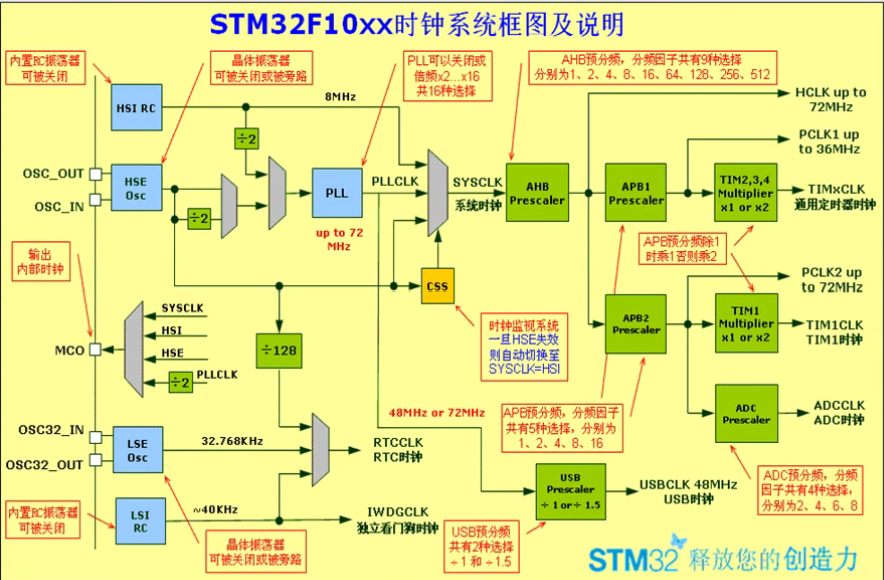

# STM32 系统时钟

## 1、时钟简介

### 1.1 时钟概述

​	时钟是单片机运行的**基础**，时钟信号推动单片机内各个部分执行相应的指令；

​	时钟就 CPU 的**脉搏**，决定了 CPU 运行的速率，时钟对整个系统都是至关重要；


### 1.2 STM32设置多个时钟的原因

​	STM32本身十分复杂，外设非常多 。但我们实际使用的时候只会用到有限的几个外设；

​	使用任何外设都需要时钟才能启动，但并不是所有的外设都需要系统时钟那么高的频率，为了**兼容**不同速度的设备，有些高速，有些低速；

​	如果都用高速时钟，势必造成**浪费** ； 并且，同一个电路，时钟越快功耗越快，同时**抗电磁干扰能力**也就越弱；

​	所以较为复杂的MCU都是采用多时钟源的方法来解决这些问题。所以便有了**STM32的时钟系统和时钟树**。


### 1.3 总结

- STM32时钟系统**主要的目的**就是给相对**独立**的外设模块提供时钟，也是为了降低整个芯片的**耗能**；

- 系统时钟，是处理器运行**时间基准**（每一条机器指令一个时钟周期）；

- 时钟是单片机运行的**基础**，时钟信号推动单片机内各个部分执行相应的指令；

- 一个单片机内提供多个不同的**系统时钟**，可以适应更多的应用场合；

- 不同的功能模块会有不同的时钟上限，因此提供不同的时钟，也能在一个单片机内放置更多的功能模块；

- 对不同模块的时钟增加**开启和关闭**功能，可以降低单片机的功耗；

- STM32为了**低功耗**，将所有的外设时钟都设置为disable(**不使能**)，用到什么外设，只要打开对应外设的时钟就可以， 其他的没用到的可以还是disable(不使能)，这样耗能就会减少。  这就是为什么不管你配置什么功能都需要先打开对应的时钟的原因；

    


## 2、STM32时钟系统结构

​	STM32F1xx系列时钟整体结构如图：



​	图中，蓝色框为时钟源，灰色梯形为选择器，可以选择其某个输入作为输出，绿色为分频器，可以将输入频率增大或减少指定的倍数；


### 2.1 四个独立时钟源

- **HSI RC：**
    - 位于左上角的 High Speed Inside，内部高速时钟，其由 RC 电路产生约为 **8MHz** 的频率；
    - 用途：
        - **系统时钟**：直接用于系统时钟；
        - **PLL**：经过2分频后用于 PLL（之后会提）；
- **HSE Osc：**
    - 位于 HSI RC 下方的 High Speed External，外部高速时钟，可接石英/陶瓷谐振器，或者接外部时钟源，频率范围为**4MHz~16MHz**；
    - 用途：
        - **PLL**：不分频或已经2分频后用于PLL；
        - **系统时钟**：直接用于系统时钟；
        - **CSS**：直接用于 CSS（之后会提）；
        - **RTC**：经过128倍数分频后用于 RTC 时钟；
- **LSE Osc：**
    - 位于左下方的 Lose Speed External，外部低速时钟，接频率为**32.768kHz**的石英晶体；	
    - 用途：
        - **RTC**：直接用于 RTC 时钟；
- **LSI RC**：
    - 位于左下方的 Lose Speed Inside，内部低速时钟，RC振荡器，频率为**40kHz**，提供低功耗时钟；
    - 用途：
        - **RTC**：直接用于 RTC 时钟；
        - **看门狗：**直接用于 IWDGCLK 看门狗时钟；


### 2.2 PLL时钟源

​	PLL 为锁相环倍频输出，其主要作用就是根据不同的输入频率，调制其内部的倍频数，使得最终输出的时钟频率为提高，最大可以达到 72MHz，可直接用于系统时钟；

​	由上述分析可知，PLL 的时钟源可以选择：

- HSI 的2分频；
- HSE 或 HSE 的2分频；

​	PLL时钟源主要两个用途：

- 用于系统时钟；
- 经过分配器后用于 USECLK；


### 2.3 系统时钟SYSCLK

​	系统时钟，内核时钟，根据上述分析其可以来源自：

- HSE
- HSI
- PLL


### 2.4 CSS

​	时钟检测系统，其将会检测 HSE 的时钟信号是否正常，若不正常，为了整个体系的正常工作，将系统时钟源选择为 HSI；


### 2.5 USECLK

​	全速功能的USB模块，需要48MHz的时钟源；

​	该时钟源**只能从PLL输出端获取**，可以选择为1.5分频或者1分频，也就是，当需要使用USB模块时，PLL必须使能，并且时钟频率配置为48MHz或72MHz；


### 2.6 输出时钟信号

​	STM32可以选择一个时钟信号输出到MCO脚(PA8)上，可以选择为PLL输出的2分频、HSI、HSE、或者系统时钟。可以把时钟信号输出供外部使用；


### 2.7 外设时钟


- **AHB**

    - 系统时钟 SYSCLK 首先经过 AHB 分配器作为 APB1 与 APB2 的时钟源;

    - AHB 分频因子可以选择：1、2、4、8、16、64、128、256、512；	
    - AHB 最大频率为 72MHz；
    - 用途：
        - **内核总线：**送给AHB总线、内核、内存和DMA使用的HCLK时钟；
        - **SysTick：**通过8分频后送给Cortex的系统定时器时钟;
        - **I2S总线**：直接送给Cortex的空闲运行时钟FCLK；
        - **APB1 与 APB2**  ：送给 APB1 与 APB2 的预分频器使用；

- **APB1**

    - AHB 时钟经过 APB1 分频器输出得到 APB1 时钟；
    - APB1 分频因子可以选择：1、2、4、8、16；
    - APB1 最大频率为 36MHz；
    - 用途：
        - **外设**：APB1 时钟给挂载在 APB1 总线上的外设使用；
        - **计时器**：经过基本、通过计时器分频器，给基本、通过计时器使用；

- **APB2**

    - AHB 时钟经过 APB2 分频器输出得到 APB2 时钟；

    - APB1 分频因子可以选择：1、2、4、8、16；

    - APB1 最大频率为 36MHz；
    - 用途：
        - **外设**：APB1 时钟给挂载在 APB1 总线上的外设使用；
        - **计时器**：经过高级计时器分频器，给高级计时器使用；
        - **ADC**：分频后送给ADC模块使用。ADC分频器可选择为2、4、6、8分频；

​	其中特别的是 APB 上对计时器的分频设置：

​	定时器时钟频率分配由硬件按以下2种情况自动设置：

- 如果相应的APB预分频系数是1，定时器的时钟频率与所在APB总线频率一致；
- 否则，定时器的时钟频率被设为与其相连的APB总线频率的2倍；

​	


## 3、时钟相关寄存器

### 3.1 RCC_TypeDef 结构体

​	RCC：Reset and clock control；

​	位于 stm32f10x.h 中定义的 RCC_TypeDef 结构体：

````c
typedef struct
{
  __IO uint32_t CR; // 
  __IO uint32_t CFGR; //
  __IO uint32_t CIR;
  __IO uint32_t APB2RSTR; 
  __IO uint32_t APB1RSTR;
  __IO uint32_t AHBENR;
  __IO uint32_t APB2ENR;
  __IO uint32_t APB1ENR;
  __IO uint32_t BDCR;
  __IO uint32_t CSR;
   
  uint32_t RESERVED0;
  __IO uint32_t CFGR2;

} RCC_TypeDef;
````

​	再找官方定义好的 RCC_TypeDef 结构体在内存的哪里：

````c
#define PERIPH_BASE           ((uint32_t)0x40000000) 
#define APB2PERIPH_BASE       (PERIPH_BASE + 0x10000)
#define RCC_BASE              (AHBPERIPH_BASE + 0x1000)
#define RCC                 ((RCC_TypeDef *) RCC_BASE)
````

​	可以看出官方把 RCC 放置在了 APB2 总线的内存上；

​	接下来分析结构体内部的寄存器，其中有五个会先着重介绍：CR、CFGR、AHBENR、APB2ENR、APB1ENR；


### 3.1 CR寄存器

​	CR寄存器：时钟控制寄存器(RCC_CR)，主要用于配置几个时钟源，其各位功能介绍如下：

--------------------------

- 位31~26：保留位，始终为0；

- 位25：**PLLRDY：PLL时钟就绪位（PLL clock ready flag）**

    - 0：PLL 未锁定；
    - 1：PLL锁定；

- 位24：**PLLON：PLL使能 （PLL enable）**

    - 0：PLL关闭；
    - 1：PLL开启；

- 位23~20：保留位始终位0；

- 位19：**CSSON：时钟安全系统使能（Clock security system enbale）由软件设置来使能时钟检测器**

    - 0：时钟检测关闭；
    - 1：时钟检测开启；

- 位18：**HSEBYP：外部高速时钟旁路（External high-speed clock bypass）**

    在调试模式下由软件设置旁路外部晶体振荡，只要外部4-16MHz振荡器关闭的时候才能写入

    - 0：外部4-16MHz振荡器没有旁路；
    - 1：外部4-16MHz振荡器晶体振荡器被旁路；

- 位17：**HSERDY：外部高速时钟就绪标志（External high-speed clock ready flag）**

    由硬件设置来表示振荡器已经稳定（开启振荡器后，不一定马上稳定，需要等待其稳定后，硬件设计该     位表示振荡器准备就绪，程序才能开始运行）	

    - 0：外部4-16MHz振荡器没有就绪；
    - 1：外部4-16MHz振荡器就绪；

- 位16：**HSEON：外部高速时钟使能位（External high-speed clock enable）**

    由软件设置；当进入待机或者停止状态，该位由硬件设置，关闭外部振荡器；

    - 0：HSE振荡器关闭；
    - 1：HSE振荡器开启；

- 位15~8：**HSICAL[7:0]：内部高速时钟校准（Internal high-speed clock calibration）**

    在系统启动时，这些位被自动初始化；

- 位7~3：**HSITRIM[4:0]：内部高速时钟调制（Internal high-speed clock trimming）**

    不做了解；

- 位2：保留为0；

- 位1：**HSIRDY：内部高速时钟就绪标志（Internal high-speed clock ready flag）**

    由硬件设置1表示内部振荡器稳定；与外部类似的情况

    - 0：内部8MHz振荡器没有就绪；
    - 1：内部8MHz振荡器就绪；

- 位0：**HSION：内部高速时钟使能位（Internal high-speed clock enable）**

    由软件设置；当从待机或停止返回或者用作系统时钟的外部振荡器故障，由硬件设置来启动内部8MHz的RC振荡器；

    - 0：内部8MHz振荡器关闭；
    - 1：内部8MHz振荡器开启；

--------------------------

​	主要是关于 **PLL、HSI 与 HSE 的就绪与开启**，还有关于 CCS 的一点设置；


### 3.2 CFGR寄存器

​	时钟配置寄存器(RCC_CFGR)，主要用来设置各个分频器的分频数量；

----

- 位31~27：保留，始终读为0；

- 位26~24：**MCO： 微控制器时钟输出 (Microcontroller clock output)**

    由软件置’1’或清零。

    - 0xx：**没有**时钟输出；
    - 100：系统时钟(**SYSCLK**)输出；
    - 101：内部RC振荡器时钟(**HSI**)输出；
    - 110：外部振荡器时钟(**HSE**)输出；
    - 111：**PLL**时钟2分频后输出；

- 位22：**USBPRE：USB预分频 (USB prescaler)**

    由软件置’1’或清’0’来产生48MHz的USB时钟；在RCC_APB1ENR寄存器中使能USB时钟之
    前，必须保证该位已经有效。如果USB时钟被使能，该位不能被清零；

    - 0：**PLL时钟1.5倍分频**作为USB时钟
    - 1：**PLL时钟直接**作为USB时钟

- 位21~18：**PLLMUL：PLL倍频系数 (PLL multiplication factor)**

    由软件设置来确定PLL倍频系数。只有在PLL关闭的情况下才可被写入；

    注意：PLL的输出频率不能超过72MHz

    - 0000：PLL 2倍频输出
    - 1000：PLL 10倍频输出
    - 0001：PLL 3倍频输出
    - 1001：PLL 11倍频输出
    - 0010：PLL 4倍频输出
    - 1010：PLL 12倍频输出
    - 0011：PLL 5倍频输出
    - 1011：PLL 13倍频输出
    - 0100：PLL 6倍频输出
    - 1100：PLL 14倍频输出
    - 0101：PLL 7倍频输出
    - 1101：PLL 15倍频输出
    - 0110：PLL 8倍频输出
    - 1110：PLL 16倍频输出
    - 0111：PLL 9倍频输出
    - 1111：PLL 16倍频输出

- 位17：**PLLXTPRE：HSE分频器作为PLL输入 (HSE divider for PLL entry)**

    由软件置’1’或清’0’来分频HSE后作为PLL输入时钟。只能在关闭PLL时才能写入此位；

    - 0：HSE不分频；
    - 1：HSE 2分频；

- 位16：**PLLSRC：PLL输入时钟源 (PLL entry clock source)**

    由软件置’1’或清’0’来选择PLL输入时钟源。只能在关闭PLL时才能写入此位；

    - 0：HSI振荡器时钟经2分频后作为PLL输入时钟
    - 1：HSE时钟作为PLL输入时钟。

- 位15~14：**ADCPRE[1:0]：ADC预分频 (ADC prescaler)**

    由软件置’1’或清’0’来确定ADC时钟频率

    - 00：PCLK2 2分频后作为ADC时钟
    - 01：PCLK2 4分频后作为ADC时钟
    - 10：PCLK2 6分频后作为ADC时钟
    - 11：PCLK2 8分频后作为ADC时钟

- 位13~11：**PPRE2[2:0]：高速APB预分频(APB2) (APB high-speed prescaler (APB2))**

    由软件置’1’或清’0’来控制高速APB2时钟(PCLK2)的预分频系数；

    - 0xx：HCLK不分频
    - 100：HCLK 2分频
    - 101：HCLK 4分频
    - 110：HCLK 8分频
    - 111：HCLK 16分频

- 位10~8：**PPRE1[2:0]：低速APB预分频(APB1) (APB low-speed prescaler (APB1))**

    由软件置’1’或清’0’来控制低速APB1时钟(PCLK1)的预分频系数。

    警告：软件必须保证**APB1时钟频率不超过36MHz；**

    - 0xx：HCLK不分频
    - 100：HCLK 2分频
    - 101：HCLK 4分频
    - 110：HCLK 8分频
    - 111：HCLK 16分频

- 位7~4：**HPRE[3:0]： AHB预分频 (AHB Prescaler)**

    由软件置’1’或清’0’来控制AHB时钟的预分频系数。

    - 0xxx：SYSCLK不分频
    - 1000：SYSCLK 2分频
    - 1100：SYSCLK 64分频
    - 1001：SYSCLK 4分频
    - 1101：SYSCLK 128分频
    - 1010：SYSCLK 8分频
    - 1110：SYSCLK 256分频
    - 1011：SYSCLK 16分频
    - 1111：SYSCLK 512分频

- 位3~2：**SWS[1:0]：系统时钟切换状态 (System clock switch status)**

    由硬件置’1’或清’0’来指示哪一个时钟源被作为系统时钟。

    - 00：HSI作为系统时钟；
    - 01：HSE作为系统时钟；
    - 10：PLL输出作为系统时钟；
    - 11：不可用。

- 位1~0：**SW[1:0]：系统时钟切换 (System clock switch)**

    由软件置’1’或清’0’来选择系统时钟源。

    在从停止或待机模式中返回时或直接或间接作为系统时钟的HSE出现故障时，由硬件强制选择

    HSI作为系统时钟(如果时钟安全系统已经启动)

    - 00：HSI作为系统时钟；
    - 01：HSE作为系统时钟；
    - 10：PLL输出作为系统时钟；
    - 11：不可用；

-------------------------

可以看出 CFGR 寄存器主要用来配置各种分频器的值与选择时钟源；


### 3.3 AHBENR寄存器

​	AHB外设时钟使能寄存器 (RCC_AHBENR)，主要用来使能一些位于 AHB 总线上的外设；

（以下使能位都由软件设置，0表示关闭，1表示开启）

----------------

- 位31~11：保留，始终读为0。
- 位10：SDIOEN：SDIO时钟使能 (SDIO clock enable)
- 位9：保留，始终读为0。
- 位8：FSMCEN：FSMC时钟使能 (FSMC clock enable)
- 位7：保留，始终读为0。
- 位6：CRCEN：CRC时钟使能 (CRC clock enable)
- 位5：保留，始终读为0。
- 位4：FLITFEN：闪存接口电路时钟使能 (FLITF clock enable)
- 位3：保留，始终读为0。
- 位2：SRAMEN：SRAM时钟使能 (SRAM interface clock enable)
- 位1：DMA2EN：DMA2时钟使能 (DMA2 clock enable)
- 位0：DMA1EN：DMA1时钟使能 (DMA1 clock enable)

--------------------------


### 3.4 APB2ENR寄存器

​	APB2 外设时钟使能寄存器(RCC_APB2ENR)，只要用于使能 APB2 总线上的时钟；

---

- 位31:16：保留，始终读为0。
- 位15：ADC3EN：ADC3接口时钟使能 (ADC 3 interface clock enable)
- 位14：USART1EN：USART1时钟使能 (USART1 clock enable)
- 位13：TIM8EN：TIM8定时器时钟使能 (TIM8 Timer clock enable)
- 位12：SPI1EN：SPI1时钟使能 (SPI 1 clock enable)
- 位11：TIM1EN：TIM1定时器时钟使能 (TIM1 Timer clock enable)
- 位10：ADC2EN：ADC2接口时钟使能 (ADC 2 interface clock enable)
- 位9：ADC1EN：ADC1接口时钟使能 (ADC 1 interface clock enable)
- 位8：IOPGEN：IO端口G时钟使能 (I/O port G clock enable)
- 位7：IOPFEN：IO端口F时钟使能 (I/O port F clock enable)
- 位6：IOPEEN：IO端口E时钟使能 (I/O port E clock enable)
- 位5：IOPDEN：IO端口D时钟使能 (I/O port D clock enable)
- 位4：IOPCEN：IO端口C时钟使能 (I/O port C clock enable)
- 位3：IOPBEN：IO端口B时钟使能 (I/O port B clock enable)
- 位2：IOPAEN：IO端口A时钟使能 (I/O port A clock enable)
- 位1：保留，始终读为0。
- 位0：AFIOEN：辅助功能IO时钟使能 (Alternate function I/O clock enable)

---------------

​	在这里我们可以看到 IOPxEN，这就是各个GPIO组的时钟了，开启时钟函数本质上就只是设置了相关的寄存器位，而硬件会帮助我们处理剩下的一切；

​	这是 stm32f10x_rcc.c 中关于开启时钟的源码，其实所有开启/关闭时钟函数都只是设置了寄存器的某个位，

而这些宏定义就恰好就是其对应的位：

````c
void RCC_APB2PeriphClockCmd(uint32_t RCC_APB2Periph, FunctionalState NewState)
{
  /* Check the parameters */
  assert_param(IS_RCC_APB2_PERIPH(RCC_APB2Periph));
  assert_param(IS_FUNCTIONAL_STATE(NewState));
  if (NewState != DISABLE)
  {
    RCC->APB2ENR |= RCC_APB2Periph;
  }
  else
  {
    RCC->APB2ENR &= ~RCC_APB2Periph;
  }
}
````


### 3.5 APB1ENR寄存器

- 位31:30：保留，始终读为0。

- 位29：DACEN: DAC接口时钟使能 (DAC interface clock enable)
- 位28：PWREN：电源接口时钟使能 (Power interface clock enable)
- 位27：BKPEN：备份接口时钟使能 (Backup interface clock enable)
- 位26：保留，始终读为0。
- 位25：CANEN：CAN时钟使能 (CAN clock enable)
- 位24：保留，始终读为0。
- 位23：USBEN：USB时钟使能 (USB clock enable)
- 位22：I2C2EN：I2C 2时钟使能 (I2C 2 clock enable)
- 位21：I2C1EN：I2C 1时钟使能 (I2C 1 clock enable)
- 位20：UART5EN：UART5时钟使能 (UART 5 clock enable)
- 位19：UART4EN：UART4时钟使能 (UART 4 clock enable)
- 位18：USART3EN：USART3时钟使能 (USART 3 clock enable)
- 位17：USART2EN：USART2时钟使能 (USART 2 clock enable)
- 位16：保留，始终读为0。
- 位15：SPI3EN：SPI 3时钟使能 (SPI 3 clock enable)
- 位14：SPI2EN：SPI 2时钟使能 (SPI 2 clock enable)
- 位13:12：保留，始终读为0。
- 位11：WWDGEN：窗口看门狗时钟使能 (Window watchdog clock enable)
- 位10:6：保留，始终读为0。
- 位5：TIM7EN：定时器7时钟使能 (Timer 7 clock enable)
- 位4：TIM6EN：定时器6时钟使能 (Timer 6 clock enable)
- 位3：TIM5EN：定时器5时钟使能 (Timer 5 clock enable)
- 位2：TIM4EN：定时器4时钟使能 (Timer 4 clock enable)
- 位1：TIM3EN：定时器3时钟使能 (Timer 3 clock enable)
- 位0：TIM2EN：定时器2时钟使能 (Timer 2 clock enable)

---------------------

​	不多说了，都是一些外设时钟的使能位；


### 3.6 综述

​	我们就介绍这五个，其他的见手册；

​	看完以后，需要知道：

- CR寄存器是关于 PLL、HSE、HSI时钟源的就绪与开启位；
- CFGR寄存器是设置分频数量，选择时钟源；
- APB1、AHB、APB2ENR寄存器都是对各自总线上的一些时钟的使能设置；


## 4、时钟相关函数

​	看完了这些寄存器，许多都出现了由软件设置，那么想一想，其实我们没有设置多少时钟相关的寄存器，只是在开启外设时会配置设置；

​	那么这么多复杂的，特别是 RCC_CFGR 寄存器上各种各样的分频与选择是何时配置的呢？

​	我们就一步一步从源码寻找答案：


### 4.1 SystemInit函数

​	在启动过程中，我们就提过这个函数，启动文件中定义了 Reset_Handler 函数，上电后 PC 就直接来到这里，执行了 SystemInit 与 __main；

​	在 system_stm32f10x.c 中：

````c
void SystemInit (void)
{
  RCC->CR |= (uint32_t)0x00000001;

#ifndef STM32F10X_CL
  RCC->CFGR &= (uint32_t)0xF8FF0000;
#else
  RCC->CFGR &= (uint32_t)0xF0FF0000;
#endif  
  
  RCC->CR &= (uint32_t)0xFEF6FFFF;

  RCC->CR &= (uint32_t)0xFFFBFFFF;

  RCC->CFGR &= (uint32_t)0xFF80FFFF;

#ifdef STM32F10X_CL
  RCC->CR &= (uint32_t)0xEBFFFFFF;

  RCC->CIR = 0x00FF0000;

  RCC->CFGR2 = 0x00000000;
#elif defined (STM32F10X_LD_VL) || defined (STM32F10X_MD_VL) || (defined STM32F10X_HD_VL)
  RCC->CIR = 0x009F0000;

  RCC->CFGR2 = 0x00000000;      
#else
  RCC->CIR = 0x009F0000;
#endif 
    
#if defined (STM32F10X_HD) || (defined STM32F10X_XL) || (defined STM32F10X_HD_VL)
  #ifdef DATA_IN_ExtSRAM
    SystemInit_ExtMemCtl(); 
  #endif 
#endif 

  SetSysClock();

#ifdef VECT_TAB_SRAM
  SCB->VTOR = SRAM_BASE | VECT_TAB_OFFSET;
#else
  SCB->VTOR = FLASH_BASE | VECT_TAB_OFFSET; 
#endif 
}
````

 	现在来解析一下这个函数：

````c
RCC->CR |= (uint32_t)0x00000001;
````

​	1、CR寄存器的0位是HSI的使能位，所以：将HSI使能；

---

````c
RCC->CFGR &= (uint32_t)0xF0FF0000;
````

​	2、对照3.2的内容，可以知道，这句话将SW, HPRE, PPRE1, PPRE2, ADCPRE and MCO都清空；表示：

- AHB、APB1、APB2的默认不分频；
- 系统时钟默认选择了 HSI；
- MCO默认不输出；
- 默认将PCLK2 2分频后作为ADC时钟；

--------

````3
RCC->CR &= (uint32_t)0xFEF6FFFF;
````

3、将 CR 的16、19、24位置零，即将HSEON, CSSON 和 PLLON置零，表示：

- PLL 不使能； 
- HSE 不使能；
- CSS 安全检测关闭；

---

````c
RCC->CR &= (uint32_t)0xFFFBFFFF;
````

4、将CR的18位置零，表示外部高速时钟旁路关闭；

-------

````c
RCC->CFGR &= (uint32_t)0xFF80FFFF;
````

5、将 CFGR 的 16 - 22 bit 置零，表示：

- HSE不分频作为PLL的选择之一；
- HSI/2 作为PLL 的中断源；
- PLL 将输入信号作2倍频输出；
- USB 时钟使用 PLL 输出的1.5分频；

------

````c
/* Disable all interrupts and clear pending bits  */
  RCC->CIR = 0x009F0000;

  /* Reset CFGR2 register */
  RCC->CFGR2 = 0x00000000;      
````

6、这里与中断相关，我们先不深入学习；

-----

```
SetSysClock();
```

7、调用 SetSysClock() 是接下来要分析的；

---

​	总结一下 SystemInit，这个函数主要是设置一下 CR 与 CFGR 的默认值，稍后会设置，还有一些相关的中断设置，最后去调用 SetSysClock()函数，当然如果你选择用 SRAM 启动最后还会重定位中断向量表；


### 4.2 SetSysClock函数

​	在 SystemInit 函数的结尾调用 SetSysClock 去配置时钟；

​	在 system_stm32f10x.c 中：

````c
static void SetSysClock(void)
{
#ifdef SYSCLK_FREQ_HSE
  SetSysClockToHSE();
#elif defined SYSCLK_FREQ_24MHz
  SetSysClockTo24();
#elif defined SYSCLK_FREQ_36MHz
  SetSysClockTo36();
#elif defined SYSCLK_FREQ_48MHz
  SetSysClockTo48();
#elif defined SYSCLK_FREQ_56MHz
  SetSysClockTo56();  
#elif defined SYSCLK_FREQ_72MHz
  SetSysClockTo72();
#endif
````

​	可以看到，这个函数根据不同的宏定义来执行不同的函数，一般我们都是设置系统时钟 72MHz，那么就会调用最后一个函数 SetSysClockTo72()；

​	当然也是可以该的：

````c
#if defined (STM32F10X_LD_VL) || (defined STM32F10X_MD_VL) || (defined STM32F10X_HD_VL)
/* #define SYSCLK_FREQ_HSE    HSE_VALUE */
 #define SYSCLK_FREQ_24MHz  24000000
#else
/* #define SYSCLK_FREQ_HSE    HSE_VALUE */
/* #define SYSCLK_FREQ_24MHz  24000000 */ 
/* #define SYSCLK_FREQ_36MHz  36000000 */
/* #define SYSCLK_FREQ_48MHz  48000000 */
/* #define SYSCLK_FREQ_56MHz  56000000 */
#define SYSCLK_FREQ_72MHz  72000000
#endif
````

​	 在 system_stm32f10x.c 选择你需要的时钟信号，不要的就注释，这里就使用了 72MHz 的；


### 4.3 :star:SetSysClockTo72函数

​	经过两次的包装，终于到了真正配置时钟的函数， 在system_stm32f10x.c 定义：

​	（以 STM32F103RC 来分析，定义了 STM32F10X_HD，我去掉了一些宏定义的判断）

````c
static void SetSysClockTo72(void)
{
  __IO uint32_t StartUpCounter = 0, HSEStatus = 0;
    
  RCC->CR |= ((uint32_t)RCC_CR_HSEON);
 
  do
  {
    HSEStatus = RCC->CR & RCC_CR_HSERDY;
    StartUpCounter++;  
  } while((HSEStatus == 0) && (StartUpCounter != HSE_STARTUP_TIMEOUT));

  if ((RCC->CR & RCC_CR_HSERDY) != RESET)
  {
    HSEStatus = (uint32_t)0x01;
  }
  else
  {
    HSEStatus = (uint32_t)0x00;
  }  

  if (HSEStatus == (uint32_t)0x01)
  {
    /* Enable Prefetch Buffer */
    FLASH->ACR |= FLASH_ACR_PRFTBE;

    /* Flash 2 wait state */
    FLASH->ACR &= (uint32_t)((uint32_t)~FLASH_ACR_LATENCY);
    FLASH->ACR |= (uint32_t)FLASH_ACR_LATENCY_2;    


    RCC->CFGR |= (uint32_t)RCC_CFGR_HPRE_DIV1;
      
    RCC->CFGR |= (uint32_t)RCC_CFGR_PPRE2_DIV1;
    
    RCC->CFGR |= (uint32_t)RCC_CFGR_PPRE1_DIV2;

    RCC->CFGR &= (uint32_t)((uint32_t)~(RCC_CFGR_PLLSRC | RCC_CFGR_PLLXTPRE |
                                        RCC_CFGR_PLLMULL));
    RCC->CFGR |= (uint32_t)(RCC_CFGR_PLLSRC_HSE | RCC_CFGR_PLLMULL9);

    RCC->CR |= RCC_CR_PLLON;

    while((RCC->CR & RCC_CR_PLLRDY) == 0)
    {
    }
    
    RCC->CFGR &= (uint32_t)((uint32_t)~(RCC_CFGR_SW));
    RCC->CFGR |= (uint32_t)RCC_CFGR_SW_PLL;    

    while ((RCC->CFGR & (uint32_t)RCC_CFGR_SWS) != (uint32_t)0x08)
    {
    }
  }
  else
  { 
  }
}
````

​	现在来一步一步分析

---

````
__IO uint32_t StartUpCounter = 0, HSEStatus = 0;
````

1、定义两个临时变量；

---

````c
RCC->CR |= ((uint32_t)RCC_CR_HSEON);
````

2、将 CR 寄存器 | 上 RCC_CR_HSEON；

​	RCC_CR_HSEON 是一个定义在 stm32f10x.h 中的宏

````c
#define  RCC_CR_HSEON                        ((uint32_t)0x00010000)
````

​	那么这句话就是将 CR 寄存器的第16位置1，即为开启 HSE 时钟；

---

````c
do
{
   HSEStatus = RCC->CR & RCC_CR_HSERDY;
   StartUpCounter++;  
} while((HSEStatus == 0) && (StartUpCounter != HSE_STARTUP_TIMEOUT));
````

3、等待 HSE 稳定的过程：

​	先介绍里面出现的新符号（stm32f10x.h 中）：

````c
#define  RCC_CR_HSERDY                     		((uint32_t)0x00020000)
#define HSE_STARTUP_TIMEOUT   					((uint16_t)0x0500)
````

​	那么这个 do-while 的就是先查看 CR 寄存器上第 17 位的值，并且赋值给临时变量 HSEStatus（而在 3.1 中我们知道 CR 寄存器的第 17位是一个由硬件设置的位，表示 HSE 是否稳定）

​	之后让 StartUpcount 自＋1；

​	最后去判断，需要满足 HSEStatus 等于 0，并且 StartUpcount 小于 0x500 才能继续执行循环；

​	综上，整个的意思就是，不断去读取 HSE的就绪位，每次读取让 StartUpcount 累加1；直到 HSE 准备就绪，或者说稳定时间过长，计数超出范围就退出循环；

---

```c
if ((RCC->CR & RCC_CR_HSERDY) != RESET)
  {
    HSEStatus = (uint32_t)0x01;
  }
  else
  {
    HSEStatus = (uint32_t)0x00;
  }  
```

4、判断 HSE 是否稳定：

​	在执行完 3 的循环后，有两种可能：

- 

- HSE 稳定，时钟可以正常使用；
- HSE 在规定时间范围里没有达到稳定状态；

​	那么我们就需要判断 CR 寄存器的17位：

- 如果位17是1， HSE 稳定，可以使用，就令临时变量  HSEStatus = 0；
- 如果位17是0，HSE 不稳定，就令临时变量  HSEStatus = 1；

---

````c
if (HSEStatus == (uint32_t)0x01)
{
	...
}
else
{
}
````

5、根据 HSE 是否开启成功选择继续配置还是退出函数，这里就不多bb了，我们下面就看看成功了的情况；

---

````c
/* Enable Prefetch Buffer */
    FLASH->ACR |= FLASH_ACR_PRFTBE;

    /* Flash 2 wait state */
    FLASH->ACR &= (uint32_t)((uint32_t)~FLASH_ACR_LATENCY);
    FLASH->ACR |= (uint32_t)FLASH_ACR_LATENCY_2;   
````

6、这是关于 FLASH 的，我们不研究；

---

````
RCC->CFGR |= (uint32_t)RCC_CFGR_HPRE_DIV1;
````

7、将 CFGR | 或上 RCC_CFGR_HPRE_DIV1；

​	RCC_CFGR_HPRE_DIV1 定义在 stm32f10x.h 中

````c
#define  RCC_CFGR_HPRE_DIV1                  ((uint32_t)0x00000000)
````

​	这句话其实什么也没做，但需要注意，在 SystemInit 函数里面，我们已经默认让 AHB、APB1、APB2的分频器都不分频，现在就只是坚定了默认值：AHB 总线时钟与系统时钟一致；

---

````c
RCC->CFGR |= (uint32_t)RCC_CFGR_PPRE2_DIV1;
    
RCC->CFGR |= (uint32_t)RCC_CFGR_PPRE1_DIV2;
````

8、这两代码与7类似，设置的是 APB1 与 APB2 的分频器，其中两个宏定义为：

````c
#define  RCC_CFGR_PPRE2_DIV1                 ((uint32_t)0x00000000)
#define  RCC_CFGR_PPRE1_DIV2                 ((uint32_t)0x00000400)
````

​	那么对 APB2 也是什么都不改，坚定了默认值：APB2 总线时钟与 AHB 一致；

​	主要看看 APB1，第二行代码让 CFGR 的第10位设为1，也就是现在 10~8位从000 -> 100;

​	在 3.1 我们知道当 CFGR 的 10~8 位为 100 时，APB1 分频器设置为2；

​	也就是说，APB1 总线时钟为 AHB 时钟频率的一半；

---

```c
RCC->CFGR &= (uint32_t)((uint32_t)~(RCC_CFGR_PLLSRC | RCC_CFGR_PLLXTPRE |
                                        RCC_CFGR_PLLMULL));
```

9、先看三个宏定义：

````
#define  RCC_CFGR_PLLSRC                     ((uint32_t)0x00010000)
#define  RCC_CFGR_PLLXTPRE                   ((uint32_t)0x00020000)
#define  RCC_CFGR_PLLMULL                    ((uint32_t)0x003C0000) 
````

​		  0000 0000 0000 0001 0000 0000 0000 0000 

​		  0000 0000 0000 0010 0000 0000 0000 0000 

​		  0000 0000 0011 1100 0000 0000 0000 0000 

| ->	0000 0000 0011 1111 0000 0000 0000 0000 

~ ->    1111 1111 11 00 0000 1111 1111 1111 1111

​	所以即：将 CFGR 的 16 到 21 设为 0，即：

- PLL 将输入时钟频率作为2倍频输出；
- HSE不分频作为 PLL 的输入选择；
- HSI振荡器时钟经2分频后作为PLL输入时钟；

----

````c
RCC->CFGR |= (uint32_t)(RCC_CFGR_PLLSRC_HSE | RCC_CFGR_PLLMULL9);
````

10、看宏定义：

````c
#define  RCC_CFGR_PLLSRC_HSE                ((uint32_t)0x00010000)
#define  RCC_CFGR_PLLMULL9                  ((uint32_t)0x001C0000)
````

​			0000 0000 0000 0001 0000 0000 0000 0000

​			0000 0000 0001 1100 0000 0000 0000 0000

|->      0000 0000 0001 1101 0000 0000 0000 0000

​	所以即：将 CFGR 的 16、18、19、20 设置为 1（21-18为 0111）：

- 将 HSE 作为 PLL 的输入；
- PLL 将输入时钟频率×9输出；

​	**那么如果外部 HSE 为 8MHz，那么 PLL 将输出 72MHz；**

---

````c
RCC->CR |= RCC_CR_PLLON;
````

11、将 CR 寄存器 | 上   RCC_CR_PLLON ：

````c
#define  RCC_CR_PLLON                        ((uint32_t)0x01000000)
````

​	即为将 CR 寄存器上的第 24 位设置为 1：

​	开启 PLL 使能；

---

````c
while((RCC->CR & RCC_CR_PLLRDY) == 0)
{
}
````

12、等待 PLL 的就绪位被设置为 1，一直等到 PLL 就绪；

````c
#define  RCC_CR_PLLRDY                       ((uint32_t)0x02000000)
````

​	CR 寄存器的 25 位为 PLL 就绪位；

---

````c
RCC->CFGR &= (uint32_t)((uint32_t)~(RCC_CFGR_SW));
RCC->CFGR |= (uint32_t)RCC_CFGR_SW_PLL;  
````

13、先看寄存器

````
#define  RCC_CFGR_SW                         ((uint32_t)0x00000003)
#define  RCC_CFGR_SW_PLL                     ((uint32_t)0x00000002)
````

​	这句话就是把 CFGR寄存器的 0 1 位设置为 0：HSI作为系统时钟；

​	再把 CFGR 寄存器的 1 位设置为 1：所以最终选择了**PLL输出作为系统时钟**；

​	那么我们可以得到：

- PLL 输出为 72MHz；
- 选择系统时钟为 PLL,那么系统时钟为 72MHz；
- AHB 选择不分频：AHB 总线为 72MHz；
- APB2 选择不分频：APB2 总线为 72MHz；
- APB1 选择2分频：APB1 总线为 36MHz；

---

````c
while ((RCC->CFGR & (uint32_t)RCC_CFGR_SWS) != (uint32_t)0x08)
{
}
````

14、先看宏定义

````
#define  RCC_CFGR_SWS                        ((uint32_t)0x0000000C) 
````

​	循环判断：

​	CFGR 的 2 3 位是否为 10：即等待PLL输出作为系统时钟配置完成；

----

​	至此，我们配置好了各个主要时钟：

- 选择 HSE 作为 PLL 输入，HSE 为 4MHz；
- 选择 PLL 倍频系数为 9，输出 72MHz ；
- 选择 PLL 输入作为系统时钟，即 72MHz；
- 选择 AHB 分频为 1，即 AHB 总线时钟为 72MHz；
- 选择 APB2 分频为 1，即 APB2 总线时钟为 72MHz，硬件自动将 APB2 上 TIM 倍频设为1，TIM 频率 72MHz；
- 选择 APB1 分频为 2，即 APB1 总线时钟为 36MHz，硬件自动将 APB1 上 TIM 倍频设为2，TIM 频率 72MHz；


### 4.4 RCC_APB2PeriphClockCmd函数

````c
void RCC_APB2PeriphClockCmd(uint32_t RCC_APB2Periph, FunctionalState NewState)
{
  /* Check the parameters */
  assert_param(IS_RCC_APB2_PERIPH(RCC_APB2Periph));
  assert_param(IS_FUNCTIONAL_STATE(NewState));
  if (NewState != DISABLE)
  {
    RCC->APB2ENR |= RCC_APB2Periph;
  }
  else
  {
    RCC->APB2ENR &= ~RCC_APB2Periph;
  }
}
````

​	很简单，根据传入的外设，开启或者关闭 APB2ENR 对于的 bit ，这些宏定义的设置都是跟 3.4 中一一对应；


### 4.5 RCC_APB1PeriphClockCmd函数

````c
void RCC_APB1PeriphClockCmd(uint32_t RCC_APB1Periph, FunctionalState NewState)
{
  /* Check the parameters */
  assert_param(IS_RCC_APB1_PERIPH(RCC_APB1Periph));
  assert_param(IS_FUNCTIONAL_STATE(NewState));
  if (NewState != DISABLE)
  {
    RCC->APB1ENR |= RCC_APB1Periph;
  }
  else
  {
    RCC->APB1ENR &= ~RCC_APB1Periph;
  }
}
````

​	很简单，根据传入的外设，开启或者关闭 APB1ENR 对于的 bit ，这些宏定义的设置都是跟 3.5 中一一对应；

