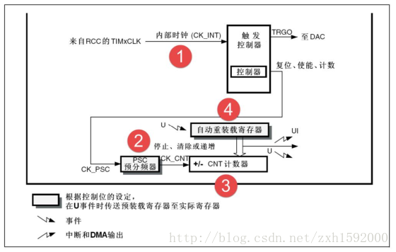

# STM32 TIM计时器

## 1、TIM介绍

### 1.1 概述

​	TIM（Timer）计时器是STM32上非常重要的外设之一，其可以对输入的时钟进行计数，并在计数值达到设定值时触发定时中断；


### 1.2 TIM的分类

​	STM32中主要有三种类型的计时器，

|       定时器种类        | 位数 |     计数器模式     | 产生DMA请求 | 捕获比较通道 | 互补输出 |                特殊应用场景                 |
| :---------------------: | :--: | :----------------: | :---------: | :----------: | :------: | :-----------------------------------------: |
| 高级定时器（TIM1,TIM8)  |  16  | 向上，向下，向上下 |    可以     |      4       |    有    |  带死区控制盒紧急刹车，可应用于PWM电机控制  |
| 通用定时器（TIM2~TIM5） |  16  | 向上，向下，向上下 |    可以     |      4       |    无    | 通用。定时计数，PWM输出，输入捕获，输出比较 |
|  基本定时器(TIM6,TIM7)  |  16  | 向上，向下，向上下 |    可以     |      0       |    无    |              主要应用于驱动DAC              |

- 位数表示最大计数值，三种都是 16bit，也即最大 0xFFFF （1~65536）；
- 计数模式：
    - 向上计时模式：从 0 开始累加到设定值，发出中断，再回到0；
    - 向下计时模式：从设计值开始向下递减至 0，发出中断，再回到设定值；
    - 向下下计时模式：从 0 增加到设定值，发出中断；再递减到 0，发出中断；


### 1.3 TIM相关寄存器

​	同一般外设一样，STM32 通过操作一些寄存器的值来对其进行配置、使用；

​	在 stm32f10x.h 中定义了 TIM_TypeDef 结构体来保存一个 TIM 所需要的寄存器：

````c
typedef struct
{
  __IO uint16_t CR1;
  uint16_t  RESERVED0;
  __IO uint16_t CR2;
  uint16_t  RESERVED1;
  __IO uint16_t SMCR;
  uint16_t  RESERVED2;
  __IO uint16_t DIER;
  uint16_t  RESERVED3;
  __IO uint16_t SR;
  uint16_t  RESERVED4;
  __IO uint16_t EGR;
  uint16_t  RESERVED5;
  __IO uint16_t CCMR1;
  uint16_t  RESERVED6;
  __IO uint16_t CCMR2;
  uint16_t  RESERVED7;
  __IO uint16_t CCER;
  uint16_t  RESERVED8;
  __IO uint16_t CNT;
  uint16_t  RESERVED9;
  __IO uint16_t PSC;
  uint16_t  RESERVED10;
  __IO uint16_t ARR;
  uint16_t  RESERVED11;
  __IO uint16_t RCR;
  uint16_t  RESERVED12;
  __IO uint16_t CCR1;
  uint16_t  RESERVED13;
  __IO uint16_t CCR2;
  uint16_t  RESERVED14;
  __IO uint16_t CCR3;
  uint16_t  RESERVED15;
  __IO uint16_t CCR4;
  uint16_t  RESERVED16;
  __IO uint16_t BDTR;
  uint16_t  RESERVED17;
  __IO uint16_t DCR;
  uint16_t  RESERVED18;
  __IO uint16_t DMAR;
  uint16_t  RESERVED19;
} TIM_TypeDef;
````

​	这个结构体对三种不同的计时器都是通用的；

​	有了结构体相信也有会宏定义来包装一个结构体指针：

- 基本计时器：

````c
#define TIM6_BASE             (APB1PERIPH_BASE + 0x1000)
#define TIM7_BASE             (APB1PERIPH_BASE + 0x1400)
#define TIM6                ((TIM_TypeDef *) TIM6_BASE)
#define TIM7                ((TIM_TypeDef *) TIM7_BASE)
````

​	两个基本计时器 TIM6、TIM7都是位于 APB1 总线上；

- 通过计时器：

````c
#define TIM2_BASE             (APB1PERIPH_BASE + 0x0000)
#define TIM3_BASE             (APB1PERIPH_BASE + 0x0400)
#define TIM4_BASE             (APB1PERIPH_BASE + 0x0800)
#define TIM5_BASE             (APB1PERIPH_BASE + 0x0C00)
#define TIM2                ((TIM_TypeDef *) TIM2_BASE)
#define TIM3                ((TIM_TypeDef *) TIM3_BASE)
#define TIM4                ((TIM_TypeDef *) TIM4_BASE)
#define TIM5                ((TIM_TypeDef *) TIM5_BASE)
````

​	四个基本计时器 TIM2、TIM3、TIM4、TIM5都是位于 APB1 总线上；

- 高级计时器：

````c
#define TIM1_BASE             (APB2PERIPH_BASE + 0x2C00)
#define TIM8_BASE             (APB2PERIPH_BASE + 0x3400)
#define TIM1                ((TIM_TypeDef *) TIM1_BASE)
#define TIM8                ((TIM_TypeDef *) TIM8_BASE)
````

​	两个高级计时器 TIM1、TIM8都是位于 APB2 总线上；

​	最终我们所有的配置，或者是计时的过程都是在操作这些寄存器；


## 2、基本计时器

​	基本计时器是三种中，结构最简单的一种，相应的功能也最少；

### 2.1基本计时器结构

​	

- **①时钟源**
    定时器时钟TIMxCLK，即内部时钟CK_INT，经APB1预分频器后分频提供，如果APB1 预分频系数等于 1，则频率不变，否则频率乘以 2，库函数中 APB1 预分频的系数是 2，即 PCLK1=36M，所以定时器时钟 TIMxCLK=36*2=72M ；
- **②计数器时钟**
    定时器时钟经过 PSC 预分频器之后，即 CK_CNT，用来驱动计数器计数。PSC 是一个16 位的预分频器，可以对定时器时钟 TIMxCLK 进行 1~65536 之间的任何一个数进行分频。
    具体计算方式为：CK_CNT=TIMxCLK/(PSC+1)；
- **③计数器**
    计数器 CNT 是一个 16 位的计数器，只能往上计数，最大计数值为 65535。当计数达到自动重装载寄存器的时候产生更新事件，并清零从头开始计数。
- **④自动重装载寄存器**
    自动重装载寄存器 ARR 是一个 16 位的寄存器，这里面装着计数器能计数的最大数值。当计数到这个值的时候，如果使能了中断的话，定时器就产生溢出中断。


### 2.2 基本计时器的配置

​	即使是最简单的 BaseTIM，其配置过程也是比较繁琐的，需要十分小心；

​	请非常非常注意，三种 TIM 都是发送中断到 NVIC，之后去执行中断程序，那么也是需要配置 NVIC的，这里就不再写了，在 Note6. STM32 异常与中断中有详细的说明，只不 NVIC 的中断源选择需要注意，具体的见 1.3 ;


#### 2.2.1 定义初始化结构体

​	使用 **TIM_TimeBaseInitTypeDef** 可以定义一个原来配置基本计时器的对象

````c
TIM_TimeBaseInitTypeDef TimeBase_InitStruture;
````

​	在 stm32f10x_tim.h 中，可以找到 TIM_TimeBaseInitTypeDef 的定义：

````c
typedef struct
{
  uint16_t TIM_Prescaler;         

  uint16_t TIM_CounterMode;      

  uint16_t TIM_Period;            

  uint16_t TIM_ClockDivision;     

  uint8_t TIM_RepetitionCounter;  
                                    
} TIM_TimeBaseInitTypeDef;   
````

​	这里解释一下每个成员的含义：

- TIM_Precaler（分频寄存器）：分频的倍数；
- TIM_CounterMode（计时模式）：这里无意义，因为基本计时器只能向上计数，即从小增大；
- TIM_Period（自动重装载寄存器）：计数器计到这里就产生一次中断；
- TIM_ClockDivision（时钟分频因子） ：基本定时器没有；
- TIM_RepetiaiionCounter：（重复计数器的值）：基本定时器没有；

​	那么很明显，对一个基本计时器，我们其实只需要配置一下 TIM_Precaler 与 Period 即可；

​	这样每当计时器计到 Period，那么就发送一个中断，CPU 去执行中断服务函数；

​	具体配置的方法与注意会在后面说明；


#### 2.2.2 开启时钟

​	基本计时器是一个外设，所以需要开启时钟，这里以 TIM6 为例

````c
RCC_APB1PeriphClockCmd(RCC_APB1Periph_TIM6， ENABLE);
````

​	注意，不同的 TIM 可能位于不同的总线上，这里的 TIM6 是位于 APB1 上的；


#### 2.2.3 设置分频数

​	设置我们需要的分频数：

````c
TimeBase_InitStruture.TIM_Perscaler = 71;
````

​	这里需要很注意，我们设置的分配数应该是真正的分配数量减一，比如这里设置了 71，其实最后分频的系数应该是 72；


#### 2.2.4 设置计数周期

​	设置重载寄存器的值：

````c
TimeBase_InitStruture.TIM_Period = 1000;
````


#### 2.2.5 初始化计时器

​	需要我们对初始化结构体的配置已经结束，调用初始化函数将我们配置写入相应寄存器：

````
TIM_TimeBaseInit(TIM6, &TimeBase_InitStruture);
````

​	注意第一个参数不能写错，需要配置哪个就写入哪个，这也就是 1.3 说的 TIM_TypeDef 结构体对象；

​	第二个参数传入指针；


#### 2.2.6 计时器中断使能

​	配置好 TIM6 后，需要使能其中断：

````c
TIM_ITConfig(TIM6, TIM_IT_Update, ENABLE);
````

​	

#### 2.2.7 计时器使能

​	最后开启计时器：

````
TIM_Cmd(TIM6, ENABLE);
````


#### 2.2.8 编写中断服务函数

​	跟之前遇到的所有中断服务函数一样，启动文件中已经写好了一个默认的，我们需要使用自己的就要重写，并且使用相同的函数名称：

````c
void TIM6_IRQHandler(void)
{
    if(TIM_GetITStatus(TIM6, TIM_IT_Update) != RESET)
    {	
        ...
        TIM_ClearITPendingBit(TIM6, TIM_IT_Update);
	}
}
````

​	函数里的两个小函数我们也不再讲了；


### 2.3 计时器的计算

​	在 STM32 时钟系统中已经知道，默认情况下，TIM 的频率都是 72MHz，那么发送中断的间隔就是：
$$
T = \frac {分频数}{TIM时钟源频率} \cdot 计时周期
$$


## 3、通用计时器


## 4、高级计时器